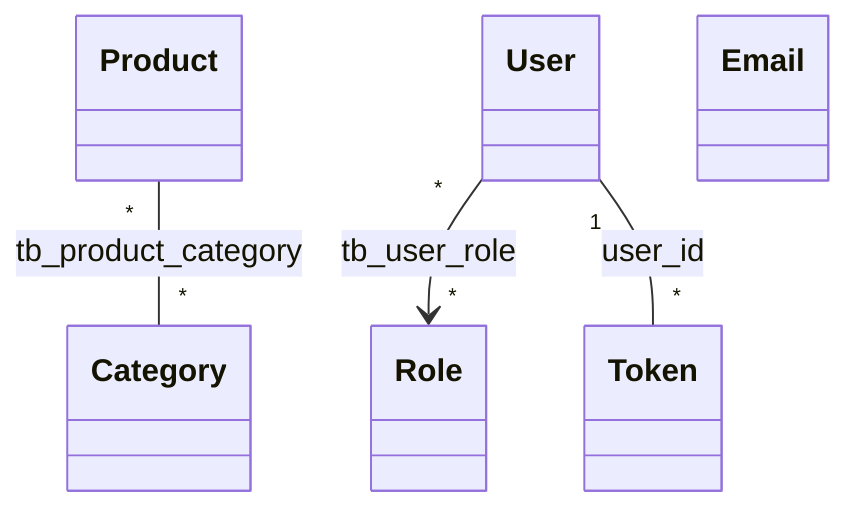

<h1 align="center">🏛️ Capítulo 04 — Domain Modeling, ORM, Business Use Cases & Data Access</h1>

<p align="justify">
<em>
This chapter focuses on designing a robust domain model, implementing real business use cases, optimizing database access strategies, and applying advanced JPA/Hibernate techniques to build enterprise-grade backend applications aligned with real-world business requirements.
</em>
</p>

<p align="center">


<a href="LICENSE"></a>

</p>

<p align="justify">
<em>
Neste capítulo, o projeto <strong>ASJCatalog</strong> evolui significativamente além dos cenários tradicionais de CRUD, incorporando fluxos de negócio completos encontrados em aplicações corporativas reais.

Foram implementados casos de uso relacionados ao ciclo de vida da conta do usuário, incluindo cadastro, ativação de conta, recuperação de senha, redefinição de credenciais e obtenção do usuário autenticado, utilizando uma arquitetura baseada em regras de negócio explícitas, entidades ricas e serviços especializados.

Além da evolução funcional, a camada de persistência foi aprimorada com consultas otimizadas utilizando <strong>Spring Data JPA</strong>, <strong>JPQL</strong>, consultas nativas, paginação, filtros dinâmicos e estratégias para eliminação do problema <strong>N+1 Select</strong>, garantindo melhor desempenho e escalabilidade.

O capítulo também introduz integração com serviços externos através do envio de e-mails transacionais, gerenciamento de tokens de negócio e aplicação de conceitos inspirados em <strong>Domain-Driven Design (DDD)</strong>, aproximando o projeto dos padrões encontrados em sistemas corporativos modernos.

O nome <strong>ASJCatalog</strong> vem das iniciais de <strong>Albert Silva de Jesus</strong>: o projeto nasceu da base do <strong>DSCatalog</strong>, do curso DevSuperior, e evoluiu de forma independente.
</em>

</p>

---

## 📑 Sumário

> Navegação do capítulo.

---

| 🧩 Module                                                                       | ⚡ Description                                                                     |
| ------------------------------------------------------------------------------- | ---------------------------------------------------------------------------------- |
| [📚 Contexto da Implementação](#-contexto-da-implementação)                     | Contexto da evolução arquitetural e dos novos requisitos de negócio                |
| [🎯 Objetivos](#-objetivos)                                                     | Metas técnicas e arquiteturais implementadas neste módulo                          |
| [🚀 Como Executar](#-como-executar)                                             | Pré-requisitos e comandos para rodar o projeto localmente                          |
| [📖 Documentação Técnica](#-documentação-técnica)                               | Guias detalhados de cada parte do backend                                          |
| [📂 Organização dos Packages](#-organização-dos-packages)                       | Estrutura modular da aplicação e responsabilidades das camadas                     |
| [🧩 Organização da Camada de Domínio](#-organização-da-camada-de-domínio)       | Evolução da camada de domínio e organização dos subdomínios                        |
| [🧠 Conceitos Fundamentais Trabalhados](#-conceitos-fundamentais-trabalhados)   | Conceitos de arquitetura, persistência e modelagem aplicados                       |
| [🛠️ Tecnologias e Frameworks Utilizados](#️-tecnologias-e-frameworks-utilizados) | Stack tecnológica empregada na evolução da aplicação                               |
| [🗄️ Modelagem ORM](#️-modelagem-orm)                                             | Entidades, relacionamentos e estratégias de persistência                           |
| [🎯 Casos de Uso](#-casos-de-uso)                                               | Fluxos de negócio implementados na camada de serviços                              |
| [🔍 Consultas e Otimizações](#-consultas-e-otimizações)                         | Spring Data JPA, JPQL, Native SQL e a eliminação do N+1 Select                     |
| [📧 Integração com E-mail](#-integração-com-e-mail)                             | Envio de e-mails transacionais e gerenciamento de tokens                           |
| [🧱 Boas Práticas Aplicadas](#-boas-práticas-aplicadas)                         | Padrões arquiteturais e boas práticas adotadas durante a implementação             |
| [📈 Evolução Arquitetural](#-evolução-arquitetural)                             | Principais evoluções estruturais da aplicação, inclusive além do tema do capítulo |
| [🎓 Aprendizados](#-aprendizados)                                               | Conhecimentos consolidados ao longo deste capítulo                                 |
| [💼 Competências Técnicas Desenvolvidas](#-competências-técnicas-desenvolvidas) | Competências adquiridas com a implementação                                        |
| [🏁 Conclusão](#-conclusão)                                                     | Considerações finais sobre a evolução da arquitetura                               |
| [📚 Referências Técnicas](#-referências-técnicas)                               | Documentações oficiais e materiais utilizados                                      |
| [👨‍💻 Autor](#-autor)                                                             | Informações sobre o autor da documentação                                          |
| [📎 Contato](#-contato)                                                         | Canais de contato e redes profissionais                                            |

---

## 📚 Contexto da Implementação

Após a implementação da infraestrutura de autenticação e autorização baseada em Spring Security, OAuth2 e JWT, o ASJCatalog evolui para incorporar fluxos de negócio mais próximos dos requisitos encontrados em aplicações corporativas reais.

Neste módulo foram implementados casos de uso completos relacionados ao ciclo de vida da conta do usuário, além da evolução da camada de persistência utilizando JPA/Hibernate, consultas otimizadas e integração com serviços de e-mail.

O foco principal foi construir fluxos de negócio completos, desacoplados e alinhados com boas práticas de arquitetura backend.

---

## 🎯 Objetivos

Os principais objetivos deste módulo são:

- Evoluir a modelagem ORM da aplicação.
- Implementar casos de uso completos relacionados à gestão de contas de usuário.
- Aplicar conceitos de Domain-Driven Design na modelagem de negócio.
- Implementar mecanismos de ativação e recuperação de acesso.
- Resolver problemas de performance relacionados ao carregamento de entidades (N + 1 Select).
- Utilizar JPQL, consultas nativas e projeções para otimização de consultas.
- Implementar paginação e filtros dinâmicos.
- Integrar a aplicação com serviços de envio de e-mails transacionais.
- Centralizar regras de negócio em serviços e entidades quando apropriado.
- Melhorar a experiência de autenticação e gerenciamento de contas.
- Aplicar estratégias utilizadas em aplicações corporativas para escalabilidade, manutenção e segurança.

---

## 🚀 Como Executar

**Pré-requisitos:** JDK 17, PostgreSQL com um banco chamado `asjcatalog` e as variáveis de ambiente `POSTGRES_DATASOURCE_USER` e `POSTGRES_DATASOURCE_PASSWORD` com o usuário e a senha do banco.

**PowerShell**:

```powershell
git clone https://github.com/Albertinesilva/backend-engineering-journey-java-springboot.git
cd backend-engineering-journey-java-springboot; git checkout chapter-04-domain-orm
cd backend
.\mvnw spring-boot:run '-Dspring-boot.run.arguments=--spring.mail.test-connection=false'
```

**bash**:

```bash
git clone https://github.com/Albertinesilva/backend-engineering-journey-java-springboot.git
cd backend-engineering-journey-java-springboot && git checkout chapter-04-domain-orm
cd backend
./mvnw spring-boot:run -Dspring-boot.run.arguments=--spring.mail.test-connection=false
```

O último comando sobe a aplicação sem exigir um servidor de e-mail (SMTP). A API fica em `http://localhost:8080`, e a documentação interativa (Swagger) em `http://localhost:8080/docs-asjcatalog.html`.

> [!TIP]
> O passo a passo completo, com criação do banco, usuários de exemplo, obtenção de token e solução de problemas comuns, está em [Primeiros Passos](docs/guides/GETTING-STARTED.md). Para rodar os testes: `./mvnw verify` (veja [Testes](docs/guides/TESTING.md)).

---

## 📖 Documentação Técnica

Os detalhes técnicos de cada parte do backend ficam em guias próprios, dentro de `docs/`.

| 📘 Documento                                                          | ⚡ Descrição                                                                    |
| --------------------------------------------------------------------- | ------------------------------------------------------------------------------ |
| [🚀 Primeiros Passos](docs/guides/GETTING-STARTED.md)                 | Do zero até a primeira requisição autenticada                                  |
| [⚙️ Configuração e Perfis](docs/guides/CONFIGURATION.md)              | Perfis `dev`, `test` e `prod` e todas as variáveis de ambiente                 |
| [🏗️ Arquitetura](docs/guides/ARCHITECTURE.md)                         | Camadas, pacotes e caminho de uma requisição                                   |
| [🧩 Modelo de Domínio](docs/guides/DOMAIN-MODEL.md)                   | Entidades, relacionamentos e regras de negócio                                 |
| [🔍 Acesso a Dados](docs/guides/DATA-ACCESS.md)                       | Repositórios, consultas, paginação, N+1 e transações                           |
| [🗄️ Migrations](docs/guides/DATABASE-MIGRATIONS.md)                   | Flyway, pastas `schema`/`reference`/`data` e numeração das versões             |
| [🌐 Endpoints da API](docs/guides/API-ENDPOINTS.md)                   | Todas as rotas, permissões, corpos e respostas                                 |
| [🔐 Autenticação](docs/guides/AUTHENTICATION.md)                      | Login, tokens JWT, refresh token, roles, 401 e 403                             |
| [📧 Fluxos de Conta](docs/guides/ACCOUNT-FLOWS.md)                    | Cadastro, ativação, recuperação de senha e envio de e-mails                    |
| [🧾 Validação](docs/guides/VALIDATION.md)                             | Bean Validation, validadores customizados, senha forte e e-mail                |
| [⚠️ Tratamento de Erros](docs/guides/ERROR-HANDLING.md)               | Formato das respostas de erro e códigos `ApiErrorCode`                         |
| [🌍 Internacionalização](docs/guides/INTERNATIONALIZATION.md)         | Mensagens em português, inglês e espanhol                                      |
| [🧪 Testes](docs/guides/TESTING.md)                                   | Testes de unidade e de integração, comandos e cobertura                        |
| [📐 Convenções](docs/guides/CONVENTIONS.md)                           | Nomes, JavaDoc, commits, branches e migrations                                 |
| [🛡️ Contrato de Segurança](docs/SECURITY-CONTRACT.md)                 | Referência detalhada do comportamento de autenticação e autorização            |
| [🏠 Índice da Documentação](docs/HOME.md)                             | Visão geral da documentação e histórico de auditorias                          |

---

## 📂 Organização dos Packages

A evolução do ASJCatalog exigiu uma reorganização estrutural da aplicação para suportar novos requisitos de negócio, mecanismos de segurança, integrações externas e estratégias avançadas de persistência.

A arquitetura foi organizada com base nos princípios de separação de responsabilidades, alta coesão e baixo acoplamento, permitindo que cada módulo possua responsabilidades bem definidas dentro do sistema.

O código fica em `backend/src/main/java`, no pacote base `com.albertsilva.dev.asjcatalog`:

| Package      | Responsabilidade                                                                                          |
| ------------ | --------------------------------------------------------------------------------------------------------- |
| `config`     | Configurações globais: documentação OpenAPI (`config.documentation`) e idiomas das mensagens (`config.i18n`) |
| `domain`     | Entidades centrais do domínio e regras de negócio                                                          |
| `dto`        | Contratos de entrada (`request`) e saída (`response`) da API                                               |
| `mapper`     | Conversão entre entidades e DTOs                                                                           |
| `projection` | Projeções utilizadas em consultas otimizadas                                                               |
| `repository` | Acesso e persistência de dados                                                                             |
| `security`   | Autenticação, autorização e infraestrutura OAuth2                                                          |
| `service`    | Implementação dos casos de uso e exceções de negócio (`service.exception`)                                 |
| `util`       | Utilitários, como a reordenação de resultados usada contra o N+1                                          |
| `validation` | Anotações e validadores customizados                                                                       |
| `web`        | Controllers REST e tratamento global de erros (`web.exception`)                                            |

Os recursos ficam em `backend/src/main/resources`: configurações por perfil (`application*.properties`), mensagens em três idiomas (`messages_*.properties`), migrations do Flyway (`db/migration/schema`, `reference` e `data`) e templates de e-mail.

> [!NOTE]
> A árvore completa de pacotes, o papel de cada tipo de classe e o caminho de uma requisição do controller ao banco estão em [Arquitetura](docs/guides/ARCHITECTURE.md).

---

## 🧩 Organização da Camada de Domínio

Uma das principais evoluções arquiteturais deste capítulo foi a transformação da antiga camada baseada apenas em entidades persistentes para uma camada efetivamente orientada ao domínio.

Nas primeiras versões do projeto, as classes eram organizadas em um package denominado `entity`, refletindo principalmente sua função de mapeamento para o banco de dados. Com o crescimento da aplicação e o surgimento de novos requisitos de negócio, o package foi evoluído para `domain`, e as entidades passaram a representar conceitos centrais do negócio, deixando de ser tratadas apenas como estruturas de persistência.

| Módulo     | Classes                                         | Responsabilidade                                                                           |
| ---------- | ----------------------------------------------- | ------------------------------------------------------------------------------------------ |
| `catalog`  | `Category`, `Product`                           | Catálogo de produtos e suas categorias                                                     |
| `user`     | `User`, `Role`                                  | Identidade dos usuários e perfis de acesso (RBAC, controle de acesso baseado em papéis)    |
| `recovery` | `Token`, `Email` e as enums `TokenType`, `EmailStatus` | Ativação de conta, recuperação de senha e registro dos e-mails enviados            |

A criação do módulo `recovery` permitiu encapsular as responsabilidades de recuperação de acesso sem sobrecarregar as entidades relacionadas aos usuários.

> [!NOTE]
> Campos, relacionamentos e regras de cada entidade estão em [Modelo de Domínio](docs/guides/DOMAIN-MODEL.md).

---

## 🧠 Conceitos Fundamentais Trabalhados

Durante a evolução da aplicação, foram aplicados diversos conceitos fundamentais de arquitetura backend, persistência de dados e modelagem de domínio. Mais do que utilizar os recursos oferecidos pelo ecossistema Spring, a implementação buscou aproximar o projeto das práticas adotadas em aplicações corporativas, com foco em organização arquitetural, separação de responsabilidades, desempenho e manutenção.

A tabela a seguir resume os principais conceitos explorados e a forma como cada um foi aplicado no ASJCatalog.

| 🧩 Conceito                         | 📖 Aplicação no ASJCatalog                                                                                                                                                  | 🎯 Objetivo                                                                   |
| ----------------------------------- | --------------------------------------------------------------------------------------------------------------------------------------------------------------------------- | ----------------------------------------------------------------------------- |
| **Domain Modeling**                 | Organização do domínio em módulos (`catalog`, `user` e `recovery`) contendo entidades que representam conceitos do negócio.                                                 | Tornar o modelo mais expressivo e alinhado às regras de negócio.              |
| **Domain-Driven Design (DDD)**      | Evolução da antiga camada `entity` para `domain`, aproximando a estrutura da linguagem do domínio e separando responsabilidades por subdomínios.                            | Melhorar organização arquitetural, legibilidade e escalabilidade.             |
| **ORM (Object-Relational Mapping)** | Mapeamento objeto-relacional entre entidades Java e tabelas do PostgreSQL utilizando Jakarta Persistence (JPA) com Hibernate como provedor ORM.                             | Reduzir o SQL manual nas operações de persistência.                           |
| **Spring Data JPA**                 | Implementação dos repositórios utilizando interfaces derivadas de `JpaRepository` e consultas customizadas.                                                                 | Simplificar operações de acesso aos dados.                                    |
| **Hibernate**                       | Provedor ORM responsável pela implementação da especificação Jakarta Persistence (JPA), gerenciamento do ciclo de vida das entidades e carregamento de relacionamentos.     | Automatizar a persistência orientada a objetos.                               |
| **Relacionamentos JPA**             | `@ManyToMany` entre produtos e categorias e entre usuários e roles; `@OneToMany`/`@ManyToOne` entre usuários e tokens.                                                      | Representar corretamente as relações existentes no domínio.                   |
| **JPQL**                            | Consultas orientadas às entidades, como o carregamento de produtos com suas categorias via `JOIN FETCH`.                                                                    | Escrever consultas independentes do banco de dados.                           |
| **Native SQL**                      | Duas consultas nativas: a busca paginada de produtos por nome e categorias e a busca do usuário com suas roles no login.                                                     | Obter melhor desempenho em cenários específicos.                              |
| **Projection Pattern**              | Interfaces como `ProductProjection` e `UserDetailsProjection` retornam apenas os atributos necessários das consultas.                                                       | Reduzir transferência de dados e aumentar eficiência.                         |
| **Paginação**                       | Utilização de `Pageable` e `Page` para retorno paginado de produtos, categorias e usuários.                                                                                 | Melhorar escalabilidade em consultas com grandes volumes de dados.            |
| **Filtros Dinâmicos**               | Busca por nome e categorias utilizando parâmetros opcionais nas consultas.                                                                                                  | Permitir consultas flexíveis sem duplicação de código.                        |
| **Fetch Join**                      | Estratégia utilizada para carregar categorias juntamente com produtos em uma única consulta.                                                                                | Eliminar consultas adicionais provocadas pelo carregamento lazy.              |
| **Problema N+1 Select**             | Solucionado através da combinação entre consultas nativas, projeções e `JOIN FETCH`.                                                                                        | Reduzir drasticamente o número de consultas executadas pelo Hibernate.        |
| **Service Layer**                   | Serviços especializados (`AccountService`, `UserService`, `ProductService`, `CategoryService`, `TokenService`, `EmailService`) concentram a implementação dos casos de uso. | Centralizar regras de negócio e desacoplar controllers da persistência.       |
| **Repository Pattern**              | Repositórios responsáveis exclusivamente pelo acesso aos dados, abstraindo detalhes da persistência.                                                                        | Separar regras de negócio das operações de banco de dados.                    |
| **DTO Pattern**                     | Utilização de objetos específicos (`record`) para entrada e saída de dados da API.                                                                                          | Evitar exposição direta das entidades do domínio.                             |
| **Mapper Pattern**                  | Conversão entre entidades e DTOs através de classes dedicadas de mapeamento.                                                                                                | Reduzir acoplamento entre domínio e camada de apresentação.                   |
| **Transactional Management**        | Métodos anotados com `@Transactional` garantem consistência durante operações de escrita e leitura.                                                                         | Assegurar integridade das transações e controle do contexto de persistência.  |
| **Business Use Cases**              | Implementação completa dos fluxos de cadastro, ativação de conta, recuperação e redefinição de senha e gestão dos dados do usuário autenticado.                             | Aproximar a aplicação de cenários reais encontrados em sistemas corporativos. |
| **Business Tokens**                 | A entidade `Token` encapsula criação, validação, expiração e invalidação de tokens para ativação de conta e recuperação de senha.                                           | Garantir segurança e encapsular regras do domínio diretamente na entidade.    |
| **Factory Methods**                 | Métodos estáticos como `activationToken()` e `passwordRecoveryToken()` criam tokens de negócio com regras padronizadas.                                                     | Padronizar a criação de objetos complexos e evitar duplicação de lógica.      |
| **Transactional Email**             | Integração entre `EmailService`, templates Thymeleaf e Spring Mail para envio de e-mails de ativação e recuperação de senha.                                                | Automatizar comunicações transacionais com usuários.                          |
| **Authentication Context**          | Serviço `AuthenticatedUserService` centraliza a recuperação do usuário autenticado a partir do JWT presente no `SecurityContext`.                                           | Desacoplar a infraestrutura de segurança das regras de negócio.               |
| **Spring Security Integration**     | Implementação de `UserDetailsService`, `GrantedAuthority` e consultas personalizadas para autenticação baseada em OAuth2 e JWT.                                             | Integrar autenticação e autorização ao modelo de domínio da aplicação.        |
| **Exception Handling**              | Exceções específicas, como `InvalidTokenException` e `ResourceNotFoundException`, convertidas pelo `ControllerExceptionHandler` em respostas `ProblemDetails` com um código estável (`ApiErrorCode`). | Padronizar o tratamento de erros e melhorar a legibilidade da aplicação.      |
| **Internacionalização (i18n)**      | Mensagens da API em português, inglês e espanhol (`messages_*.properties`), escolhidas pelo cabeçalho `Accept-Language`.                                                    | Atender clientes em mais de um idioma sem textos fixos no código.             |

---

## 🛠️ Tecnologias e Frameworks Utilizados

Ao longo desta etapa de evolução do ASJCatalog, a aplicação passou a incorporar recursos normalmente encontrados em sistemas corporativos. Cada ferramenta foi adotada com um propósito específico, contribuindo para aspectos como produtividade, organização arquitetural, segurança, desempenho, manutenibilidade e escalabilidade.

| 🛠️ Tecnologia                              | 📦 Versão    | 📖 Utilização no Projeto                         | 🎯 Objetivo                                                                                                 |
| ------------------------------------------ | ------------ | ------------------------------------------------ | ----------------------------------------------------------------------------------------------------------- |
| **Java**                                   | 17 LTS       | Linguagem principal da aplicação                 | Base da implementação, utilizando recursos modernos da linguagem, como `record`.                            |
| **Spring Boot**                            | 3.5          | Framework principal do backend                   | Simplificar a configuração, inicialização e execução da aplicação.                                         |
| **Spring Web (Spring MVC)**                | Starter      | Implementação da API REST                        | Exposição dos endpoints HTTP da aplicação.                                                                  |
| **Spring Data JPA**                        | Starter      | Camada de persistência                           | Repositórios e consultas orientadas ao domínio.                                                             |
| **Hibernate ORM**                          | 6.6          | Implementação da especificação JPA               | Mapeamento objeto-relacional e gerenciamento do ciclo de vida das entidades.                               |
| **PostgreSQL**                             | Runtime      | Banco de dados dos perfis `dev` e `prod`         | Persistência relacional da aplicação.                                                                       |
| **H2 Database**                            | 2.3          | Banco em memória, usado **apenas no perfil `test`** | Executar os testes automatizados sem depender de um banco externo.                                       |
| **Flyway**                                 | 11           | Versionamento do banco de dados                  | Criação e evolução do schema por migrations versionadas.                                                    |
| **Spring Validation (Jakarta Validation)** | Starter      | Validação de dados                               | Bean Validation e validadores customizados.                                                                 |
| **Spring Security**                        | 6.5          | Segurança da aplicação                           | Autenticação, autorização e proteção dos recursos REST.                                                     |
| **Spring Authorization Server**            | 1.5          | Servidor OAuth2                                  | Emissão de access tokens e refresh tokens.                                                                  |
| **OAuth2 Resource Server**                 | Starter      | Validação dos tokens JWT                         | Proteção dos endpoints com tokens JWT assinados.                                                            |
| **JWT (JSON Web Token)**                   | RS256        | Autenticação stateless                           | Representar a identidade e as permissões do usuário num token assinado.                                    |
| **Spring Mail**                            | Starter      | Envio de e-mails                                 | E-mails transacionais de ativação de conta e recuperação de senha.                                          |
| **Thymeleaf**                              | Starter      | Templates HTML                                   | Geração do corpo HTML dos e-mails.                                                                          |
| **SpringDoc OpenAPI**                      | 2.8          | Documentação automática                          | Especificação OpenAPI e interface Swagger UI.                                                               |
| **Maven**                                  | Wrapper      | Gerenciamento do projeto                         | Dependências, plugins e ciclo de build, sem instalar o Maven (`mvnw`).                                      |
| **JUnit**                                  | 5            | Testes automatizados                             | Base dos testes de unidade e de integração.                                                                 |
| **Mockito**                                | 5            | Testes de unidade                                | Substituir dependências por mocks.                                                                          |
| **Spring Security Test e MockMvc**         | Starter Test | Testes de segurança e da camada web              | Simular requisições HTTP, autenticação e autorização.                                                       |
| **Maven Failsafe**                         | Plugin       | Testes de integração                             | Executar as classes `*IT` na fase `verify`.                                                                 |
| **Spring Boot DevTools**                   | Runtime      | Desenvolvimento local                            | Reinício automático da aplicação ao alterar o código.                                                       |

### ⚙️ Recursos da Plataforma Utilizados

| ⚙️ Recurso                              | 📖 Aplicação                                                                                                                     |
| --------------------------------------- | -------------------------------------------------------------------------------------------------------------------------------- |
| **Perfis `dev`, `test` e `prod`**       | Configurações separadas por ambiente, escolhidas pela variável `APP_PROFILE`. Sem ela, o perfil é `dev`.                         |
| **Externalização de Configurações**     | Segredos, URLs e credenciais em variáveis de ambiente; no perfil `prod`, sem valores padrão.                                     |
| **Open Session in View Desabilitado**   | `spring.jpa.open-in-view=false`: os dados são carregados dentro dos services, sem consultas escondidas na camada web.            |
| **Migrations Versionadas**              | Pastas `schema`, `reference` e `data`, aplicadas conforme o perfil.                                                             |
| **Internacionalização**                 | `MessageSourceConfig` e mensagens `messages_*.properties` em três idiomas.                                                      |
| **Swagger Customizado**                 | Documentação em `/docs-asjcatalog.html` nos perfis `dev` e `test`, desligada em `prod`.                                         |
| **Configuração de CORS**                | Origens autorizadas a consumir a API definidas em `cors.origins`.                                                               |
| **SMTP e Tokens Configuráveis**         | Servidor de e-mail e validade dos tokens de ativação e recuperação definidos por variáveis de ambiente.                          |

> [!NOTE]
> A comparação completa entre os perfis e a lista de todas as variáveis de ambiente estão em [Configuração e Perfis](docs/guides/CONFIGURATION.md).

### 🏗️ Organização Tecnológica

```text
                  Backend Stack

                    Java 17
                       │
               Spring Boot 3.5
                       │
 ┌───────────────┬───────────────┬────────────────┐
 │               │               │                │
Spring Web   Spring Data JPA  Spring Security  Spring Mail
 │               │               │                │
 │          Hibernate ORM     OAuth2 + JWT    Thymeleaf
 │               │               │                │
 └───────────────┴───────┬───────┴────────────────┘
                         │
                     PostgreSQL
                         │
                      Flyway
```

> [!NOTE]
> Essa organização evidencia a separação das responsabilidades entre as camadas da aplicação: o Spring Boot atua como núcleo da infraestrutura, enquanto os módulos especializados oferecem suporte à construção da API REST, persistência de dados, segurança e comunicação por e-mail.

---

## 🗄️ Modelagem ORM

A camada de persistência do **ASJCatalog** foi implementada utilizando a especificação **Jakarta Persistence (JPA)**, com o **Hibernate** como provedor **ORM** (a biblioteca que traduz operações em objetos Java para comandos SQL).

| Entidade     | Responsabilidade                                                                    |
| ------------ | ----------------------------------------------------------------------------------- |
| **Product**  | Representa os produtos disponíveis no catálogo.                                     |
| **Category** | Organiza os produtos em categorias.                                                 |
| **User**     | Representa os usuários da aplicação e implementa `UserDetails` do Spring Security. |
| **Role**     | Define os perfis de acesso utilizados pelo Spring Security (RBAC).                  |
| **Token**    | Gerencia tokens de ativação de conta e recuperação de senha.                        |
| **Email**    | Registra os e-mails transacionais enviados, sem relacionamento com `User`.          |


```mermaid
classDiagram
    Product "*" -- "*" Category : tb_product_category
    User "*" --> "*" Role : tb_user_role
    User "1" -- "*" Token : user_id
    class Email
```

> [!NOTE]
> Os campos de cada entidade, os factory methods de `Token` e as limitações conhecidas do modelo estão em [Modelo de Domínio](docs/guides/DOMAIN-MODEL.md).

---

## 🎯 Casos de Uso

Além das operações CRUD tradicionais, o ASJCatalog implementa casos de uso que representam fluxos completos de negócio encontrados em aplicações corporativas. Cada caso de uso é encapsulado na camada de serviços (Service Layer), responsável por aplicar validações, regras de negócio, controle transacional, persistência e integrações externas, enquanto os controllers permanecem responsáveis pela exposição dos endpoints REST.

| Caso de Uso                        | Descrição                                                                                                                              |
| ---------------------------------- | -------------------------------------------------------------------------------------------------------------------------------------- |
| 👤 **Gerenciamento de Usuários**   | Cadastro, consulta, atualização, ativação, desativação e remoção de usuários por administradores, com criptografia de senhas e perfis. |
| 🛍️ **Gerenciamento de Produtos**   | Cadastro, consulta, atualização, ativação, desativação e remoção de produtos, com categorias, paginação e filtros por nome e categoria. |
| 🗂️ **Gerenciamento de Categorias** | Cadastro, consulta, atualização, ativação, desativação e remoção das categorias do catálogo.                                          |
| 🔐 **Registro de Conta**           | Criação de novas contas com a role `ROLE_OPERATOR`, geração de token de ativação e envio de e-mail de confirmação.                     |
| ✉️ **Ativação de Conta**           | Validação do token de ativação, habilitação da conta e invalidação do token utilizado.                                                 |
| 🔄 **Reenvio de Ativação**         | Geração de um novo token de ativação para usuários que ainda não confirmaram o cadastro.                                               |
| 🔑 **Recuperação de Senha**        | Solicitação de redefinição de senha mediante geração de token temporário e envio de e-mail transacional.                              |
| 🔒 **Redefinição de Senha**        | Validação do token de recuperação, atualização segura da senha e invalidação do token utilizado.                                       |
| 👤 **Usuário Autenticado**         | Consulta e atualização dos próprios dados e troca da própria senha, a partir do usuário identificado no token.                         |
| 🔑 **Autenticação**                | Login com OAuth2 e JWT, renovação por refresh token e autorização baseada em papéis (RBAC).                                             |

### Fluxo Geral dos Casos de Uso

```text
Cliente
   │
   ▼
Controller (REST API)
   │
   ▼
Service Layer ──────► TokenService
   │                  EmailService
   │                  AuthenticatedUserService
   ├── Validações
   ├── Regras de negócio
   └── Controle transacional
   │
   ▼
Repositories
   │
   ▼
Banco de Dados
```

### Organização por Responsabilidade

| Serviço                    | Responsabilidade Principal                                                                         |
| -------------------------- | -------------------------------------------------------------------------------------------------- |
| `ProductService`           | Gerencia produtos, categorias associadas, paginação, filtros e otimizações de consulta.            |
| `CategoryService`          | Centraliza as operações relacionadas às categorias do catálogo.                                    |
| `UserService`              | Gerencia usuários e perfis de acesso e carrega o usuário para o login (`UserDetailsService`).      |
| `AccountService`           | Implementa o ciclo de vida da conta: registro, ativação, recuperação, redefinição e troca de senha. |
| `TokenService`             | Cria, valida e invalida tokens de ativação e recuperação de senha.                                 |
| `EmailService`             | Gera e envia e-mails transacionais utilizando templates HTML.                                      |
| `AuthenticatedUserService` | Recupera o usuário autenticado a partir do JWT presente no `SecurityContext`.                      |

> [!NOTE]
> Os casos de uso seguem a arquitetura em camadas (Controller → Service → Repository): os controllers recebem as requisições HTTP e delegam o processamento aos services, que centralizam regras de negócio, validações, transações e integrações. Os fluxos de conta estão detalhados em [Fluxos de Conta](docs/guides/ACCOUNT-FLOWS.md), e todas as rotas em [Endpoints da API](docs/guides/API-ENDPOINTS.md).

---

## 🔍 Consultas e Otimizações

A camada de persistência combina diferentes estratégias de consulta conforme os requisitos de desempenho, flexibilidade e complexidade de cada operação.

| Estratégia            | Aplicação no ASJCatalog                                                                     | Benefício                                                           |
| --------------------- | ------------------------------------------------------------------------------------------- | ------------------------------------------------------------------- |
| **Query Methods**     | Métodos derivados do nome, como `findByNameContainingIgnoreCase()` e `existsByNameIgnoreCase()`. | Reduz código repetitivo por meio das convenções do Spring Data JPA. |
| **JPQL**              | Consulta com `JOIN FETCH` para carregar produtos juntamente com suas categorias.            | Evita carregamentos adicionais e melhora o desempenho.              |
| **Native SQL**        | Busca paginada de produtos com filtros por nome e categorias, e busca do usuário no login.  | Permite consultas mais eficientes em cenários complexos.            |
| **Projection**        | `ProductProjection` retorna apenas os campos necessários para a paginação inicial.          | Reduz transferência de dados e consumo de memória.                  |
| **Paginação**         | Utilização de `Page`, `Pageable` e `PageImpl`.                                              | Permite consultas escaláveis para grandes volumes de dados.         |
| **Filtros Dinâmicos** | Busca por nome e múltiplas categorias utilizando parâmetros opcionais.                      | Oferece maior flexibilidade sem duplicação de consultas.            |

### 🚀 Eliminação do N+1 Select

O **problema N+1** acontece quando o sistema faz 1 consulta para buscar uma lista e depois mais 1 consulta para cada item, para carregar dados relacionados. Com 20 produtos na página, seriam 21 consultas só para trazer as categorias.

A listagem de produtos resolve isso com **duas consultas controladas e uma reordenação**:


```mermaid
flowchart LR
    A["1ª consulta (Native SQL + Projection)<br/>página de ids"] --> B["2ª consulta (JPQL + JOIN FETCH)<br/>produtos com categorias"]
    B --> C["IdentifiableUtils.reorderByReference<br/>ordem da paginação"]
    C --> D["DTOs de resposta"]
```

1. A consulta nativa aplica filtros e paginação e devolve só os ids dos produtos (`ProductProjection`).
2. A consulta JPQL com `JOIN FETCH` carrega esses produtos e suas categorias de uma vez.
3. `IdentifiableUtils.reorderByReference()` devolve a ordem original da paginação.

> [!TIP]
> Como cada estratégia foi implementada, o uso de `open-in-view=false` e das transações estão em [Acesso a Dados](docs/guides/DATA-ACCESS.md).

---

## 📧 Integração com E-mail

O ASJCatalog envia e-mails nos fluxos de ativação de conta e de recuperação de senha, utilizando **Spring Mail**, **JavaMailSender** e templates **Thymeleaf** para gerar mensagens HTML.

```text
AccountService ──► TokenService   (cria o token de ativação ou de recuperação)
      │
      └──────────► EmailService ──► Template Thymeleaf ──► Servidor SMTP ──► Usuário
```

| Recurso                             | Aplicação                                                                                                 |
| ----------------------------------- | --------------------------------------------------------------------------------------------------------- |
| **Spring Mail e JavaMailSender**    | Comunicação com o servidor SMTP.                                                                          |
| **Thymeleaf**                       | Templates HTML dos e-mails de ativação e de redefinição de senha.                                         |
| **Envio síncrono**                  | Os métodos de envio têm `@Async`, mas o projeto não tem `@EnableAsync`: a requisição espera o envio terminar. Falhas de envio ficam registradas no log. |
| **Tokens de negócio**               | Token de ativação válido por 24 horas e de recuperação por 30 minutos, criados por factory methods da entidade `Token`. |
| **Registro de envios**              | Cada envio bem-sucedido é registrado na entidade `Email`, que não tem relacionamento com `User`.           |
| **Externalização de Configurações** | Servidor SMTP, URLs dos links e validade dos tokens configurados por variáveis de ambiente.               |

> [!NOTE]
> Os fluxos completos, os templates e como testar sem servidor de e-mail estão em [Fluxos de Conta](docs/guides/ACCOUNT-FLOWS.md).

---

## 🧱 Boas Práticas Aplicadas

Durante o desenvolvimento deste capítulo foram adotadas diversas práticas utilizadas em aplicações corporativas construídas com Spring Boot.

| Boa prática                             | Aplicação no projeto                                                                                 |
| --------------------------------------- | ---------------------------------------------------------------------------------------------------- |
| **Arquitetura em Camadas**              | Separação entre Controller, Service, Repository e Domain.                                            |
| **Separação por Domínio**               | Organização dos módulos `catalog`, `user` e `recovery`.                                              |
| **DTO Pattern**                         | Evita exposição direta das entidades.                                                                |
| **Mapper Pattern**                      | Conversão centralizada entre entidades e DTOs.                                                       |
| **Repository Pattern**                  | Isolamento da camada de persistência.                                                                |
| **Service Layer**                       | Centralização das regras de negócio.                                                                 |
| **Bean Validation**                     | Validações declarativas através de anotações customizadas.                                           |
| **Tratamento Global de Exceções**       | `ControllerExceptionHandler` padroniza as respostas de erro com `ProblemDetails` e `ApiErrorCode`.   |
| **Internacionalização**                 | Mensagens da API em três idiomas, sem textos fixos nas respostas de erro e de validação.             |
| **Transações**                          | Utilização de `@Transactional` para garantir consistência dos dados.                                 |
| **Externalização de Configurações**     | Perfis por ambiente, arquivos `.properties` e variáveis de ambiente.                                 |
| **Versionamento do Banco de Dados**     | Versionamento do schema utilizando Flyway.                                                           |
| **Testes Automatizados**                | Testes de unidade (Surefire) e de integração (Failsafe).                                             |
| **Documentação da API**                 | Integração com OpenAPI/Swagger.                                                                      |
| **Princípio da Responsabilidade Única** | Cada classe possui uma responsabilidade bem definida.                                                |

---

## 📈 Evolução Arquitetural

A evolução arquitetural do ASJCatalog reflete a transição de uma aplicação inicialmente focada na persistência de entidades para uma arquitetura orientada ao domínio, aproximando sua organização dos princípios e padrões adotados em sistemas corporativos. Essa evolução reorganizou a estrutura da aplicação em torno dos conceitos centrais do negócio, substituindo uma abordagem baseada apenas em entidades persistentes por um modelo mais expressivo, modular e alinhado às boas práticas de arquitetura de software.

Entre as principais evoluções destacam-se:

- Migração da antiga camada `entity` para `domain`.
- Organização do domínio em módulos (`catalog`, `user` e `recovery`).
- Introdução de serviços especializados para autenticação, tokens e envio de e-mails.
- Implementação de casos de uso completos relacionados ao ciclo de vida das contas.
- Separação mais clara entre infraestrutura, domínio e exposição da API.
- Evolução da camada de persistência com consultas otimizadas e estratégias de desempenho.
- Fortalecimento da arquitetura baseada em responsabilidades bem definidas.

### 🔧 Além do tema do capítulo

Durante este capítulo, o projeto também recebeu melhorias de infraestrutura que vão além da modelagem de domínio:

- **Perfis `dev`, `test` e `prod`**, com `dev` como padrão e um perfil `prod` seguro: sem valores padrão para segredos e com Swagger e console do H2 desligados. Veja [Configuração e Perfis](docs/guides/CONFIGURATION.md).
- **Migrations separadas em `schema`, `reference` e `data`**, para que os dados de exemplo nunca cheguem à produção. Veja [Migrations](docs/guides/DATABASE-MIGRATIONS.md).
- **Testes de integração com o Maven Failsafe**, executados na fase `verify`. Veja [Testes](docs/guides/TESTING.md).
- **Internacionalização em pt-BR, en e es**, com testes que garantem a consistência das mensagens e a escolha do idioma. Veja [Internacionalização](docs/guides/INTERNATIONALIZATION.md).
- **Ampliação da suíte de testes**, com testes de conta, autorização, CORS, OAuth2 e consultas nativas. Veja [Testes](docs/guides/TESTING.md#6-o-que-cada-grupo-cobre).
- **Renomeação do pacote base** para `com.albertsilva.dev.asjcatalog`. Veja [Arquitetura](docs/guides/ARCHITECTURE.md#5-origem-do-nome).
- **Reorganização da documentação** em guias técnicos, contrato de segurança e histórico de auditorias. Veja o [Índice da Documentação](docs/HOME.md).

> [!IMPORTANT]
> Essa evolução tornou a aplicação mais organizada, extensível e preparada para receber novas funcionalidades sem comprometer sua estrutura.

---

## 🎓 Aprendizados

Esta etapa consolidou conhecimentos relacionados à modelagem de domínio, persistência de dados, otimização de consultas e implementação de arquiteturas backend utilizando `Spring Boot`, `Spring Data JPA` e `Hibernate`.

Os principais aprendizados incluem:

- Modelagem de domínios mais expressivos.
- Utilização avançada do Spring Data JPA.
- Construção de consultas otimizadas.
- Resolução do problema N+1 Select.
- Implementação de relacionamentos complexos com Hibernate.
- Aplicação de boas práticas de arquitetura em camadas.
- Desenvolvimento de casos de uso completos.
- Integração com serviços externos utilizando SMTP.
- Gerenciamento seguro de tokens de negócio.
- Organização de aplicações inspiradas em Domain-Driven Design.

---

## 💼 Competências Técnicas Desenvolvidas

Ao concluir este capítulo foram desenvolvidas competências relacionadas à construção de aplicações backend corporativas.

| Competência                      | Nível de aplicação |
| -------------------------------- | ------------------ |
| Modelagem ORM com JPA/Hibernate  | ✔️                 |
| Spring Data JPA                  | ✔️                 |
| JPQL e Native SQL                | ✔️                 |
| Paginação e filtros dinâmicos    | ✔️                 |
| Relacionamentos complexos        | ✔️                 |
| Otimização de consultas          | ✔️                 |
| Fetch Join e Projection          | ✔️                 |
| Resolução de N+1 Select          | ✔️                 |
| Domain-Driven Design (conceitos) | ✔️                 |
| Service Layer Pattern            | ✔️                 |
| Repository Pattern               | ✔️                 |
| DTO e Mapper Pattern             | ✔️                 |
| Bean Validation                  | ✔️                 |
| Spring Mail + Thymeleaf          | ✔️                 |
| OAuth2 + JWT                     | ✔️                 |
| Flyway                           | ✔️                 |
| OpenAPI/Swagger                  | ✔️                 |

---

## 🏁 Conclusão

Este capítulo marcou a transição do ASJCatalog para um backend mais próximo dos padrões adotados em aplicações corporativas. Além da evolução da modelagem de domínio e da camada de persistência, foram implementados fluxos completos de negócio, mecanismos de recuperação de acesso, integração com serviços de e-mail e estratégias avançadas de otimização de consultas.

A adoção de práticas arquiteturais como separação em camadas, modelagem orientada ao domínio, consultas otimizadas, tratamento centralizado de exceções, versionamento do banco de dados e documentação da API contribuiu para tornar a aplicação mais organizada, robusta, escalável e de fácil manutenção.

Com essa base consolidada, o projeto passa a oferecer uma arquitetura modular e extensível, preparada para incorporar novos requisitos funcionais sem comprometer aspectos como organização, desempenho, manutenibilidade e escalabilidade, estabelecendo uma base sólida para a evolução contínua da aplicação.

---

## 📚 Referências Técnicas

### 🔹 Spring Boot

- https://docs.spring.io/spring-boot/documentation.html
- https://spring.io/projects/spring-boot

---

### 🔹 Spring Data JPA e Persistência

- https://spring.io/projects/spring-data-jpa
- https://docs.spring.io/spring-data/jpa/reference/
- https://jakarta.ee/specifications/persistence/
- https://hibernate.org/orm/documentation/

---

### 🔹 Hibernate ORM

- https://hibernate.org/orm/
- https://docs.jboss.org/hibernate/orm/current/userguide/html_single/Hibernate_User_Guide.html

---

### 🔹 PostgreSQL

- https://www.postgresql.org/docs/

---

### 🔹 Flyway

- https://flywaydb.org/documentation/
- https://documentation.red-gate.com/flyway

---

### 🔹 Spring Mail e Thymeleaf

- https://docs.spring.io/spring-framework/reference/integration/email.html
- https://www.thymeleaf.org/documentation.html

---

### 🔹 OpenAPI e Swagger

- https://swagger.io/specification/
- https://springdoc.org/

---

### 🔹 Domain-Driven Design (DDD)

- https://domainlanguage.com/ddd/
- Eric Evans — _Domain-Driven Design: Tackling Complexity in the Heart of Software_

---

### 🔹 Arquitetura e Padrões

- Martin Fowler — _Patterns of Enterprise Application Architecture_
- https://martinfowler.com/eaaCatalog/

---

## 👨‍💻 Autor

**Albert Silva de Jesus**  
Desenvolvedor Backend Java | Spring Boot

---

## 📎 Contato

[](https://www.linkedin.com/in/albert-backend-java-spring-boot/)
[](mailto:albertinesilva.17@gmail.com)
