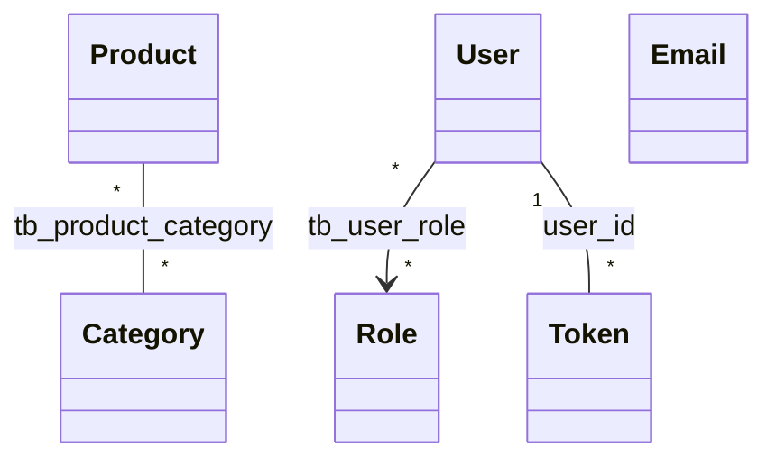

<h1 align="center">🏛️ Capítulo 04 — Domain Modeling, ORM, Business Use Cases & Data Access</h1>

<p align="justify">
<em>
This chapter focuses on designing a robust domain model, implementing real business use cases, optimizing database access strategies, and applying advanced JPA/Hibernate techniques to build enterprise-grade backend applications aligned with real-world business requirements.
</em>
</p>

<p align="center">


<a href="LICENSE"></a>


</p>

<p align="justify">
<em>
Neste capítulo, o projeto <strong>ASJCatalog</strong> vai além do CRUD e implementa o ciclo de vida completo da conta do usuário: cadastro, ativação, recuperação e redefinição de senha e gestão dos próprios dados, com e-mails transacionais e tokens de negócio.

A camada de persistência evolui com <strong>Spring Data JPA</strong>, <strong>JPQL</strong>, consultas nativas, projeções, paginação e filtros dinâmicos, e a listagem de produtos elimina o problema <strong>N+1 Select</strong>. O domínio passa a ser organizado em módulos, com conceitos inspirados em <strong>Domain-Driven Design (DDD)</strong>.

O nome <strong>ASJCatalog</strong> vem das iniciais de <strong>Albert Silva de Jesus</strong>: o projeto nasceu da base do <strong>DSCatalog</strong>, do curso DevSuperior, e evoluiu de forma independente.
</em>

</p>

<p align="center">
<a href="docs/HOME.md"><strong>📖 Documentação técnica</strong></a> · <a href="docs/guides/GETTING-STARTED.md">🚀 Primeiros Passos</a> · <a href="docs/guides/ARCHITECTURE.md">🏗️ Arquitetura</a> · <a href="docs/guides/DATA-ACCESS.md">🔍 Acesso a Dados</a>
</p>

---

## 📑 Sumário

> Navegação do capítulo.

---

| 🧩 Module                                                                       | ⚡ Description                                            |
| ------------------------------------------------------------------------------- | --------------------------------------------------------- |
| [📚 Contexto da Implementação](#-contexto-da-implementação)                     | Ponto de partida e motivação do capítulo                  |
| [🎯 Objetivos](#-objetivos)                                                     | Metas técnicas do capítulo                                |
| [🚀 Como Executar](#-como-executar)                                             | Pré-requisitos e comandos para rodar o projeto localmente |
| [📂 Organização dos Packages](#-organização-dos-packages)                       | Pacotes da aplicação e suas responsabilidades             |
| [🧩 Domínio e Modelagem ORM](#-domínio-e-modelagem-orm)                         | Módulos do domínio, entidades e relacionamentos           |
| [🧠 Conceitos Fundamentais Trabalhados](#-conceitos-fundamentais-trabalhados)   | Conceitos de modelagem e persistência aplicados           |
| [🛠️ Tecnologias e Frameworks Utilizados](#️-tecnologias-e-frameworks-utilizados) | Stack tecnológica e versões                               |
| [🎯 Casos de Uso](#-casos-de-uso)                                               | Fluxos de negócio implementados                           |
| [🔍 Consultas e Otimizações](#-consultas-e-otimizações)                         | A eliminação do N+1 Select na listagem de produtos        |
| [📧 Integração com E-mail](#-integração-com-e-mail)                             | E-mails transacionais e tokens de conta                   |
| [🧱 Boas Práticas Aplicadas](#-boas-práticas-aplicadas)                         | Práticas de engenharia adotadas no projeto                |
| [📈 Evolução Arquitetural](#-evolução-arquitetural)                             | Principais evoluções, inclusive além do tema do capítulo  |
| [🎓 Aprendizados](#-aprendizados)                                               | Conhecimentos consolidados ao longo do capítulo           |
| [💼 Competências Técnicas Desenvolvidas](#-competências-técnicas-desenvolvidas) | Competências praticadas na implementação                  |
| [🏁 Conclusão](#-conclusão)                                                     | Considerações finais                                      |
| [📖 Documentação Técnica](#-documentação-técnica)                               | Onde encontrar os guias técnicos do backend               |
| [📚 Referências Técnicas](#-referências-técnicas)                               | Documentações oficiais e materiais utilizados             |
| [👨‍💻 Autor](#-autor)                                                             | Informações sobre o autor da documentação                 |
| [📎 Contato](#-contato)                                                         | Canais de contato e redes profissionais                   |

---

## 📚 Contexto da Implementação

Com a autenticação e a autorização prontas (Spring Security, OAuth2 e JWT), o ASJCatalog precisava de fluxos de negócio próximos dos de uma aplicação real. Esses fluxos aumentaram o domínio e o volume de consultas, e o capítulo reorganiza as entidades em módulos e passa a planejar cada acesso ao banco.

---

## 🎯 Objetivos

- Reorganizar o domínio em módulos e evoluir a modelagem ORM.
- Implementar o ciclo de vida completo da conta do usuário.
- Integrar e-mails transacionais com tokens de ativação e de recuperação de senha.
- Escrever consultas com JPQL, SQL nativo e projeções, com paginação e filtros.
- Eliminar o problema N+1 na listagem de produtos.
- Manter as regras de negócio nos services e nas entidades, fora dos controllers.

---

## 🚀 Como Executar

**Pré-requisitos:** JDK 17, PostgreSQL com um banco chamado `asjcatalog` e as variáveis de ambiente `POSTGRES_DATASOURCE_USER` e `POSTGRES_DATASOURCE_PASSWORD` com o usuário e a senha do banco.

**PowerShell**:

```powershell
git clone https://github.com/Albertinesilva/backend-engineering-journey-java-springboot.git
cd backend-engineering-journey-java-springboot; git checkout chapter-04-domain-orm
cd backend
.\mvnw spring-boot:run '-Dspring-boot.run.arguments=--spring.mail.test-connection=false'
```

**bash**:

```bash
git clone https://github.com/Albertinesilva/backend-engineering-journey-java-springboot.git
cd backend-engineering-journey-java-springboot && git checkout chapter-04-domain-orm
cd backend
./mvnw spring-boot:run -Dspring-boot.run.arguments=--spring.mail.test-connection=false
```

O último comando sobe a aplicação sem exigir um servidor de e-mail (SMTP). A API fica em `http://localhost:8080`, e a documentação interativa (Swagger) em `http://localhost:8080/docs-asjcatalog.html`.

> [!TIP]
> O passo a passo completo, com criação do banco, usuários de exemplo, obtenção de token e solução de problemas comuns, está em [Primeiros Passos](docs/guides/GETTING-STARTED.md). Para rodar os testes: `./mvnw verify` (veja [Testes](docs/guides/TESTING.md)).

---

## 📂 Organização dos Packages

O código fica em `backend/src/main/java`, no pacote base `com.albertsilva.dev.asjcatalog`:

| Package      | Responsabilidade                                |
| ------------ | ----------------------------------------------- |
| `config`     | Documentação OpenAPI e idiomas das mensagens    |
| `domain`     | Entidades e regras de negócio, em módulos       |
| `dto`        | Entrada (`request`) e saída (`response`) da API |
| `mapper`     | Conversão entre entidades e DTOs                |
| `projection` | Projeções das consultas otimizadas              |
| `repository` | Acesso a dados com Spring Data JPA              |
| `security`   | OAuth2, JWT e leitura do usuário autenticado    |
| `service`    | Casos de uso e exceções de negócio              |
| `util`       | Reordenação de resultados usada contra o N+1    |
| `validation` | Anotações e validadores customizados            |
| `web`        | Controllers REST e tratamento global de erros   |

> [!NOTE]
> A árvore completa de pacotes, o papel de cada tipo de classe e o caminho de uma requisição do controller ao banco estão em [Arquitetura](docs/guides/ARCHITECTURE.md).

---

## 🧩 Domínio e Modelagem ORM

Nas primeiras versões, as entidades ficavam num pacote `entity` e serviam só para mapear tabelas. Neste capítulo, o pacote passou a se chamar `domain`, foi dividido em módulos por assunto e as entidades ganharam regras de negócio próprias. O mapeamento usa **Jakarta Persistence (JPA)**, com o **Hibernate** como provedor ORM.

| Módulo     | Entidades                                              | Responsabilidade                                                  |
| ---------- | ------------------------------------------------------ | ----------------------------------------------------------------- |
| `catalog`  | `Category`, `Product`                                  | Catálogo de produtos e suas categorias                            |
| `user`     | `User`, `Role`                                         | Usuários e perfis de acesso (RBAC, controle de acesso por papéis) |
| `recovery` | `Token`, `Email` e as enums `TokenType`, `EmailStatus` | Ativação de conta, recuperação de senha e registro dos e-mails    |


```mermaid
classDiagram
    Product "*" -- "*" Category : tb_product_category
    User "*" --> "*" Role : tb_user_role
    User "1" -- "*" Token : user_id
    class Email
```

`User` implementa `UserDetails` e `Role` implementa `GrantedAuthority`, do Spring Security. `Email` não tem relacionamento com `User`.

> [!NOTE]
> Campos, relacionamentos, factory methods e regras de cada entidade estão em [Modelo de Domínio](docs/guides/DOMAIN-MODEL.md).

---

## 🧠 Conceitos Fundamentais Trabalhados

| 🧩 Conceito                           | 📖 Aplicação no ASJCatalog                                                                                                               | 🎯 Objetivo                                          |
| ------------------------------------- | ---------------------------------------------------------------------------------------------------------------------------------------- | ---------------------------------------------------- |
| **Domain Modeling (DDD-inspired)**    | Módulos `catalog`, `user` e `recovery`, com regras dentro das entidades, como `User.activate()` e `Token.validate()`.                    | Aproximar o código da linguagem do negócio.          |
| **ORM com JPA e Hibernate**           | Entidades Java mapeadas para tabelas do PostgreSQL, com o Hibernate como provedor.                                                       | Reduzir o SQL manual nas operações de persistência.  |
| **Relacionamentos JPA**               | `@ManyToMany` entre produtos e categorias e entre usuários e roles; `@OneToMany`/`@ManyToOne` entre usuários e tokens.                   | Representar as relações do domínio.                  |
| **Spring Data JPA**                   | Repositórios que estendem `JpaRepository`, com consultas derivadas como `findByNameContainingIgnoreCase()`.                              | Simplificar o acesso aos dados.                      |
| **JPQL**                              | Carregamento de produtos com suas categorias via `JOIN FETCH`.                                                                           | Consultar pelas entidades, sem depender do banco.    |
| **Native SQL**                        | Busca paginada de produtos por nome e categorias e busca do usuário com suas roles no login.                                             | Controlar o SQL em consultas específicas.            |
| **Projection**                        | `ProductProjection` e `UserDetailsProjection` trazem só as colunas usadas.                                                               | Reduzir os dados lidos do banco.                     |
| **Paginação e filtros dinâmicos**     | `Pageable` e `Page` nas listagens de produtos, categorias e usuários, com filtros opcionais.                                             | Escalar as consultas sem duplicar código.            |
| **Fetch Join e N+1**                  | A listagem de produtos usa duas consultas controladas em vez de uma consulta por produto.                                                | Evitar consultas extras do carregamento lazy.        |
| **Service Layer e transações**        | Seis services no pacote `service`, com `@Transactional`; o `AuthenticatedUserService`, em `security.auth`, lê o usuário do JWT.          | Centralizar os casos de uso e garantir consistência. |
| **DTO e Mapper**                      | `record`s de entrada e saída e mappers dedicados; as entidades não saem pela API.                                                        | Desacoplar o domínio do contrato da API.             |
| **Business Tokens e Factory Methods** | `Token.activationToken()` e `Token.passwordRecoveryToken()` criam tokens com validade; a entidade confere tipo, desativação e expiração. | Encapsular as regras dos tokens na própria entidade. |

---

## 🛠️ Tecnologias e Frameworks Utilizados

| 🛠️ Tecnologia                             | 📦 Versão | 📖 Utilização no Projeto                                | 🎯 Objetivo                                          |
| ----------------------------------------- | --------- | ------------------------------------------------------- | ---------------------------------------------------- |
| **Java**                                  | 17 (LTS)  | Linguagem principal                                     | Base da implementação, com recursos como `record`.   |
| **Spring Boot**                           | 3.5       | Framework principal do backend                          | Configuração, inicialização e execução da aplicação. |
| **Spring Web (Spring MVC)**               | 6.2       | API REST                                                | Exposição dos endpoints HTTP.                        |
| **Spring Data JPA**                       | 3.5       | Camada de persistência                                  | Repositórios e consultas.                            |
| **Hibernate ORM**                         | 6.6       | Implementação do JPA                                    | Mapeamento objeto-relacional.                        |
| **PostgreSQL**                            | 42.7      | Banco dos perfis `dev` e `prod` (versão do driver JDBC) | Persistência relacional.                             |
| **H2 Database**                           | 2.3       | Banco em memória, **apenas no perfil `test`**           | Testes automatizados sem banco externo.              |
| **Flyway**                                | 11.7      | Versionamento do banco                                  | Criação e evolução do schema por migrations.         |
| **Bean Validation (Hibernate Validator)** | 8.0       | Validação dos dados de entrada                          | Validações declarativas e validadores customizados.  |
| **Spring Security**                       | 6.5       | Segurança da aplicação                                  | Autenticação e autorização dos recursos REST.        |
| **Spring Authorization Server**           | 1.5       | Servidor OAuth2                                         | Emissão de access tokens e refresh tokens.           |
| **OAuth2 Resource Server**                | 6.5       | Validação dos tokens JWT                                | Proteção dos endpoints com tokens assinados.         |
| **JWT (JSON Web Token)**                  | —         | Tokens assinados com RS256                              | Representar a identidade e as permissões do usuário. |
| **Spring Mail**                           | 6.2       | Envio de e-mails com `JavaMailSender`                   | E-mails de ativação de conta e recuperação de senha. |
| **Thymeleaf**                             | 3.1       | Templates HTML                                          | Corpo HTML dos e-mails.                              |
| **SpringDoc OpenAPI**                     | 2.8       | Documentação automática                                 | Especificação OpenAPI e Swagger UI.                  |
| **Maven (Wrapper)**                       | 3.9       | Build do projeto (`mvnw`)                               | Dependências e ciclo de build sem instalar o Maven.  |
| **JUnit**                                 | 5.12      | Testes automatizados                                    | Base dos testes de unidade e de integração.          |
| **Mockito**                               | 5.17      | Testes de unidade                                       | Substituir dependências por mocks.                   |
| **Spring Security Test e MockMvc**        | 6.5 / 6.2 | Testes de segurança e da camada web                     | Simular requisições, autenticação e autorização.     |
| **Maven Failsafe**                        | 3.5       | Testes de integração                                    | Executar as classes `*IT` na fase `verify`.          |
| **Spring Boot DevTools**                  | 3.5       | Desenvolvimento local                                   | Reinício automático ao alterar o código.             |

---

## 🎯 Casos de Uso

Além do CRUD, o ASJCatalog implementa fluxos completos de negócio. Os controllers expõem os endpoints e disparam a validação da entrada (`@Valid`); os services aplicam as regras de negócio, abrem as transações e acionam os tokens e os e-mails.

| Caso de Uso                        | Descrição                                                                                                                               |
| ---------------------------------- | --------------------------------------------------------------------------------------------------------------------------------------- |
| 👤 **Gerenciamento de Usuários**   | Cadastro, consulta, atualização, ativação, desativação e remoção de usuários por administradores, com criptografia de senhas e perfis.  |
| 🛍️ **Gerenciamento de Produtos**   | Cadastro, consulta, atualização, ativação, desativação e remoção de produtos, com categorias, paginação e filtros por nome e categoria. |
| 🗂️ **Gerenciamento de Categorias** | Cadastro, consulta, atualização, ativação, desativação e remoção das categorias do catálogo.                                            |
| 🔐 **Registro de Conta**           | Criação de novas contas com a role `ROLE_OPERATOR`, geração de token de ativação e envio de e-mail de confirmação.                      |
| ✉️ **Ativação de Conta**           | Validação do token de ativação, habilitação da conta e invalidação do token utilizado.                                                  |
| 🔄 **Reenvio de Ativação**         | Geração de um novo token de ativação para usuários que ainda não confirmaram o cadastro.                                                |
| 🔑 **Recuperação de Senha**        | Solicitação de redefinição de senha mediante geração de token temporário e envio de e-mail transacional.                                |
| 🔒 **Redefinição de Senha**        | Validação do token de recuperação, atualização segura da senha e invalidação do token utilizado.                                        |
| 👤 **Usuário Autenticado**         | Consulta e atualização dos próprios dados e troca da própria senha, a partir do usuário identificado no token.                          |
| 🔑 **Autenticação**                | Login com OAuth2 e JWT, renovação por refresh token e autorização baseada em papéis (RBAC).                                             |

> [!NOTE]
> Os fluxos de conta estão em [Fluxos de Conta](docs/guides/ACCOUNT-FLOWS.md), todas as rotas em [Endpoints da API](docs/guides/API-ENDPOINTS.md) e a responsabilidade de cada service em [Arquitetura](docs/guides/ARCHITECTURE.md#services).

---

## 🔍 Consultas e Otimizações

O destaque de desempenho do capítulo é a listagem de produtos, que combina SQL nativo, projeção, JPQL e paginação.

### 🚀 Eliminação do N+1 Select

O **problema N+1** acontece quando o sistema faz 1 consulta para buscar uma lista e depois mais 1 consulta para cada item, para carregar dados relacionados. Com 20 produtos na página, seriam 21 consultas só para trazer as categorias.

A listagem de produtos resolve isso com **duas consultas controladas e uma reordenação**:


```mermaid
flowchart LR
    A["1ª consulta (Native SQL + Projection)<br/>página de ids e nomes"] --> B["2ª consulta (JPQL + JOIN FETCH)<br/>produtos com categorias"]
    B --> C["IdentifiableUtils.reorderByReference<br/>ordem da paginação"]
    C --> D["DTOs de resposta"]
```

1. A consulta nativa aplica filtros e paginação e devolve só o id e o nome de cada produto (`ProductProjection`).
2. A consulta JPQL com `JOIN FETCH` carrega esses produtos e suas categorias de uma vez.
3. `IdentifiableUtils.reorderByReference()` devolve a ordem original da paginação.

> [!TIP]
> Os tipos de consulta, as projeções, a paginação, o uso de `open-in-view=false` e as transações estão em [Acesso a Dados](docs/guides/DATA-ACCESS.md).

---

## 📧 Integração com E-mail

Os fluxos de ativação de conta e de recuperação de senha enviam e-mails HTML com **Spring Mail** e templates **Thymeleaf**:

```text
AccountService ──► TokenService   (cria o token de ativação ou de recuperação)
      │
      └──────────► EmailService ──► Template Thymeleaf ──► Servidor SMTP ──► Usuário
```

- O envio de e-mail é síncrono: a requisição espera o envio terminar.
- O token de ativação vale 24 horas e o de recuperação, 30 minutos; os dois prazos são configuráveis por variáveis de ambiente.
- Cada envio bem-sucedido é registrado na entidade `Email`.

> [!NOTE]
> Os fluxos completos, os templates e como testar sem servidor de e-mail estão em [Fluxos de Conta](docs/guides/ACCOUNT-FLOWS.md).

---

## 🧱 Boas Práticas Aplicadas

| Boa prática                        | Aplicação no projeto                                                                                                       |
| ---------------------------------- | -------------------------------------------------------------------------------------------------------------------------- |
| **Arquitetura em Camadas**         | Controller → Service → Repository; cada camada conversa só com a vizinha.                                                  |
| **Validação Declarativa**          | Bean Validation nos DTOs, com validadores customizados (e-mail único, senha forte), executada pelo `@Valid` no controller. |
| **Tratamento Global de Exceções**  | `ControllerExceptionHandler` converte as exceções em `ProblemDetails` com um código estável (`ApiErrorCode`).              |
| **Internacionalização**            | Mensagens da API em português, inglês e espanhol, escolhidas pelo cabeçalho `Accept-Language`.                             |
| **Configuração por Perfis**        | Perfis `dev`, `test` e `prod`; no `prod`, segredos e credenciais vêm de variáveis de ambiente, sem valor padrão.           |
| **Open Session in View Desligado** | Os dados são carregados dentro dos services, sem consultas escondidas na camada web.                                       |
| **Migrations Versionadas**         | Flyway com as pastas `schema`, `reference` e `data`; os dados de exemplo não chegam à produção.                            |
| **Testes Automatizados**           | Testes de unidade e de integração, separados pelo nome da classe: `*Test` e `*Tests` no Surefire e `*IT` no Failsafe.      |
| **Documentação da API**            | OpenAPI e Swagger UI em `/docs-asjcatalog.html` nos perfis `dev` e `test`.                                                 |

---

## 📈 Evolução Arquitetural

O ASJCatalog deixou de ser uma aplicação centrada na persistência de entidades e passou a ser organizado em torno dos conceitos do negócio:

- Entidades com regras próprias, organizadas em módulos de domínio.
- Serviços especializados para conta, tokens, e-mail e usuário autenticado.
- Consultas planejadas para cada listagem, em vez do carregamento padrão do ORM.

### 🔧 Além do tema do capítulo

Durante este capítulo, o projeto também recebeu melhorias de infraestrutura que vão além da modelagem de domínio:

- **Perfis `dev`, `test` e `prod`**, com `dev` como padrão e um perfil `prod` seguro: sem valores padrão para segredos e com Swagger e console do H2 desligados. Veja [Configuração e Perfis](docs/guides/CONFIGURATION.md).
- **Migrations separadas em `schema`, `reference` e `data`**, para que os dados de exemplo nunca cheguem à produção. Veja [Migrations](docs/guides/DATABASE-MIGRATIONS.md).
- **Testes de integração com o Maven Failsafe**, executados na fase `verify`. Veja [Testes](docs/guides/TESTING.md).
- **Internacionalização em pt-BR, en e es**, com testes que garantem a consistência das mensagens e a escolha do idioma. Veja [Internacionalização](docs/guides/INTERNATIONALIZATION.md).
- **Ampliação da suíte de testes**, com testes de conta, autorização, CORS, OAuth2 e consultas nativas. Veja [Testes](docs/guides/TESTING.md#6-o-que-cada-grupo-cobre).
- **Renomeação do pacote base** para `com.albertsilva.dev.asjcatalog`. Veja [Arquitetura](docs/guides/ARCHITECTURE.md#5-origem-do-nome).
- **Reorganização da documentação** em guias técnicos, contrato de segurança e histórico de auditorias. Veja o [Índice da Documentação](docs/HOME.md).

---

## 🎓 Aprendizados

- Uma entidade pode guardar regras do negócio, e não apenas mapear colunas.
- O carregamento lazy esconde consultas; desligar o open-in-view torna esse custo visível.
- Paginação e `JOIN FETCH` de coleções não combinam na mesma consulta, e por isso a listagem usa duas.
- Projeções evitam carregar a entidade inteira quando só algumas colunas são necessárias.
- Fluxos de conta exigem cuidado com o que a resposta revela, como na recuperação de senha, que sempre responde da mesma forma.
- Tokens de uso único precisam de tipo, validade e invalidação explícitos.

---

## 💼 Competências Técnicas Desenvolvidas

- Modelagem de entidades e relacionamentos com JPA e Hibernate.
- Escrita de consultas com Spring Data JPA, JPQL e SQL nativo.
- Diagnóstico e correção do N+1 Select em listagens paginadas.
- Implementação de casos de uso em uma camada de serviços transacional.
- Envio de e-mails transacionais com Spring Mail e Thymeleaf.
- Integração do domínio com Spring Security, OAuth2 e JWT.
- Versionamento do banco com Flyway.
- Documentação da API com OpenAPI e Swagger.

---

## 🏁 Conclusão

Este capítulo levou o ASJCatalog a um backend mais próximo dos padrões corporativos: um domínio organizado em módulos, fluxos de conta completos, e-mails transacionais e consultas planejadas para desempenho. Com essa base, a aplicação está preparada para receber novos requisitos sem perder organização nem manutenibilidade.

---

## 📖 Documentação Técnica

> [!TIP]
> Os guias técnicos do backend (primeiros passos, configuração, arquitetura, domínio, acesso a dados, endpoints, autenticação, testes e outros), o contrato de segurança e o histórico de auditorias estão reunidos no [Índice da Documentação](docs/HOME.md).

---

## 📚 Referências Técnicas

### 🔹 Spring Boot

- https://docs.spring.io/spring-boot/documentation.html
- https://spring.io/projects/spring-boot

---

### 🔹 Spring Data JPA e Persistência

- https://spring.io/projects/spring-data-jpa
- https://docs.spring.io/spring-data/jpa/reference/
- https://jakarta.ee/specifications/persistence/
- https://hibernate.org/orm/documentation/

---

### 🔹 Hibernate ORM

- https://hibernate.org/orm/
- https://docs.jboss.org/hibernate/orm/current/userguide/html_single/Hibernate_User_Guide.html

---

### 🔹 PostgreSQL

- https://www.postgresql.org/docs/

---

### 🔹 Flyway

- https://flywaydb.org/documentation/
- https://documentation.red-gate.com/flyway

---

### 🔹 Spring Mail e Thymeleaf

- https://docs.spring.io/spring-framework/reference/integration/email.html
- https://www.thymeleaf.org/documentation.html

---

### 🔹 OpenAPI e Swagger

- https://swagger.io/specification/
- https://springdoc.org/

---

### 🔹 Domain-Driven Design (DDD)

- https://domainlanguage.com/ddd/
- Eric Evans — _Domain-Driven Design: Tackling Complexity in the Heart of Software_

---

### 🔹 Arquitetura e Padrões

- Martin Fowler — _Patterns of Enterprise Application Architecture_
- https://martinfowler.com/eaaCatalog/

---

## 👨‍💻 Autor

**Albert Silva de Jesus**  
Desenvolvedor Backend Java | Spring Boot

---

## 📎 Contato

[](https://www.linkedin.com/in/albert-backend-java-spring-boot/)
[](mailto:albertinesilva.17@gmail.com)
