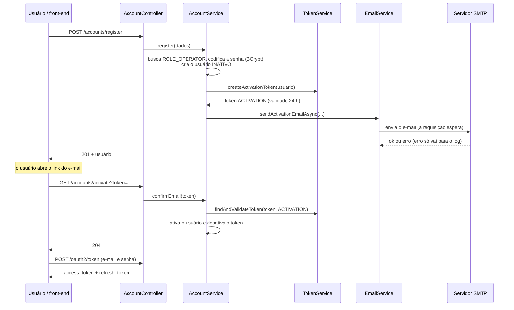
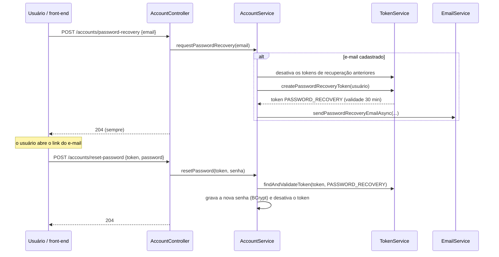

# Fluxos de conta

⬅️ Anterior: [Autenticação e autorização](AUTHENTICATION.md) · [🏠 Índice](../HOME.md) · Próximo: [Testes](TESTING.md) ➡️

Este guia descreve o ciclo de vida da conta do usuário: cadastro, ativação, reenvio de ativação, recuperação e redefinição de senha, consulta e alteração dos próprios dados, além dos tokens de conta e do envio de e-mails.

## Sumário

1. [Visão geral](#1-visão-geral)
2. [Cadastro, ativação e login](#2-cadastro-ativação-e-login)
3. [Reenvio de ativação](#3-reenvio-de-ativação)
4. [Recuperação e redefinição de senha](#4-recuperação-e-redefinição-de-senha)
5. [Dados da própria conta](#5-dados-da-própria-conta)
6. [Tokens de conta](#6-tokens-de-conta)
7. [E-mails](#7-e-mails)
8. [Testar os fluxos sem servidor de e-mail](#8-testar-os-fluxos-sem-servidor-de-e-mail)
9. [Limitações conhecidas](#9-limitações-conhecidas)

## 1. Visão geral

Todos os endpoints ficam em `/api/v1/accounts`, no `AccountController`, e a lógica fica no `AccountService`.

| Fluxo | Endpoint | Token de acesso |
| --- | --- | --- |
| Cadastro | `POST /register` | Não |
| Ativação | `GET /activate?token=...` | Não |
| Reenvio de ativação | `POST /resend-activation` | Não |
| Pedido de recuperação de senha | `POST /password-recovery` | Não |
| Redefinição de senha | `POST /reset-password` | Não |
| Consultar os próprios dados | `GET /me` | Sim |
| Alterar os próprios dados | `PUT /me` | Sim |
| Trocar a própria senha | `PATCH /me/password` | Sim |
| Desativar a própria conta | `POST /deactivate` | Sim; **não implementado** |

Status, corpos e erros de cada endpoint: [API-ENDPOINTS.md](API-ENDPOINTS.md#5-conta). Regras de validação dos dados: [VALIDATION.md](VALIDATION.md).

## 2. Cadastro, ativação e login



**Cadastro** (`POST /accounts/register`, corpo `firstName`, `lastName`, `email`, `password`):

1. Os dados passam pela validação: e-mail com registro MX e ainda não cadastrado, senha forte e sem dados pessoais.
2. O usuário é criado **inativo**, com a senha codificada em BCrypt e a role `ROLE_OPERATOR`.
3. Um token de ativação é criado e enviado por e-mail.
4. A resposta é `201` com o usuário criado.

**Ativação** (`GET /accounts/activate?token=...`): valida o token (tipo `ACTIVATION`, não desativado, não expirado), ativa o usuário e desativa o token. Resposta `204`.

**Login:** só depois da ativação. Antes disso, `POST /oauth2/token` responde `invalid_grant` com a mensagem `Your account has not been activated yet. Please check your email.` Veja [AUTHENTICATION.md](AUTHENTICATION.md).

## 3. Reenvio de ativação

`POST /accounts/resend-activation` com `{"email": "..."}`:

- se o e-mail não existe, ou se a conta já está ativa, não faz nada;
- caso contrário, **desativa todos os tokens de ativação ainda válidos** do usuário, cria um novo e envia outro e-mail.

A resposta é sempre `204`, para não revelar se o e-mail está cadastrado.

## 4. Recuperação e redefinição de senha



**Pedido** (`POST /accounts/password-recovery` com `{"email": "..."}`): se o e-mail existe, desativa os tokens de recuperação anteriores, cria um novo e envia o e-mail. Responde `204` mesmo quando o e-mail não existe.

**Redefinição** (`POST /accounts/reset-password` com `{"token": "...", "password": "..."}`): valida o token (tipo `PASSWORD_RECOVERY`), grava a nova senha codificada e desativa o token. Resposta `204`.

## 5. Dados da própria conta

Estes endpoints atuam sobre o usuário dono do token. O `AuthenticatedUserService` lê o claim `userId` do token e carrega o usuário do banco.

| Endpoint | O que faz |
| --- | --- |
| `GET /accounts/me` | Devolve `id`, `firstName`, `lastName`, `email` e `roles` |
| `PUT /accounts/me` | Altera `firstName`, `lastName` e `email`. Os nomes são gravados sem espaços nas pontas, e o e-mail em minúsculas. O e-mail não pode pertencer a outro usuário |
| `PATCH /accounts/me/password` | Troca a senha (abaixo) |

**Troca de senha** (`PATCH /accounts/me/password`, corpo `currentPassword`, `newPassword`, `confirmPassword`). Além das regras de senha forte e de tamanho, o service confere, nesta ordem:

1. `newPassword` igual a `confirmPassword`;
2. `currentPassword` igual à senha atual;
3. `newPassword` diferente da senha atual.

Se alguma falha, a resposta é `422` com `code` igual a `PASSWORD_UPDATE_ERROR`. Em caso de sucesso, `204`.

**Desativar a própria conta** (`POST /accounts/deactivate`): o endpoint existe, mas o service só lança `UnsupportedOperationException`, e a resposta é `500`.

## 6. Tokens de conta

Os tokens de conta são registros da tabela `tb_token` (entidade `Token`, detalhada em [DOMAIN-MODEL.md](DOMAIN-MODEL.md#7-token)), enviados por e-mail dentro de um link. **Não confunda** com o token JWT de login.

| Tipo | Criado em | Validade | Variável |
| --- | --- | --- | --- |
| `ACTIVATION` | Cadastro e reenvio de ativação | 24 horas | `ACTIVATION_TOKEN_HOURS` |
| `PASSWORD_RECOVERY` | Pedido de recuperação de senha | 30 minutos | `PASSWORD_RECOVER_TOKEN_MINUTES` |

O valor do token é um UUID aleatório.

**Um token válido por vez.** Antes de criar um token novo, o reenvio de ativação e o pedido de recuperação desativam os tokens do mesmo tipo que ainda estavam ativos. Um token usado com sucesso também é desativado.

**Validação.** Ao usar um token, o `TokenService` o busca pelo valor e confere as regras nesta ordem:

| Situação | Resposta |
| --- | --- |
| Token não encontrado | `404`, `RESOURCE_NOT_FOUND` |
| Tipo errado (por exemplo, token de recuperação na ativação) | `400`, `INVALID_TOKEN` |
| Token desativado | `400`, `INVALID_TOKEN` |
| Token expirado | `400`, `INVALID_TOKEN` |

## 7. E-mails

**O envio é síncrono.** Os métodos de envio do `EmailService` se chamam `sendActivationEmailAsync` e `sendPasswordRecoveryEmailAsync` e têm a anotação `@Async`, mas o projeto não tem `@EnableAsync`, e sem ela a anotação não tem efeito. Na prática, **a requisição espera o envio terminar** antes de responder. Se o envio falha, o erro é registrado no log e a requisição responde normalmente, sem avisar o cliente.

**Montagem.** O corpo do e-mail é HTML, gerado pelo **Thymeleaf** (motor de templates que preenche um HTML com variáveis) a partir dos arquivos em `backend/src/main/resources/templates`:

| Template | Usado em | Assunto | Link enviado |
| --- | --- | --- | --- |
| `activate_user_by_email_template.html` | Cadastro e reenvio de ativação | `Confirmação de Cadastro` | `FRONTEND_URL/activate-account?token=...` |
| `reset_password_email_template.html` | Recuperação de senha | `Redefinição de Senha` | `FRONTEND_URL/reset-password?token=...` |

O remetente no cabeçalho é `nao-responder@asjcatalog.com.br`, e o logo (`static/image/logo-ASJ-Catalog-favicon.ico`) vai embutido no e-mail.

**Os links apontam para o front-end** (`FRONTEND_URL`, padrão `http://localhost:5173`), que não faz parte deste repositório. Espera-se que o front-end leia o `token` da URL e chame a API: `GET /api/v1/accounts/activate?token=...` ou `POST /api/v1/accounts/reset-password`.

**SMTP.** Servidor, porta e credenciais vêm de `MAIL_HOST`, `MAIL_PORT`, `MAIL_USERNAME` e `MAIL_PASSWORD` (veja [CONFIGURATION.md](CONFIGURATION.md#4-variáveis-de-ambiente)). A aplicação testa a conexão ao subir (nos perfis `dev` e `prod`); como subir sem credenciais está em [GETTING-STARTED.md](GETTING-STARTED.md#5-servidor-de-e-mail-smtp).

**Registro.** Depois de cada envio bem-sucedido, o `EmailService` grava uma linha em `tb_email` (entidade `Email`).

## 8. Testar os fluxos sem servidor de e-mail

Quando a aplicação sobe sem credenciais de e-mail, o e-mail não chega, mas o token fica gravado. Para ativar uma conta cadastrada:

1. Consulte o token no banco:

   ```powershell
   psql -U postgres -d asjcatalog -c "SELECT t.token, t.type, t.expire_date FROM tb_token t JOIN tb_user u ON u.id = t.user_id WHERE u.email = 'novo.usuario@gmail.com' AND t.disabled = false;"
   ```

2. Chame a ativação com esse valor:

   ```powershell
   curl.exe -s -i "http://localhost:8080/api/v1/accounts/activate?token=VALOR_DO_TOKEN"
   ```

O mesmo vale para a recuperação de senha: o token `PASSWORD_RECOVERY` vai no corpo de `POST /accounts/reset-password`.

## 9. Limitações conhecidas

- **Envio síncrono.** A requisição de cadastro, reenvio ou recuperação fica esperando o servidor SMTP.
- **Falha de envio silenciosa.** O cliente recebe sucesso mesmo quando o e-mail não foi enviado; o erro só aparece no log.
- **Desativação da própria conta não implementada.** `POST /accounts/deactivate` sempre responde 500 com token (403 sem token).
- **Trocar a senha não encerra as sessões.** Depois de `reset-password` ou `me/password`, os tokens JWT já emitidos continuam válidos até vencer.
- **Mudança de e-mail e token.** Depois de `PUT /me` com e-mail novo, o login passa a usar o e-mail novo, mas o token atual continua funcionando (a API identifica o usuário pelo `userId`), e o claim `username` desse token mostra o e-mail antigo.
- **Template não usado.** `reactivate_user_by_email_template.html` existe, mas nenhum código o usa: o reenvio de ativação usa o template do cadastro.
- **Parágrafo vazio no e-mail de senha.** O template de redefinição exibe a variável `texto`, que o código não preenche para esse e-mail.
- **Registro de e-mail incompleto.** Veja as limitações de `Email` em [DOMAIN-MODEL.md](DOMAIN-MODEL.md#9-limitações-conhecidas).

---

⬅️ Anterior: [Autenticação e autorização](AUTHENTICATION.md) · [🏠 Índice](../HOME.md) · Próximo: [Testes](TESTING.md) ➡️
