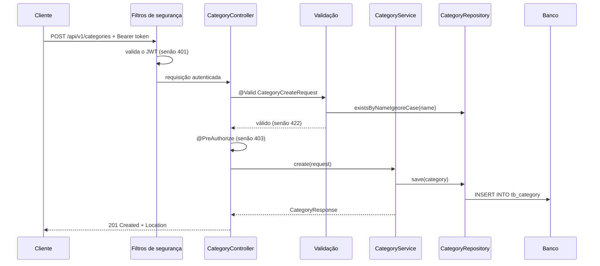

# Arquitetura

Este guia mostra como o backend do ASJCatalog está organizado em camadas e pacotes no capítulo 03, e o caminho que uma requisição percorre pela segurança, pela validação e pelas camadas até o banco.

## Sumário

1. [Camadas](#1-camadas)
2. [Pacotes](#2-pacotes)
3. [Caminho de uma requisição](#3-caminho-de-uma-requisição)
4. [Onde fica cada tipo de classe](#4-onde-fica-cada-tipo-de-classe)
5. [Origem do nome](#5-origem-do-nome)
6. [Limitações conhecidas](#6-limitações-conhecidas)

## 1. Camadas

A aplicação segue uma **arquitetura em camadas**: cada camada tem uma responsabilidade e só conversa com a camada vizinha.


| Camada | Pacote | Responsabilidade |
| --- | --- | --- |
| Web (controladores REST) | `web.controller` | Recebe a requisição HTTP e devolve a resposta. Declara as permissões de cada rota com `@PreAuthorize` |
| Serviço | `service` | Executa as operações de negócio e define as **transações** |
| Acesso a dados | `repository` | Lê e grava no banco por meio do Spring Data JPA |
| Entidades | `entity` | Classes mapeadas para as tabelas do banco |

Uma **transação** é um grupo de operações no banco que acontece por inteiro ou não acontece: se algo falha no meio, tudo é desfeito.

Entre as camadas circulam **DTOs** (*Data Transfer Objects*): classes simples que representam o que entra e o que sai da API. Os controllers nunca recebem nem devolvem entidades.

Neste capítulo, duas partes envolvem as camadas do diagrama:

- **Segurança** (`security`): filtros que rodam antes do controller, emitem e validam tokens e decidem quem pode acessar cada rota. Veja [AUTHENTICATION.md](AUTHENTICATION.md).
- **Validação** (`validation`): anotações e validadores que conferem os DTOs de entrada antes de o controller ser executado. Veja [VALIDATION.md](VALIDATION.md).

O **tratamento de erros** (`web.exception`) transforma as exceções em respostas HTTP padronizadas. Veja [ERROR-HANDLING.md](ERROR-HANDLING.md).

## 2. Pacotes

Todo o código fica em `backend/src/main/java`, no pacote base `com.albertsilva.dev.asjcatalog`:

```text
com.albertsilva.dev.asjcatalog
├── AsjcatalogApplication                classe principal (método main)
├── config                               configuração do Swagger/OpenAPI
├── dto
│   ├── category/request e response      entrada e saída de categorias
│   ├── product/request e response       entrada e saída de produtos
│   ├── user/request e response          entrada e saída de usuários
│   └── role/response                    RoleResponse
├── entity                               Category, Product, User e Role
├── mapper                               CategoryMapper, ProductMapper e UserMapper
├── projection                           UserDetailsProjection (consulta de login)
├── repository                           Category, Product, User e RoleRepository
├── security
│   ├── config                           SecurityBeansConfig (PasswordEncoder)
│   ├── oauth2
│   │   ├── authorization/config         AuthorizationServerConfig
│   │   ├── grant/password               password grant customizado (converter, provider e token)
│   │   └── resource/config              ResourceServerConfig (rotas, JWT e CORS)
│   └── userdetails                      AuthenticatedUser
├── service                              CategoryService, ProductService e UserService
│   └── exception                        ResourceNotFoundException e DatabaseException
├── validation
│   ├── category, product, role, user    cada um com annotation e validator
└── web
    ├── controller                       CategoryController, ProductController e UserController
    └── exception
        ├── enums                        ErrorType (títulos de erro)
        ├── handler                      ControllerExceptionHandler
        └── response                     ProblemDetails, ValidationError e FieldMessage
```

Os recursos ficam em `backend/src/main/resources`: arquivos `application*.properties`, `ValidationMessages.properties`, `META-INF/additional-spring-configuration-metadata.json`, o `banner-dev.txt`, as migrations em `db/migration/schema` e `db/migration/data` e o `import.sql` do perfil `test`.

Os testes ficam em `backend/src/test/java`, com subpacotes que espelham os do código principal. O mapa completo está em [TESTING.md](TESTING.md#3-mapa-dos-pacotes-de-teste).

## 3. Caminho de uma requisição

Exemplo real: `POST /api/v1/categories`, que cria uma categoria e exige ADMIN ou OPERATOR.



Passo a passo:

1. **Filtros.** A cadeia do Resource Server confere se a rota é pública. Como não é, exige um JWT válido no cabeçalho `Authorization`; sem ele, responde 401 ali mesmo.
2. **Validação.** O Spring converte o JSON em `CategoryCreateRequest` e executa as anotações, inclusive o validador que consulta o banco para saber se o nome já existe. Se algo falha, responde 422.
3. **Autorização.** O `@PreAuthorize("hasRole('ADMIN') or hasRole('OPERATOR')")` confere as roles do token; sem elas, responde 403. Essa checagem acontece depois da validação (veja [VALIDATION.md](VALIDATION.md#9-limitações-conhecidas)).
4. **Service e repositório.** `CategoryService.create` abre uma transação, marca a categoria como ativa e a grava.
5. **Resposta.** O controller devolve 201, o cabeçalho `Location` com o endereço da nova categoria e o `CategoryResponse` em JSON.

## 4. Onde fica cada tipo de classe

| Tipo | Pacote | O que é | Por que fica ali |
| --- | --- | --- | --- |
| Entidade | `entity` | Classe mapeada para uma tabela | Reúne as classes de persistência. Veja [DOMAIN-MODEL.md](DOMAIN-MODEL.md) |
| DTO | `dto.<recurso>.request` e `.response` | Formato da entrada e da saída da API (todos são `record`, classes imutáveis do Java) | Separar entrada de saída deixa claro o que o cliente envia e o que recebe |
| Mapper | `mapper.<recurso>` | Converte entre entidade e DTO | Tira a conversão do controller e do service |
| Projection | `projection` | Interface que recebe o resultado de uma consulta nativa | Usada no login, para trazer e-mail, senha e roles numa só consulta |
| Repositório | `repository` | Interface que estende `JpaRepository` | O Spring Data JPA gera a implementação. Veja [DATA-ACCESS.md](DATA-ACCESS.md) |
| Service | `service` | Operações de negócio | Único lugar que abre transações. O `UserService` também implementa `UserDetailsService`, usado no login |
| Validação | `validation.<recurso>.annotation` e `.validator` | Anotações customizadas e as classes com as regras | Separadas por recurso, perto dos DTOs que validam |
| Segurança | `security` | Configuração do Authorization Server, do Resource Server e do password grant | Isolada das camadas de negócio |
| Tratamento de erro | `web.exception` | Handler global e formatos das respostas de erro | Transforma exceções em respostas HTTP |
| Configuração | `config` e `security.config` | Classes `@Configuration` | Configurações globais |

Services, controllers e validadores recebem as dependências pelo **construtor**. É essa forma que permite aos testes criar as classes com dependências simuladas.

## 5. Origem do nome

O nome ASJCatalog vem das iniciais de Albert Silva de Jesus: o projeto nasceu da base do DSCatalog, do curso DevSuperior, e evoluiu de forma independente.

As URLs das imagens dos produtos, nos dados de exemplo, ainda apontam para o repositório externo `devsuperior/dscatalog-resources`, de onde as imagens são carregadas.

## 6. Limitações conhecidas

- **Authorization Server e Resource Server na mesma aplicação.** Os dois papéis rodam no mesmo processo, em cadeias de filtros diferentes. Continua no capítulo 04.
- **Entidades em `entity`.** As entidades ficam num pacote único; a organização por subdomínios (`domain.catalog`, `domain.user`...) chega no capítulo 04.
- **Validação antes da autorização.** No caminho da seção 3, a validação do corpo acontece antes do `@PreAuthorize`. Continua no capítulo 04.
