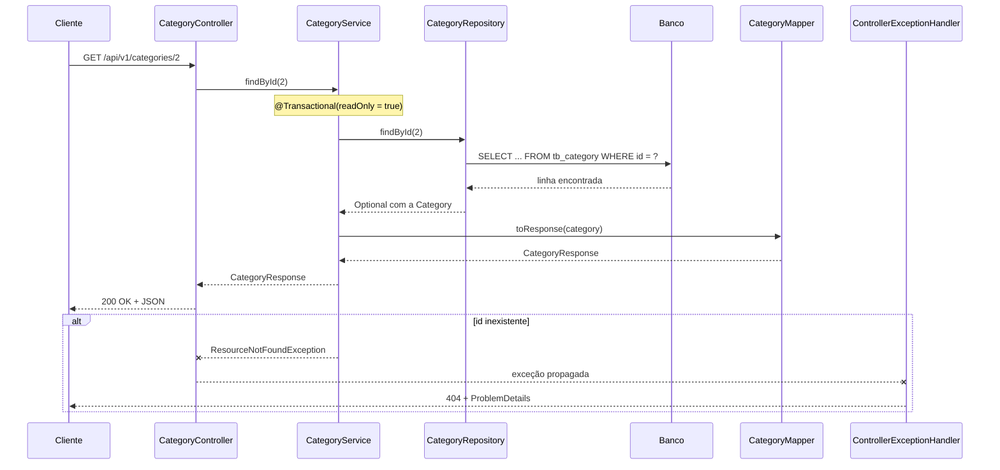

# Arquitetura

Este guia mostra como o backend do ASJCatalog está organizado em camadas e pacotes no capítulo 02, e o caminho que uma requisição percorre do controller até o banco e de volta.

## Sumário

1. [Camadas](#1-camadas)
2. [Pacotes](#2-pacotes)
3. [Caminho de uma requisição](#3-caminho-de-uma-requisição)
4. [Onde fica cada tipo de classe](#4-onde-fica-cada-tipo-de-classe)
5. [Origem do nome](#5-origem-do-nome)
6. [Limitações conhecidas](#6-limitações-conhecidas)

## 1. Camadas

A aplicação segue uma **arquitetura em camadas**: cada camada tem uma responsabilidade e só conversa com a camada vizinha.


| Camada | Pacote | Responsabilidade |
| --- | --- | --- |
| Web (controladores REST) | `web.controller` | Recebe a requisição HTTP e devolve a resposta. Não contém regra de negócio |
| Serviço | `service` | Executa as operações de negócio e define as **transações** |
| Acesso a dados | `repository` | Lê e grava no banco por meio do Spring Data JPA |
| Entidades | `entity` | Classes mapeadas para as tabelas do banco |

Uma **transação** é um grupo de operações no banco que acontece por inteiro ou não acontece: se algo falha no meio, tudo é desfeito. No diagrama, ela envolve as camadas de serviço e de acesso a dados porque é aberta nos métodos dos services.

Entre as camadas circulam **DTOs** (*Data Transfer Objects*): classes simples que representam o que entra e o que sai da API. Os controllers nunca recebem nem devolvem entidades.

Fora das camadas do diagrama fica o **tratamento de erros** (`web.exception`), que transforma as exceções lançadas nos services em respostas HTTP padronizadas. Veja [ERROR-HANDLING.md](ERROR-HANDLING.md).

A separação em camadas é o que permite testar cada parte isoladamente: o service é testado com o repositório simulado, e o controller com o service simulado. Veja [TESTING.md](TESTING.md#2-tipos-de-teste-e-a-pirâmide).

## 2. Pacotes

Todo o código fica em `backend/src/main/java`, no pacote base `com.albertsilva.dev.asjcatalog`:

```text
com.albertsilva.dev.asjcatalog
├── AsjcatalogApplication                classe principal (método main)
├── config                               configuração do Swagger/OpenAPI
├── dto
│   ├── category/request                 entrada de categorias
│   ├── category/response                saída de categorias
│   ├── product/request                  entrada de produtos
│   └── product/response                 saída de produtos
├── entity                               entidades Category e Product
├── mapper
│   ├── category                         CategoryMapper
│   └── product                          ProductMapper
├── repository                           CategoryRepository e ProductRepository
├── service                              CategoryService e ProductService
│   └── exception                        ResourceNotFoundException e DatabaseException
└── web
    ├── controller                       CategoryController e ProductController
    └── exception
        ├── enums                        ErrorType (títulos de erro)
        ├── handler                      ControllerExceptionHandler
        └── response                     ProblemDetails
```

Os recursos ficam em `backend/src/main/resources`: arquivos `application*.properties`, o `banner-dev.txt`, as migrations em `db/migration/schema` e `db/migration/data` e o `import.sql` do perfil `test`.

Os testes ficam em `backend/src/test/java`, no mesmo pacote base, com subpacotes que espelham os do código principal (`entity`, `repository`, `service`, `web.controller`), mais `factory` e `integrations`. O mapa completo está em [TESTING.md](TESTING.md#3-mapa-dos-pacotes-de-teste).

## 3. Caminho de uma requisição

Exemplo real: `GET /api/v1/categories/{id}`, que busca uma categoria pelo id.



Passo a passo:

1. **Controller.** `CategoryController.findById` recebe o id da URL e chama o service. Não acessa o banco.
2. **Service.** `CategoryService.findById` abre uma transação somente leitura e pede a entidade ao repositório.
3. **Repositório.** `CategoryRepository.findById`, herdado do Spring Data JPA, gera o SQL e devolve um `Optional<Category>`.
4. **Mapper.** `CategoryMapper.toResponse` converte a entidade no DTO `CategoryResponse` (`id`, `name`, `description`, `active`).
5. **Resposta.** O Spring converte o DTO em JSON com status 200.
6. **Erro.** Se o id não existe, o service lança `ResourceNotFoundException("Entity not found id: 2")`. O `ControllerExceptionHandler` captura a exceção e devolve 404 com um corpo `ProblemDetails`.

Os dois lados desse caminho têm teste: `CategoryControllerTest.findByIdShouldReturnNotFoundWhenIdDoesNotExist` simula o erro no service, e `CategoryControllerIT` faz a requisição real até o banco.

## 4. Onde fica cada tipo de classe

| Tipo | Pacote | O que é | Por que fica ali |
| --- | --- | --- | --- |
| Entidade | `entity` | Classe mapeada para uma tabela | Reúne as classes de persistência. Veja [DOMAIN-MODEL.md](DOMAIN-MODEL.md) |
| DTO | `dto.<recurso>.request` e `.response` | Formato da entrada e da saída da API (todos são `record`, classes imutáveis do Java) | Separar entrada de saída deixa claro o que o cliente envia e o que recebe, e impede que a API exponha as entidades |
| Mapper | `mapper.<recurso>` | Converte entre entidade e DTO | Tira a conversão do controller e do service; cada mapper é um `@Component` injetado onde é usado |
| Repositório | `repository` | Interface que estende `JpaRepository` | O Spring Data JPA gera a implementação em tempo de execução. Veja [DATA-ACCESS.md](DATA-ACCESS.md) |
| Service | `service` | Operações de negócio | Único lugar que abre transações |
| Exceção de negócio | `service.exception` | Erros previstos, como recurso não encontrado | São lançadas pelos services e tratadas na camada web |
| Tratamento de erro | `web.exception` | Handler global, formato da resposta de erro e títulos (`ErrorType`) | Fica na camada web porque transforma exceções em respostas HTTP |
| Configuração | `config` | Classe `@Configuration` do Swagger/OpenAPI | Configurações globais da aplicação |

Services e controllers recebem as dependências pelo **construtor**, sem `@Autowired` em atributos. É essa forma que permite aos testes criar o service com dependências simuladas (`@InjectMocks`).

## 5. Origem do nome

O nome ASJCatalog vem das iniciais de Albert Silva de Jesus: o projeto nasceu da base do DSCatalog, do curso DevSuperior, e evoluiu de forma independente.

As URLs das imagens dos produtos, nos dados de exemplo, ainda apontam para o repositório externo `devsuperior/dscatalog-resources`, de onde as imagens são carregadas.

## 6. Limitações conhecidas

- **Sem camada de validação.** Não há anotações de validação nos DTOs nem validadores próprios; qualquer dado é aceito. A validação chega no capítulo 03. Veja [API-ENDPOINTS.md](API-ENDPOINTS.md#6-limitações-conhecidas).
- **Sem camada de segurança.** Todas as rotas são públicas. Autenticação e autorização chegam no capítulo 03.
- **Entidades em `entity`.** Neste capítulo, as entidades ficam num pacote único; a organização por subdomínios (`domain.catalog`, `domain.user`...) chega no capítulo 04.
