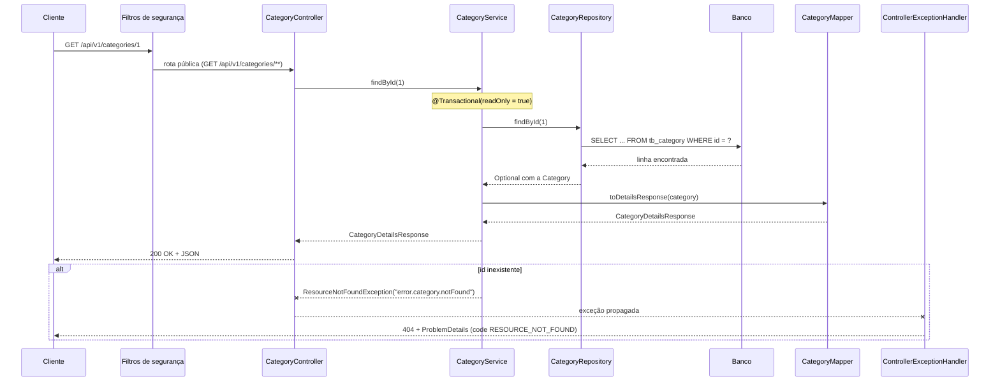

# Arquitetura

Este guia mostra como o backend do ASJCatalog está organizado em camadas e pacotes, e o caminho que uma requisição percorre do controller até o banco e de volta.

## Sumário

1. [Camadas](#1-camadas)
2. [Pacotes](#2-pacotes)
3. [Caminho de uma requisição](#3-caminho-de-uma-requisição)
4. [Onde fica cada tipo de classe](#4-onde-fica-cada-tipo-de-classe)
5. [Origem do nome](#5-origem-do-nome)

## 1. Camadas

A aplicação segue uma **arquitetura em camadas**: cada camada tem uma responsabilidade e só conversa com a camada vizinha.


| Camada | Pacote | Responsabilidade |
| --- | --- | --- |
| Web (controladores REST) | `web.controller` | Recebe a requisição HTTP, dispara a validação da entrada e devolve a resposta. Não contém regra de negócio |
| Serviço | `service` | Executa os casos de uso e as regras de negócio. Define as **transações** |
| Acesso a dados | `repository` | Lê e grava no banco por meio do Spring Data JPA |
| Domínio | `domain` | Entidades mapeadas para as tabelas, com parte das regras de negócio |

Uma **transação** é um grupo de operações no banco que acontece por inteiro ou não acontece: se algo falha no meio, tudo é desfeito. No diagrama, ela envolve as camadas de serviço e de acesso a dados porque é aberta nos métodos dos services.

Entre as camadas circulam **DTOs** (*Data Transfer Objects*): classes simples que representam o que entra e o que sai da API. Os controllers nunca recebem nem devolvem entidades.

Três partes atravessam as camadas e não aparecem no diagrama:

| Parte | Pacote | Quando atua |
| --- | --- | --- |
| Segurança | `security` | Antes do controller, em filtros que conferem o token, e nas anotações `@PreAuthorize` dos métodos dos controllers |
| Validação | `validation` | Quando o controller recebe um DTO anotado com `@Valid`, antes de chamar o service |
| Tratamento de erros | `web.exception` | Quando uma exceção sai do controller; transforma a exceção em uma resposta HTTP padronizada |

## 2. Pacotes

Todo o código fica em `backend/src/main/java`, no pacote base `com.albertsilva.dev.asjcatalog`:

```text
com.albertsilva.dev.asjcatalog
├── AsjcatalogApplication                      classe principal (método main)
├── config
│   ├── documentation                          configuração do Swagger/OpenAPI
│   └── i18n                                   idiomas das mensagens (MessageSourceConfig)
├── domain                                     interface Identifiable
│   ├── catalog                                entidades Category e Product
│   ├── recovery                               entidades Token e Email
│   │   └── enums                              TokenType e EmailStatus
│   └── user                                   entidades User e Role
├── dto
│   ├── category/{request,response}            entrada e saída de categorias
│   ├── email/request                          dados para registrar um e-mail enviado
│   ├── product/{request,response}             entrada e saída de produtos
│   ├── role/response                          saída de roles
│   └── user/{request,response}                entrada e saída de usuários e da conta
├── mapper
│   ├── category                               CategoryMapper
│   ├── product                                ProductMapper
│   └── user                                   UserMapper
├── projection                                 ProductProjection e UserDetailsProjection
├── repository                                 um repositório por entidade (6)
├── security
│   ├── auth                                   AuthenticatedUserService (usuário do token atual)
│   ├── config                                 codificador de senha (BCrypt)
│   ├── oauth2/authorization/config            servidor de autorização (emite os tokens)
│   ├── oauth2/grant/password                  login com grant_type=password
│   ├── oauth2/resource/config                 regras de acesso às rotas e CORS
│   └── userdetails                            AuthenticatedUser (dados do usuário no token)
├── service                                    casos de uso (6 services)
│   └── exception                              exceções de negócio
├── util                                       IdentifiableUtils
├── validation
│   ├── category/{annotation,validator}        validações de categoria
│   ├── product/{annotation,validator}         validações de produto
│   ├── role/{annotation,validator}            validação de roles
│   └── user/{annotation,contract,validator}   validações de usuário, e-mail e senha
└── web
    ├── controller                             4 controllers REST
    └── exception
        ├── enums                              ApiErrorCode (códigos de erro estáveis)
        ├── handler                            ControllerExceptionHandler
        └── response                           ProblemDetails, ValidationError, FieldMessage
```

Os recursos ficam em `backend/src/main/resources`: arquivos `application*.properties`, mensagens `messages_*.properties`, migrations em `db/migration`, o `import.sql` do perfil `test`, templates de e-mail em `templates/` e imagens em `static/image/`.

## 3. Caminho de uma requisição

Exemplo real: `GET /api/v1/categories/{id}`, que busca uma categoria pelo id. É uma rota pública e não exige token.



Passo a passo:

1. **Filtros de segurança.** A configuração em `security/oauth2/resource/config/ResourceServerConfig` libera `GET /api/v1/categories/**` sem token. Em rotas protegidas, é aqui que o token é conferido.
2. **Controller.** `CategoryController.findById` recebe o id da URL e chama o service. Não acessa o banco.
3. **Service.** `CategoryService.findById` abre uma transação somente leitura e pede a entidade ao repositório.
4. **Repositório.** `CategoryRepository.findById`, herdado do Spring Data JPA, gera o SQL e devolve um `Optional<Category>`.
5. **Mapper.** `CategoryMapper.toDetailsResponse` converte a entidade no DTO `CategoryDetailsResponse` (`id`, `name`, `description`, `active`).
6. **Resposta.** O Spring converte o DTO em JSON com status 200.
7. **Erro.** Se o id não existe, o service lança `ResourceNotFoundException` com a chave da mensagem. O `ControllerExceptionHandler` captura a exceção e devolve 404 com um corpo `ProblemDetails` (`timestamp`, `status`, `code`, `error`, `message`, `path`), com o texto no idioma do cabeçalho `Accept-Language`.

Em uma requisição de escrita, como `POST /api/v1/categories`, entram mais duas etapas antes do service: a anotação `@PreAuthorize` confere a role do usuário, e `@Valid` executa as validações do DTO. Se a validação falha, a resposta é 422 com a lista de campos inválidos.

## 4. Onde fica cada tipo de classe

| Tipo | Pacote | O que é | Por que fica ali |
| --- | --- | --- | --- |
| Entidade | `domain.*` | Classe mapeada para uma tabela | Separada por assunto (catálogo, usuário, recuperação de acesso) para agrupar conceitos relacionados. Veja [DOMAIN-MODEL.md](DOMAIN-MODEL.md) |
| DTO | `dto.<assunto>.request` e `.response` | Formato da entrada e da saída da API (todos são `record`) | Separar entrada de saída deixa claro o que o cliente envia e o que recebe, e impede que a API exponha as entidades |
| Mapper | `mapper.<assunto>` | Converte entre entidade e DTO | Tira a conversão do controller e do service; cada mapper é um `@Component` injetado onde é usado |
| Projection | `projection` | Interface que recebe só algumas colunas de uma consulta | Usada por consultas específicas dos repositórios. Veja [DATA-ACCESS.md](DATA-ACCESS.md#4-projections) |
| Repositório | `repository` | Interface que estende `JpaRepository` | O Spring Data JPA gera a implementação em tempo de execução |
| Service | `service` | Casos de uso e regras de negócio | Único lugar que abre transações |
| Exceção de negócio | `service.exception` | Erros previstos, como recurso não encontrado ou token inválido | São lançadas pelos services e carregam a chave da mensagem traduzida |
| Validação | `validation.<assunto>.annotation` e `.validator` | Anotação (`@UniqueEmail`, `@CategoryCreateValid`...) e a classe que implementa a regra | A anotação fica no DTO e a regra fica no validator. Vários validators consultam o banco pelos repositórios, por exemplo para checar e-mail repetido |
| Contrato de validação | `validation.user.contract` | Interface `PasswordPersonalDataCandidate` | Permite que um único validator de senha atenda DTOs diferentes |
| Tratamento de erro | `web.exception` | Handler global, formato da resposta de erro e códigos `ApiErrorCode` | Fica na camada web porque transforma exceções em respostas HTTP |
| Configuração | `config` e `security.*.config` | Classes `@Configuration` | Separadas por assunto: documentação, idiomas e segurança |

### Services

Os casos de uso ficam nos seis services do pacote `service`. O `AuthenticatedUserService` também é um `@Service`, mas fica em `security.auth` porque lê a identidade do token.

| Service | Pacote | Responsabilidade |
| --- | --- | --- |
| `CategoryService` | `service` | Busca paginada por nome, consulta, criação, atualização, ativação, desativação e remoção de categorias |
| `ProductService` | `service` | Listagem paginada com filtros por nome e categorias (veja [DATA-ACCESS.md](DATA-ACCESS.md#5-o-problema-n1-e-a-listagem-de-produtos)), consulta, criação, atualização, ativação, desativação e remoção de produtos |
| `UserService` | `service` | Busca paginada por nome, consulta, criação, atualização, ativação, desativação e remoção de usuários. Implementa `UserDetailsService` e carrega o usuário no login (`loadUserByUsername`) |
| `AccountService` | `service` | Ciclo de vida da conta: cadastro, ativação, reenvio de ativação, recuperação e redefinição de senha, dados e senha do próprio usuário. Veja [ACCOUNT-FLOWS.md](ACCOUNT-FLOWS.md) |
| `TokenService` | `service` | Cria, invalida e valida os tokens de ativação e de recuperação de senha. Todos os métodos públicos são transacionais (`@Transactional` na classe) |
| `EmailService` | `service` | Monta os e-mails com Thymeleaf, envia pelo `JavaMailSender` e registra cada envio bem-sucedido em `tb_email` |
| `AuthenticatedUserService` | `security.auth` | Lê o claim `userId` do JWT da requisição e carrega o usuário do banco. É usado pelo `AccountService`, por um validador de e-mail e pela regra `@PreAuthorize` do `UserController` (`isCurrentUser`) |

## 5. Origem do nome

O projeto nasceu da base do **DSCatalog**, projeto do curso da DevSuperior, e evoluiu de forma independente. O nome atual, **ASJCatalog**, vem das iniciais do autor, Albert Silva de Jesus.

Alguns vestígios do nome antigo continuam no repositório de propósito:

- as URLs de imagens do seed apontam para o repositório externo `devsuperior/dscatalog-resources`;
- os registros históricos em [`docs/audits/`](../audits/) citam o pacote antigo `com.albertsilva.dev.dscatalog`, que foi renomeado para `com.albertsilva.dev.asjcatalog`.
