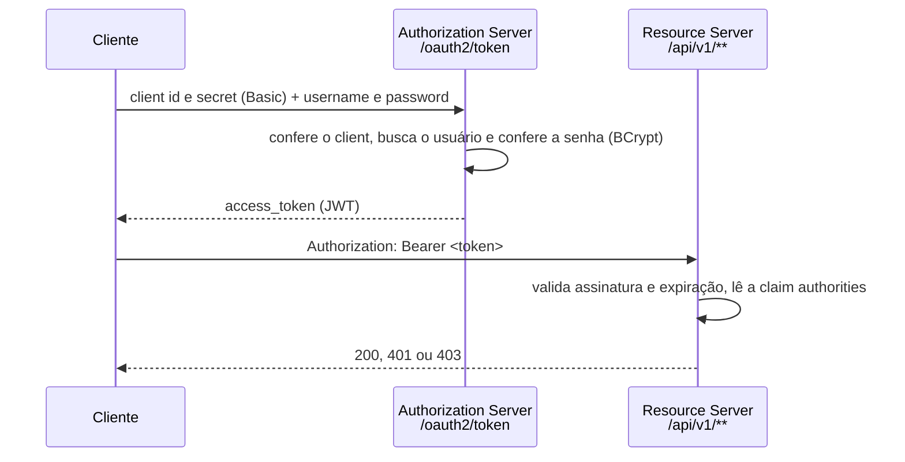

# Autenticação e autorização

Este guia explica como a segurança da API do ASJCatalog funciona no capítulo 03: como obter um token, o que ele contém, quais rotas são públicas, quem pode fazer o quê e como a API responde quando o acesso é negado.

## Sumário

1. [Visão geral](#1-visão-geral)
2. [As três cadeias de filtros](#2-as-três-cadeias-de-filtros)
3. [Login](#3-login)
4. [O access token (JWT)](#4-o-access-token-jwt)
5. [A chave de assinatura muda a cada subida](#5-a-chave-de-assinatura-muda-a-cada-subida)
6. [Roles e regras de acesso](#6-roles-e-regras-de-acesso)
7. [Chamar uma rota protegida](#7-chamar-uma-rota-protegida)
8. [401 e 403](#8-401-e-403)
9. [Quem pode fazer o quê](#9-quem-pode-fazer-o-quê)
10. [Client OAuth2 e CORS](#10-client-oauth2-e-cors)
11. [Limitações conhecidas](#11-limitações-conhecidas)

## 1. Visão geral

Termos usados neste guia:

- **Autenticação** é descobrir quem está fazendo a requisição; **autorização** é decidir se essa pessoa pode fazer o que pediu.
- **Spring Security** é o módulo do Spring que cuida das duas.
- **OAuth2** é um protocolo para emitir e usar tokens de acesso. Um **grant** é a forma de pedir um token; aqui, o *password grant*, em que o cliente envia o e-mail e a senha do usuário.
- **JWT** (*JSON Web Token*) é um token em texto, assinado digitalmente, que carrega informações sobre o usuário. Cada informação dentro dele é uma **claim**.
- **Role** é um perfil de permissões. O projeto tem duas: `ROLE_OPERATOR` e `ROLE_ADMIN`.

A mesma aplicação faz dois papéis:

- **Authorization Server**: recebe as credenciais em `/oauth2/token` e emite o JWT (`AuthorizationServerConfig`, com o password grant em `security/oauth2/grant/password`).
- **Resource Server**: protege as rotas `/api/v1/**`, valida o JWT recebido no cabeçalho `Authorization` e aplica as regras de acesso (`ResourceServerConfig`).



As senhas são guardadas com **BCrypt**, um algoritmo de hash próprio para senhas: o banco guarda só o hash, e o login compara a senha enviada com ele (`SecurityBeansConfig`).

## 2. As três cadeias de filtros

Um **filtro** é um componente que examina a requisição antes de ela chegar ao controller. O Spring Security organiza os filtros em **cadeias** (`SecurityFilterChain`). Cada cadeia atende um conjunto de caminhos, e a primeira cuja regra combina com a URL é a usada.

| Ordem | Cadeia | Caminhos | O que faz |
| --- | --- | --- | --- |
| 1 | `h2SecurityFilterChain` (`ResourceServerConfig`) | Console do H2 | Só existe quando `spring.h2.console.enabled=true` (perfil `test`). Desliga CSRF e a proteção contra *frames* para o console funcionar |
| 2 | `asSecurityFilterChain` (`AuthorizationServerConfig`) | `/oauth2/**` e `/.well-known/**` | Endpoints do Authorization Server: emissão do token (`/oauth2/token`) e chaves públicas (`/oauth2/jwks`) |
| 3 | `rsSecurityFilterChain` (`ResourceServerConfig`) | Todo o resto | CSRF desligado, rotas públicas, validação do JWT e CORS |

**CSRF** (*Cross-Site Request Forgery*) é um ataque que se aproveita de cookies de sessão do navegador. A cadeia 3 o desliga porque a API se autentica pelo cabeçalho `Authorization`, e não por cookies.

Regras da cadeia 3, nesta ordem:

```java
.requestMatchers(HttpMethod.GET, PUBLIC_GET_ENDPOINTS).permitAll()
.requestMatchers(DOCUMENTATION_OPENAPI).permitAll()
.anyRequest().authenticated()
```

- `PUBLIC_GET_ENDPOINTS` = `/api/v1/categories/**` e `/api/v1/products/**`, só no método GET;
- `DOCUMENTATION_OPENAPI` = `/docs-asjcatalog`, `/docs-asjcatalog/**`, `/docs-asjcatalog.html` e `/swagger-ui/**`;
- qualquer outra rota exige um token válido.

`@EnableMethodSecurity` ativa o `@PreAuthorize` nos controllers (seção 6).

## 3. Login

**Usuários de exemplo.** Os dados abaixo existem só para desenvolvimento e testes. Eles são inseridos pela migration `V103__insert_user.sql` (perfil `dev`) e pelo `import.sql` (perfil `test`):

| E-mail | Senha | Roles |
| --- | --- | --- |
| `albert@gmail.com` | `123456` | `ROLE_OPERATOR` |
| `maria@gmail.com` | `123456` | `ROLE_OPERATOR`, `ROLE_ADMIN` |

A senha `123456` não passaria na validação de senha forte ([VALIDATION.md](VALIDATION.md#4-senha-forte)); ela existe porque os usuários são inseridos direto no banco, com o hash BCrypt.

**Requisição.** `POST /oauth2/token`, com o client autenticado por **Basic Auth** (cabeçalho `Authorization: Basic` com `client-id:client-secret` em Base64) e o corpo no formato de formulário (`application/x-www-form-urlencoded`):

| Parâmetro | Valor |
| --- | --- |
| `grant_type` | `password` |
| `username` | E-mail do usuário |
| `password` | Senha do usuário |

**PowerShell com `curl.exe`** (no Windows PowerShell, `curl` sem `.exe` é um apelido de outro comando):

```powershell
curl.exe -s -u myclientid:myclientsecret -d "grant_type=password&username=albert@gmail.com&password=123456" http://localhost:8080/oauth2/token
```

**PowerShell com `Invoke-RestMethod`**, guardando o token numa variável:

```powershell
$basic = [Convert]::ToBase64String([Text.Encoding]::ASCII.GetBytes('myclientid:myclientsecret'))
$body = @{ grant_type = 'password'; username = 'albert@gmail.com'; password = '123456' }
$resp = Invoke-RestMethod -Method Post -Uri http://localhost:8080/oauth2/token -Headers @{ Authorization = "Basic $basic" } -Body $body
$token = $resp.access_token
```

**bash**:

```bash
curl -s -u myclientid:myclientsecret -d "grant_type=password&username=albert@gmail.com&password=123456" http://localhost:8080/oauth2/token
```

Resposta real (`200`, token encurtado):

```json
{"access_token":"eyJraWQiOiIzMzFiMDZj...","token_type":"Bearer","expires_in":86399}
```

A resposta não traz `refresh_token` nem `scope` (veja Limitações conhecidas).

**Erros do login** (confirmados por execução):

| Situação | Status | Corpo |
| --- | --- | --- |
| Senha errada | 400 | `{"error":"Invalid credentials"}` |
| E-mail inexistente | 400 | `{"error":"Invalid credentials"}` (o código trata igual à senha errada) |
| Client id ou secret errado | 401 | `{"error":"invalid_client"}` |
| `grant_type=refresh_token` | 400 | `{"error":"invalid_grant"}` |

## 4. O access token (JWT)

Um JWT tem três partes separadas por ponto: cabeçalho, conteúdo (*payload*) e assinatura, as duas primeiras em Base64. O cabeçalho real indica o algoritmo **RS256** (assinatura com chave RSA) e o id da chave (`kid`).

Conteúdo real do token de `albert@gmail.com`:

```json
{
  "sub" : "myclientid",
  "aud" : "myclientid",
  "nbf" : 1791251547,
  "iss" : "http://localhost:8096",
  "exp" : 1791337947,
  "iat" : 1791251547,
  "jti" : "ca51b0d9-f10d-4f37-875a-28f413d01a98",
  "authorities" : [ "ROLE_OPERATOR" ],
  "username" : "albert@gmail.com"
}
```

| Claim | Significado |
| --- | --- |
| `sub` | *Subject*: **o client id**, e não o usuário. É o padrão do Authorization Server para o principal do client |
| `aud` | *Audience*: para quem o token foi emitido; também o client id |
| `username` | **O e-mail do usuário autenticado** (claim acrescentada pelo projeto em `tokenCustomizer`) |
| `authorities` | Roles do usuário (claim acrescentada pelo projeto). É dela que o Resource Server lê as permissões |
| `iss` | *Issuer*: endereço de quem emitiu o token (a URL e a porta da aplicação) |
| `iat`, `nbf`, `exp` | Emissão, início da validade e expiração, em segundos desde 1970 (UTC) |
| `jti` | Identificador único do token |

A validade vem de `security.jwt.duration` (variável `JWT_DURATION`), em segundos; o padrão é `86400`, ou seja, 24 horas.

## 5. A chave de assinatura muda a cada subida

O bean `jwkSource` gera um par de chaves RSA de 2048 bits **toda vez que a aplicação sobe**, só em memória. Confirmado por execução: cada subida produziu um `kid` diferente no cabeçalho dos tokens.

Consequência: um token emitido antes de reiniciar a aplicação deixa de ser aceito, porque a chave que o assinou não existe mais, e é preciso fazer login de novo. Em desenvolvimento com o **DevTools**, que reinicia a aplicação quando o código muda, isso acontece a cada reinício.

A chave pública atual fica em `GET /oauth2/jwks` (público).

## 6. Roles e regras de acesso

**De onde vêm as roles.** O `JwtAuthenticationConverter` do `ResourceServerConfig` lê a claim `authorities` e usa cada valor como permissão, sem acrescentar prefixo. O token de maria, por exemplo, resulta nas permissões `ROLE_OPERATOR` e `ROLE_ADMIN`.

**Rotas públicas** (sem token): `GET /api/v1/categories/**`, `GET /api/v1/products/**`, o Swagger (`/docs-asjcatalog.html`, `/docs-asjcatalog`, `/swagger-ui/**`) e os endpoints do Authorization Server. Todas as outras rotas exigem um token válido.

**`@PreAuthorize`.** Nos controllers, cada rota de escrita tem uma regra escrita em **SpEL** (*Spring Expression Language*, uma linguagem de expressões avaliada em tempo de execução). `hasRole('ADMIN')` confere a permissão `ROLE_ADMIN`: o Spring acrescenta o prefixo `ROLE_` ao comparar.

| Regra no código | Quem passa |
| --- | --- |
| `hasRole('ADMIN') or hasRole('OPERATOR')` | ADMIN ou OPERATOR |
| `hasRole('ADMIN')` | Só ADMIN |
| `hasRole('ADMIN') OR (hasRole('OPERATOR') AND #id == authentication.principal.id)` | ADMIN; a parte do OPERATOR não funciona (veja Limitações conhecidas) |

A regra é avaliada depois da validação do corpo: um usuário sem permissão que envia um corpo inválido recebe 422, e não 403 (veja [VALIDATION.md](VALIDATION.md#9-limitações-conhecidas)).

## 7. Chamar uma rota protegida

Envie o token no cabeçalho `Authorization`, precedido de `Bearer` e um espaço.

**PowerShell**, com o `$token` da seção 3:

```powershell
Invoke-RestMethod -Method Post -Uri http://localhost:8080/api/v1/categories -Headers @{ Authorization = "Bearer $token" } -ContentType 'application/json' -Body '{"name":"Gaming","description":"Gaming products"}'
```

**bash**:

```bash
TOKEN=$(curl -s -u myclientid:myclientsecret -d "grant_type=password&username=albert@gmail.com&password=123456" http://localhost:8080/oauth2/token | sed -E 's/.*"access_token":"([^"]+)".*/\1/')
curl -s -X POST http://localhost:8080/api/v1/categories -H "Authorization: Bearer $TOKEN" -H 'Content-Type: application/json' -d '{"name":"Gaming","description":"Gaming products"}'
```

Resultado confirmado com o token de `albert@gmail.com` (OPERATOR): a categoria `Gaming` foi criada com o id 16 (`201`).

No Swagger (`/docs-asjcatalog.html`), o botão **Authorize** aceita o token, por causa do esquema `bearer` declarado em `SpringDocOpenApiConfig`.

## 8. 401 e 403

| Status | Significado | Quando acontece | Corpo |
| --- | --- | --- | --- |
| **401 Unauthorized** | "Não sei quem você é" | Rota protegida sem token, com token malformado, expirado ou assinado por outra chave | **Vazio.** Só o cabeçalho `WWW-Authenticate` |
| **403 Forbidden** | "Sei quem você é, mas você não pode" | Token válido sem a role exigida pelo `@PreAuthorize` | `ProblemDetails`, com mensagem em português |

Respostas reais de `GET /api/v1/users`:

- sem token → `401`, cabeçalhos `WWW-Authenticate: Bearer` e `Content-Length: 0`;
- com `Authorization: Bearer abc` → `401`, `WWW-Authenticate: Bearer error="invalid_token", error_description="An error occurred while attempting to decode the Jwt: Malformed token", ...`;
- com o token de `albert@gmail.com` (só OPERATOR) → `403`:

```json
{
  "timestamp" : "2026-10-06T02:09:48.928708100Z",
  "status" : 403,
  "error" : "Access denied",
  "message" : "Você não possui permissão para acessar este recurso",
  "path" : "/api/v1/users"
}
```

O 403 vem do `ControllerExceptionHandler`, que trata a `AccessDeniedException` lançada pelo `@PreAuthorize`. O 401 é gerado pelo Spring Security antes de a requisição chegar ao controller, por isso não passa pelo handler. Veja [ERROR-HANDLING.md](ERROR-HANDLING.md).

Uma rota inexistente também responde 401 quando chamada sem token, porque cai na regra `anyRequest().authenticated()`. Com token, responde 404.

## 9. Quem pode fazer o quê

"Público" significa sem token. "Token" é qualquer usuário autenticado.

| Método | Rota | Acesso |
| --- | --- | --- |
| GET | `/api/v1/categories` | Público |
| GET | `/api/v1/categories/{id}` | Público |
| POST | `/api/v1/categories` | ADMIN ou OPERATOR |
| PATCH | `/api/v1/categories/{id}` | ADMIN ou OPERATOR |
| PATCH | `/api/v1/categories/{id}/activate` | ADMIN ou OPERATOR |
| PATCH | `/api/v1/categories/{id}/deactivate` | ADMIN ou OPERATOR |
| DELETE | `/api/v1/categories/{id}` | ADMIN ou OPERATOR |
| GET | `/api/v1/products` | Público |
| GET | `/api/v1/products/{id}` | Público |
| POST | `/api/v1/products` | ADMIN ou OPERATOR |
| PATCH | `/api/v1/products/{id}` | ADMIN ou OPERATOR |
| PATCH | `/api/v1/products/{id}/activate` | ADMIN ou OPERATOR |
| PATCH | `/api/v1/products/{id}/deactivate` | ADMIN ou OPERATOR |
| DELETE | `/api/v1/products/{id}` | ADMIN ou OPERATOR |
| POST | `/api/v1/users` | ADMIN |
| GET | `/api/v1/users` | ADMIN |
| GET | `/api/v1/users/{id}` | ADMIN (a regra também cita o OPERATOR no próprio usuário, mas não funciona) |
| PUT | `/api/v1/users/{id}` | ADMIN (idem) |
| PATCH | `/api/v1/users/{id}/activate` | ADMIN |
| PATCH | `/api/v1/users/{id}/deactivate` | ADMIN |
| DELETE | `/api/v1/users/{id}` | ADMIN |

Confirmado por execução: `GET /users` com OPERATOR → 403 e com ADMIN → 200; `DELETE /categories/11` com OPERATOR → 204; `GET /users/1` e `PUT /users/1` com o token do próprio albert (id 1) → 403.

## 10. Client OAuth2 e CORS

**Client.** Um **client** OAuth2 é a aplicação autorizada a pedir tokens (um front-end, por exemplo). Há um único client, registrado em memória (`InMemoryRegisteredClientRepository`):

| Propriedade | Variável | Padrão |
| --- | --- | --- |
| `security.client-id` | `CLIENT_ID` | `myclientid` |
| `security.client-secret` | `CLIENT_SECRET` | `myclientsecret` |
| `security.jwt.duration` | `JWT_DURATION` | `86400` |

O client aceita só o grant `password` e declara os scopes `read` e `write`. O secret é criptografado com BCrypt quando a aplicação sobe.

**CORS.** **CORS** (*Cross-Origin Resource Sharing*) é a regra do navegador que impede uma página de um endereço (a **origem**, como `http://localhost:5173`) de chamar uma API em outro endereço, a menos que a API autorize. Configuração em `ResourceServerConfig.corsConfigurationSource`:

| Item | Valor |
| --- | --- |
| Origens | `cors.origins` (variável `CORS_ORIGINS`), separadas por vírgula; padrão `http://localhost:3000,http://localhost:5173` |
| Métodos | `POST`, `GET`, `PUT`, `DELETE`, `PATCH` |
| Cabeçalhos | `Authorization`, `Content-Type` |
| Credenciais | Permitidas |

A configuração também é registrada como um filtro de prioridade máxima (`FilterRegistrationBean`), para valer antes das cadeias de segurança. Confirmado por execução: uma requisição de verificação (`OPTIONS`) vinda de `http://localhost:5173` recebeu `Access-Control-Allow-Origin: http://localhost:5173`; vinda de `http://evil.com`, recebeu 403.

## 11. Limitações conhecidas

- **Sem refresh token.** Um **refresh token** permitiria obter um novo access token sem enviar a senha de novo. O client só aceita o grant `password`, e a resposta do login não traz `refresh_token`; `grant_type=refresh_token` responde 400 `invalid_grant`. O refresh token, com rotação, chega no capítulo 04.
- **Usuário desativado consegue fazer login.** `loadUserByUsername` não considera o campo `active`. Confirmado por execução: depois de `PATCH /users/3/deactivate`, o login desse usuário respondeu 200. O bloqueio de contas inativas (`isEnabled` e `DisabledException`) chega no capítulo 04.
- **A regra "o próprio usuário" nunca é satisfeita.** Em `GET` e `PUT /api/v1/users/{id}`, a expressão `#id == authentication.principal.id` compara o id da URL com `principal.id`. Com JWT, o principal é o próprio token, e `id` é a claim `jti` (um texto aleatório), nunca igual ao id do usuário. Na prática, o OPERATOR recebe 403 até no próprio usuário (confirmado por execução). No capítulo 04, o `GET /users/{id}` passa a usar um serviço que identifica o usuário atual; o `PUT /users/{id}` continua com a mesma expressão.
- **Token sem `scope`.** O login autoriza só as roles do usuário que coincidem com os scopes do client (`read` e `write`), e nenhuma coincide. Por isso o token e a resposta não trazem `scope`. Continua no capítulo 04.
- **401 sem corpo.** O 401 é gerado pelo Spring Security, sem `ProblemDetails`, só com o cabeçalho `WWW-Authenticate`. Continua no capítulo 04.
- **A chave de assinatura muda a cada subida** (seção 5), e as autorizações emitidas ficam em memória (`InMemoryOAuth2AuthorizationService`), perdidas ao reiniciar. Continua no capítulo 04.
- **`sub` não identifica o usuário.** Quem consome o token precisa ler a claim `username`, e não `sub`.
- **Valores padrão do client no arquivo.** Sem as variáveis `CLIENT_ID` e `CLIENT_SECRET`, a aplicação usa `myclientid` e `myclientsecret` em qualquer perfil. No capítulo 04, o perfil `prod` passa a exigir as duas variáveis.
- **Descrições do Swagger nas rotas públicas.** As listagens e buscas por id de categorias e produtos dizem "Exige Bearer Token", mas são públicas. Continua no capítulo 04.
- **`/swagger-ui.html` responde 401.** O caminho não está na lista pública; use `/docs-asjcatalog.html` ou `/swagger-ui/index.html`. Continua no capítulo 04.
