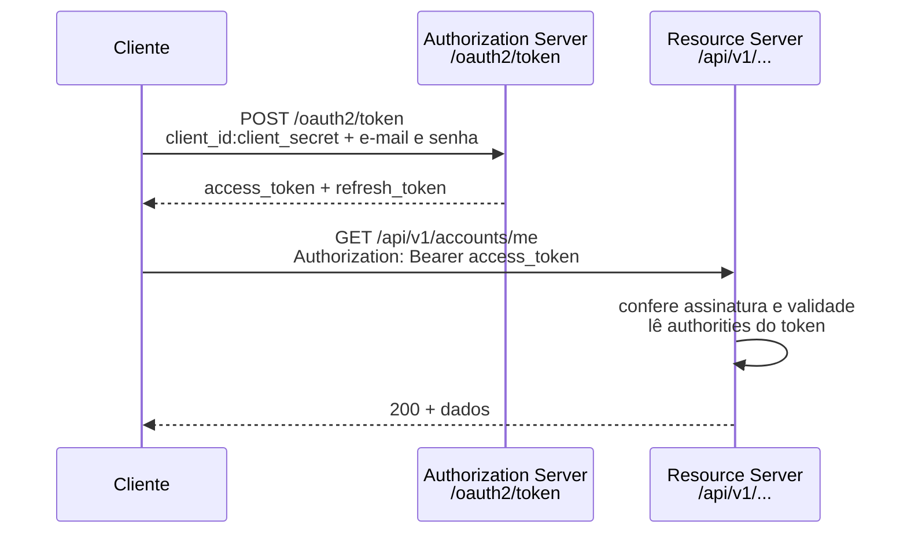

# Autenticação e autorização

⬅️ Anterior: [Internacionalização](INTERNATIONALIZATION.md) · [🏠 Índice](../HOME.md) · Próximo: [Fluxos de conta](ACCOUNT-FLOWS.md) ➡️

Este guia explica como fazer login na API, como usar e renovar os tokens, o que vai dentro do token e como a API decide quem pode acessar cada rota.

A referência completa, com o comportamento de cada classe e o que não pode ser alterado sem análise, está no [SECURITY-CONTRACT.md](../SECURITY-CONTRACT.md).

## Sumário

1. [Visão geral](#1-visão-geral)
2. [Login](#2-login)
3. [Access token (JWT)](#3-access-token-jwt)
4. [Refresh token e rotação](#4-refresh-token-e-rotação)
5. [A chave de assinatura muda a cada subida](#5-a-chave-de-assinatura-muda-a-cada-subida)
6. [Roles](#6-roles)
7. [Chamar uma rota protegida](#7-chamar-uma-rota-protegida)
8. [401 e 403](#8-401-e-403)
9. [Quem pode fazer o quê](#9-quem-pode-fazer-o-quê)
10. [Limitações conhecidas](#10-limitações-conhecidas)

## 1. Visão geral

A API usa **OAuth2**, um padrão em que o cliente troca credenciais por um **token** e depois apresenta esse token em cada requisição. A mesma aplicação faz os dois papéis:

| Papel | O que faz | Onde está configurado |
| --- | --- | --- |
| **Authorization Server** | Recebe e-mail e senha em `POST /oauth2/token` e emite os tokens | `security/oauth2/authorization/config/AuthorizationServerConfig` |
| **Resource Server** | Confere o token em cada requisição à API e decide o acesso | `security/oauth2/resource/config/ResourceServerConfig` |

Há duas identidades envolvidas no login:

- o **cliente**: a aplicação que pede o token (por exemplo, um front-end). Ele se identifica com `client_id` e `client_secret` (padrão em desenvolvimento: `myclientid` e `myclientsecret`);
- o **usuário**: a pessoa, identificada por e-mail e senha.



## 2. Login

O projeto usa o tipo de login `grant_type=password`: o cliente envia diretamente o e-mail e a senha do usuário. Esse tipo não existe mais no Spring Authorization Server, e por isso foi implementado no projeto, no pacote `security/oauth2/grant/password`.

**Requisição:**

```http
POST /oauth2/token
Authorization: Basic base64(client_id:client_secret)
Content-Type: application/x-www-form-urlencoded

grant_type=password&username=maria@gmail.com&password=123456
```

**PowerShell**:

```powershell
curl.exe -s -X POST http://localhost:8080/oauth2/token -u 'myclientid:myclientsecret' -d 'grant_type=password' -d 'username=maria@gmail.com' -d 'password=123456'
```

**bash**:

```bash
curl -s -X POST http://localhost:8080/oauth2/token -u myclientid:myclientsecret -d grant_type=password -d username=maria@gmail.com -d password=123456
```

**Resposta (200):**

| Campo | Conteúdo |
| --- | --- |
| `access_token` | O JWT usado nas requisições |
| `refresh_token` | Token para pedir um novo par sem enviar a senha de novo |
| `token_type` | `Bearer` |
| `expires_in` | Validade do access token em segundos (padrão 86400, ou seja, 24 horas; variável `JWT_DURATION`) |

**Erros reais do login.** Seguem o formato do OAuth2, e não o `ProblemDetails` da API:

| Situação | Status | Corpo |
| --- | --- | --- |
| Senha errada ou e-mail não cadastrado | 400 | `{"error_description":"Invalid credentials","error":"invalid_grant","error_uri":"https://datatracker.ietf.org/doc/html/rfc6749#section-5.2"}` |
| Conta ainda não ativada | 400 | `invalid_grant` com `"Your account has not been activated yet. Please check your email."` |
| `client_id` ou `client_secret` errado | 401 | `{"error":"invalid_client"}` |

## 3. Access token (JWT)

O access token é um **JWT** (*JSON Web Token*): três partes em Base64 separadas por ponto (cabeçalho, conteúdo e assinatura). O conteúdo pode ser lido por qualquer um; a **assinatura** garante que ele foi emitido pela aplicação e não foi alterado. O projeto assina com uma chave **RSA** (algoritmo `RS256`).

Conteúdo real de um token da usuária `maria@gmail.com`:

```json
{
  "sub": "myclientid",
  "aud": "myclientid",
  "nbf": 1790715765,
  "iss": "http://localhost:8086",
  "exp": 1790802165,
  "iat": 1790715765,
  "userId": 2,
  "jti": "b1c12356-1ba1-41d9-b5d0-d22255c010da",
  "authorities": ["ROLE_OPERATOR", "ROLE_ADMIN"],
  "username": "maria@gmail.com"
}
```

Cada informação do token é um **claim**. Os três claims do projeto são adicionados em `AuthorizationServerConfig.tokenCustomizer()`:

| Claim | Conteúdo | Quem usa |
| --- | --- | --- |
| `authorities` | Roles do usuário | O Resource Server, para decidir o acesso (seção 6) |
| `userId` | Id do usuário em `tb_user` | `AuthenticatedUserService`, para carregar o usuário do token (por exemplo em `/accounts/me`) |
| `username` | E-mail do usuário | Informativo |

Os demais claims são padrão do JWT: `sub` e `aud` são o **cliente** (`myclientid`), e não o usuário; `iss` é o endereço do servidor que emitiu o token; `iat`, `nbf` e `exp` são o momento de emissão, o início e o fim da validade (em segundos desde 1970); `jti` é um identificador único do token.

## 4. Refresh token e rotação

O refresh token serve para obter um novo access token sem pedir a senha de novo. Ele vale **30 dias** (valor fixo no código).

```powershell
curl.exe -s -X POST http://localhost:8080/oauth2/token -u 'myclientid:myclientsecret' -d 'grant_type=refresh_token' -d "refresh_token=$refreshToken"
```

No bash: `curl -s -X POST http://localhost:8080/oauth2/token -u myclientid:myclientsecret -d grant_type=refresh_token -d refresh_token=$REFRESH_TOKEN`.

A resposta traz um **novo par**: access token e refresh token novos. Isso é a **rotação** (`reuseRefreshTokens(false)`): a cada renovação, o refresh token anterior deixa de valer. Tentar usá-lo de novo responde `400 {"error":"invalid_grant"}`. O `OAuth2TokenIT` confirma esse comportamento.

O token renovado mantém os claims do login (`userId`, `username` e `authorities`).

## 5. A chave de assinatura muda a cada subida

A chave RSA que assina os tokens é **gerada em memória toda vez que a aplicação sobe** (`AuthorizationServerConfig.generateRsa()`), e os refresh tokens também ficam só em memória (`InMemoryOAuth2AuthorizationService`).

Consequência: **depois de reiniciar a aplicação, todos os tokens deixam de valer.** Access tokens antigos são recusados com 401, porque a assinatura não confere com a chave nova, e refresh tokens antigos não são mais reconhecidos. É preciso fazer login de novo.

Em desenvolvimento com o DevTools, que reinicia a aplicação quando o código muda, isso acontece a cada reinício.

## 6. Roles

Uma **role** define o que o usuário pode fazer. Existem duas, criadas pela migration `V104` e guardadas em `tb_role`:

| Role | Quem tem | Pode |
| --- | --- | --- |
| `ROLE_OPERATOR` | Toda conta criada pelo cadastro público; o usuário de exemplo `albert@gmail.com` | Gerenciar o catálogo (categorias e produtos) e consultar os próprios dados |
| `ROLE_ADMIN` | Usuários criados por um administrador com essa role; a usuária de exemplo `maria@gmail.com` | Tudo o que o OPERATOR pode, mais a gestão de usuários |

**Como a role sai do token e vira permissão.** O `ResourceServerConfig` lê o claim `authorities` e transforma cada valor numa permissão do Spring Security, sem acrescentar prefixo. Nos controllers, `@PreAuthorize("hasRole('ADMIN')")` confere a permissão `ROLE_ADMIN`: o `hasRole` acrescenta o prefixo `ROLE_` sozinho.

**`@PreAuthorize`** é uma anotação posta no método do controller com a regra de acesso, verificada antes de o método executar.

## 7. Chamar uma rota protegida

Envie o access token no cabeçalho `Authorization`, precedido de `Bearer` e um espaço.

**PowerShell**:

```powershell
$resp = curl.exe -s -X POST http://localhost:8080/oauth2/token -u 'myclientid:myclientsecret' -d 'grant_type=password' -d 'username=maria@gmail.com' -d 'password=123456'
$token = ($resp | ConvertFrom-Json).access_token
$refreshToken = ($resp | ConvertFrom-Json).refresh_token
curl.exe -s "http://localhost:8080/api/v1/users?size=1" -H "Authorization: Bearer $token"
```

**bash**:

```bash
TOKEN='cole_aqui_o_access_token'
curl -s "http://localhost:8080/api/v1/users?size=1" -H "Authorization: Bearer $TOKEN"
```

No Swagger (`/docs-asjcatalog.html`), clique em **Authorize** e cole só o valor do token, sem a palavra `Bearer`.

## 8. 401 e 403

| Status | Significado | Quando acontece | Corpo |
| --- | --- | --- | --- |
| **401 Unauthorized** | "Não sei quem você é" | Rota protegida sem token, com token malformado, expirado ou assinado por outra chave | **Vazio.** Só o cabeçalho `WWW-Authenticate: Bearer` (com `error="invalid_token"` quando o token é inválido) |
| **403 Forbidden** | "Sei quem você é, mas você não pode" | Token válido sem a role exigida pelo `@PreAuthorize` | `ProblemDetails` com `code` igual a `ACCESS_DENIED` |

Exemplos reais:

- `GET /api/v1/users` sem token → `401`, cabeçalho `WWW-Authenticate: Bearer`, sem corpo;
- `GET /api/v1/users` com o token de `albert@gmail.com` (só OPERATOR) → `403`:

```json
{"timestamp":"2026-09-29T21:03:03.020972700Z","status":403,"code":"ACCESS_DENIED","error":"Acesso negado","message":"Você não possui permissão para acessar este recurso","path":"/api/v1/users"}
```

**Exceção importante:** `GET /api/v1/accounts/me` sem token responde **403**, e não 401 (veja a seção 10).

## 9. Quem pode fazer o quê

As regras de acesso ficam em dois lugares:

1. **Regras de URL**, em `ResourceServerConfig`. São públicos: `GET /api/v1/categories/**`, `GET /api/v1/products/**`, `GET /api/v1/accounts/**`, `POST /api/v1/accounts/**` e os caminhos da documentação (`/docs-asjcatalog`, `/docs-asjcatalog/**`, `/docs-asjcatalog.html` e `/swagger-ui/**`). Qualquer outra rota exige token.
2. **`@PreAuthorize`** nos métodos dos controllers, que exige roles específicas.

| Ação | Quem pode |
| --- | --- |
| Consultar categorias e produtos | Qualquer pessoa, sem token |
| Criar, alterar, ativar, desativar e remover categorias e produtos | OPERATOR ou ADMIN |
| Listar, criar, alterar, ativar, desativar e remover usuários | ADMIN |
| Consultar um usuário pelo id | ADMIN, ou OPERATOR consultando o próprio id |
| Consultar e alterar os próprios dados e a própria senha (`/accounts/me`) | Qualquer usuário autenticado |
| Cadastro, ativação e recuperação de senha | Qualquer pessoa, sem token |

A tabela completa, rota por rota, está em [API-ENDPOINTS.md](API-ENDPOINTS.md).

## 10. Limitações conhecidas

- **`PUT /users/{id}` nunca autoriza um OPERATOR.** A regra é `hasRole('ADMIN') OR (hasRole('OPERATOR') AND #id == authentication.principal.id)`. Numa requisição com JWT, `authentication.principal` é o próprio token, e `principal.id` é o claim `jti` (um texto aleatório), e não o id do usuário. A comparação nunca é verdadeira, e o OPERATOR recebe 403 mesmo ao alterar o próprio cadastro. O `GET /users/{id}` usa outra regra (`@authenticatedUserService.isCurrentUser(#id)`, que lê o claim `userId`) e funciona.
- **`GET /accounts/me` sem token responde 403.** A regra de URL deixa `GET /api/v1/accounts/**` público; a proteção vem só do `@PreAuthorize("isAuthenticated()")`, que trata a requisição anônima como acesso negado.
- **Todos os tokens se perdem ao reiniciar** (seção 5), e não há como invalidar um token antes do vencimento: não existe logout nem revogação.
- **Usuário desativado continua com acesso até o token vencer.** O Resource Server só confere a assinatura e a validade do token, e o `AuthenticatedUserService` carrega o usuário pelo `userId` sem conferir se ele está ativo.
- **O refresh repete os dados do login.** O token renovado copia as `authorities` guardadas em memória no momento do login; uma role adicionada ou removida depois só aparece num novo login.
- **Os scopes ficam sempre vazios.** O cliente declara os scopes `read` e `write`, mas o login autoriza só as roles do usuário que coincidem com eles, e nenhuma coincide. Por isso a resposta do token não traz o campo `scope`.
- **O login diferencia maiúsculas no e-mail.** `Maria@gmail.com` não encontra `maria@gmail.com` e responde `Invalid credentials`.
- **Mensagens do login só em inglês.** Os erros de `/oauth2/token` não passam pelo sistema de tradução da API.

---

⬅️ Anterior: [Internacionalização](INTERNATIONALIZATION.md) · [🏠 Índice](../HOME.md) · Próximo: [Fluxos de conta](ACCOUNT-FLOWS.md) ➡️
