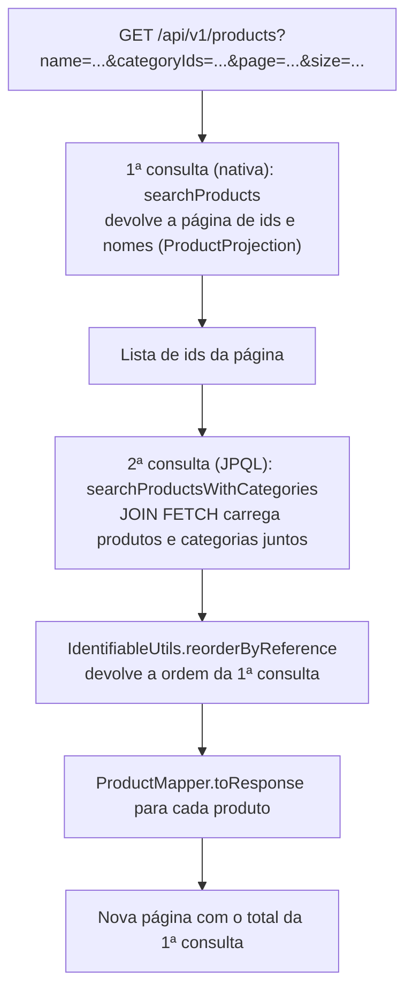

# Acesso a dados

Este guia explica como o ASJCatalog lê e grava no banco: repositórios, tipos de consulta, projections, paginação, a solução do problema N+1 na listagem de produtos e o uso de transações.

## Sumário

1. [Repositórios](#1-repositórios)
2. [Consultas derivadas](#2-consultas-derivadas)
3. [Consultas JPQL e nativas](#3-consultas-jpql-e-nativas)
4. [Projections](#4-projections)
5. [O problema N+1 e a listagem de produtos](#5-o-problema-n1-e-a-listagem-de-produtos)
6. [Paginação e ordenação](#6-paginação-e-ordenação)
7. [Open-in-view e transações](#7-open-in-view-e-transações)
8. [Limitações conhecidas](#8-limitações-conhecidas)

## 1. Repositórios

Um **repositório** é a interface por onde o código acessa o banco. No projeto, cada entidade tem o seu, no pacote `repository`, e todos estendem `JpaRepository<Entidade, Long>`:

| Repositório | Entidade |
| --- | --- |
| `CategoryRepository` | `Category` |
| `ProductRepository` | `Product` |
| `UserRepository` | `User` |
| `RoleRepository` | `Role` |
| `TokenRepository` | `Token` |
| `EmailRepository` | `Email` |

O **Spring Data JPA** gera a implementação dessas interfaces quando a aplicação sobe. Só por estender `JpaRepository`, cada repositório já tem métodos como `findById`, `findAll(Pageable)`, `save`, `delete` e `existsById`.

## 2. Consultas derivadas

Uma **consulta derivada** é um método cujo nome descreve a consulta. O Spring Data lê o nome e monta o SQL, sem que você escreva a consulta.

Exemplo real, em `CategoryRepository`:

```java
Page<Category> findByNameContainingIgnoreCase(String name, Pageable pageable);
```

O nome se lê assim: `findBy` (buscar por) + `Name` (campo `name`) + `Containing` (contém o texto) + `IgnoreCase` (sem diferenciar maiúsculas). Ele é usado na busca de categorias por nome.

Consultas derivadas do projeto:

| Repositório | Métodos |
| --- | --- |
| `CategoryRepository` | `findByNameContainingIgnoreCase`, `existsByNameIgnoreCase`, `existsByNameIgnoreCaseAndIdNot` |
| `ProductRepository` | `existsByNameIgnoreCase`, `existsByNameIgnoreCaseAndIdNot` |
| `UserRepository` | `findByFirstNameContainingIgnoreCase`, `findByEmail`, `existsByEmailIgnoreCase`, `existsByEmailIgnoreCaseAndIdNot` |
| `RoleRepository` | `findByAuthority` |
| `TokenRepository` | `findByToken`, `findByUserAndTypeAndDisabledFalse` |

Os métodos `exists...AndIdNot` são usados pelos validadores de atualização: conferem se outro registro, diferente do que está sendo editado, já usa o mesmo nome ou e-mail.

## 3. Consultas JPQL e nativas

Quando o nome do método não basta, a consulta é escrita na anotação `@Query`. Há dois tipos.

**JPQL** (*Java Persistence Query Language*) é uma linguagem parecida com SQL que usa os nomes das **entidades e campos Java**, e não das tabelas. O Hibernate a traduz para o SQL do banco em uso.

Exemplo real, em `ProductRepository`:

```java
@Query("SELECT obj FROM Product obj JOIN FETCH obj.categories WHERE obj.id IN :productsIds")
List<Product> searchProductsWithCategories(List<Long> productsIds);
```

`JOIN FETCH` pede ao Hibernate que carregue os produtos **e** as categorias de cada um na mesma consulta. Sem ele, as categorias seriam buscadas depois, uma consulta por produto (veja a seção 5).

**Consulta nativa** é SQL escrito diretamente, com os nomes das tabelas, marcado com `nativeQuery = true`. O projeto tem duas.

`ProductRepository.searchProducts` busca os ids dos produtos filtrados por nome e categorias:

```sql
SELECT * FROM (
  SELECT DISTINCT tb_product.id, tb_product.name
  FROM tb_product
  INNER JOIN tb_product_category ON tb_product.id = tb_product_category.product_id
  WHERE (:categoryIds IS NULL OR tb_product_category.category_id IN :categoryIds)
  AND (LOWER(tb_product.name) LIKE LOWER(CONCAT('%',:name,'%')))
) AS tb_result
```

Ela tem também uma `countQuery`, uma segunda consulta que conta o total de resultados para a paginação.

`UserRepository.searchUserAndRolesByEmail` busca o usuário e as roles dele para o login (veja a seção 4).

## 4. Projections

Uma **projection** é uma interface com métodos *getter* que recebe só as colunas pedidas pela consulta, em vez de uma entidade inteira. Ela evita carregar dados que não serão usados.

| Projection | Métodos | Usada por |
| --- | --- | --- |
| `ProductProjection` | `getId()`, `getName()` | `ProductRepository.searchProducts` |
| `UserDetailsProjection` | `getId()`, `getUsername()`, `getPassword()`, `getActive()`, `getRoleId()`, `getAuthority()` | `UserRepository.searchUserAndRolesByEmail` |

**Por que o login usa uma projection.** No login, o Spring Security chama `UserService.loadUserByUsername(email)`. Esse método executa `searchUserAndRolesByEmail`, uma consulta nativa que junta `tb_user`, `tb_user_role` e `tb_role` e devolve **uma linha por role** do usuário, já com id, e-mail, hash da senha, status e role. Com isso, tudo o que o login precisa vem em uma única consulta, sem carregar a entidade `User` e depois buscar as roles separadamente.

O service monta então um `User` novo com os dados da primeira linha (id, e-mail, senha e `active`) e adiciona uma `Role` para cada linha. Esse `User` não é a entidade gerenciada pelo Hibernate: serve só para a autenticação.

## 5. O problema N+1 e a listagem de produtos

O **problema N+1** acontece quando o código faz 1 consulta para buscar uma lista de N registros e depois mais 1 consulta para cada registro, para buscar dados relacionados. Com 20 produtos na página, seriam 1 + 20 = 21 consultas só para as categorias.

A listagem de produtos (`GET /api/v1/products`, em `ProductService.findAllPaged`) evita isso com **duas consultas e uma reordenação**:



1. **Primeira consulta.** `searchProducts` aplica os filtros e a paginação e devolve só `id` e `name` (`ProductProjection`). Fazer a paginação aqui, sobre linhas simples, garante que o `LIMIT` do banco conte produtos, e não pares produto-categoria.
2. **Segunda consulta.** `searchProductsWithCategories` recebe os ids da página e, com `JOIN FETCH`, traz os produtos com as categorias de uma vez.
3. **Reordenação.** A segunda consulta não garante a mesma ordem da primeira. `IdentifiableUtils.reorderByReference` põe os produtos na ordem da página: monta um mapa `id → produto` e percorre os ids da primeira consulta. Por isso `Product` e `ProductProjection` implementam `Identifiable`: o método trabalha com qualquer objeto que tenha `getId()`.
4. **Resposta.** Os produtos viram `ProductResponse`, e o service devolve um `PageImpl` com o total de elementos da primeira consulta.

O filtro `categoryIds` recebe ids separados por vírgula (por exemplo `categoryIds=1,3`). O valor padrão `0` significa "todas as categorias". O filtro `name` busca por trecho do nome, sem diferenciar maiúsculas.

## 6. Paginação e ordenação

As listagens de categorias, produtos e usuários recebem um `Pageable`, preenchido pelo Spring a partir de três parâmetros da URL:

| Parâmetro | Significado | Padrão |
| --- | --- | --- |
| `page` | Número da página, começando em 0 | `0` |
| `size` | Itens por página | `20` |
| `sort` | Campo e direção, como `sort=name,asc` ou `sort=name,desc` | Sem ordenação |

Os padrões são os do Spring Data: o projeto não usa `@PageableDefault`.

Filtros de cada listagem:

| Endpoint | Filtro | Consulta usada |
| --- | --- | --- |
| `GET /api/v1/categories` | `name` (opcional) | `findByNameContainingIgnoreCase`, ou `findAll` sem filtro |
| `GET /api/v1/products` | `name` e `categoryIds` | `searchProducts` + `searchProductsWithCategories` (seção 5) |
| `GET /api/v1/users` | `firstName` (opcional) | `findByFirstNameContainingIgnoreCase`, ou `findAll` sem filtro |

Exemplo:

```powershell
curl.exe -s "http://localhost:8080/api/v1/products?name=gamer&page=0&size=5&sort=name,asc"
```

A resposta é um objeto com a lista em `content` e os dados da página em campos como `pageable`, `totalElements` e `totalPages`.

## 7. Open-in-view e transações

**Open Session in View** (*open-in-view*) é um recurso do Spring que mantém a conexão com o banco aberta até o fim da requisição, inclusive enquanto o JSON é montado. Isso permite que relacionamentos *lazy* sejam carregados em qualquer ponto, até no controller, e esconde consultas extras.

O projeto desliga o recurso no `application.properties`:

```properties
spring.jpa.open-in-view=false
```

Consequência prática: **todos os dados necessários precisam ser carregados dentro do service**, enquanto a transação está aberta. É por isso que a listagem de produtos busca as categorias com `JOIN FETCH` antes de converter para DTO. Acessar um relacionamento *lazy* fora da transação gera uma `LazyInitializationException`.

**Transações.** A anotação `@Transactional` abre uma transação no início do método e a fecha no fim: confirma tudo (*commit*) se o método terminar bem, ou desfaz tudo (*rollback*) se sair uma exceção não verificada. No projeto, ela só aparece nos services:

| Uso | Onde |
| --- | --- |
| `@Transactional(readOnly = true)` | Métodos de leitura, como `findById`, `search` e `findAllPaged`. Avisa que não haverá escrita, o que permite otimizações do Hibernate |
| `@Transactional` | Métodos de escrita, como `create`, `update`, `activate`, `deactivate` e `delete` |
| `@Transactional` na classe | `TokenService`: todos os métodos públicos são transacionais |

O `EmailService` não declara transações: a gravação do registro de e-mail usa a transação de quem o chamou, se houver.

## 8. Limitações conhecidas

- **Produto sem categoria não aparece na listagem.** A consulta `searchProducts` usa `INNER JOIN` com `tb_product_category`, então um produto sem nenhuma categoria nunca é listado, nem sem filtro. (No seed, todos os 163 produtos têm categoria.)
- **Ordenação de produtos limitada.** A consulta nativa seleciona só `id` e `name`. `sort=name` e `sort=id` funcionam; `sort=price`, por exemplo, devolve **500**.
- **Sem `sort`, a ordem dos produtos não é definida.** A consulta não tem `ORDER BY` padrão; cada página pode vir em uma ordem diferente.
- **O login diferencia maiúsculas no e-mail.** `searchUserAndRolesByEmail` compara com `=`, então `Maria@gmail.com` não encontra `maria@gmail.com`. Já as validações de e-mail repetido ignoram maiúsculas (`existsByEmailIgnoreCase`).
- **Usuário sem role não consegue fazer login.** A consulta de login usa `INNER JOIN` com as roles; um usuário sem nenhuma role não é encontrado.
- **Formato da página não é estável.** Os controllers devolvem `Page` diretamente, e o Spring Data avisa no log que serializar `PageImpl` como está não garante uma estrutura de JSON estável entre versões.
