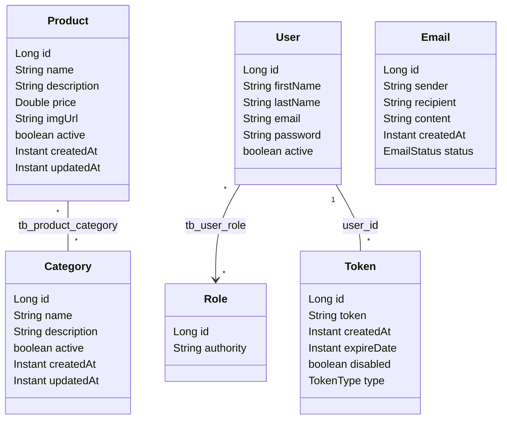

# Modelo de domínio

Este guia descreve as entidades do ASJCatalog, seus campos, relacionamentos e as regras de negócio que ficam dentro delas.

## Sumário

1. [Visão geral](#1-visão-geral)
2. [Diagrama de relacionamentos](#2-diagrama-de-relacionamentos)
3. [Category](#3-category)
4. [Product](#4-product)
5. [User](#5-user)
6. [Role](#6-role)
7. [Token](#7-token)
8. [Email](#8-email)
9. [Limitações conhecidas](#9-limitações-conhecidas)

## 1. Visão geral

Uma **entidade** é uma classe Java mapeada para uma tabela do banco com as anotações do JPA (`@Entity`, `@Table`, `@Column`). O **JPA** é a especificação Java de persistência, e o **Hibernate** é a biblioteca que a implementa e traduz as operações nos objetos em comandos SQL.

As entidades ficam em `com.albertsilva.dev.asjcatalog.domain`, divididas em três subpacotes:

| Subpacote | Entidades | Assunto |
| --- | --- | --- |
| `domain.catalog` | `Category`, `Product` | Catálogo de produtos |
| `domain.user` | `User`, `Role` | Usuários e permissões |
| `domain.recovery` | `Token`, `Email` e as enums `TokenType`, `EmailStatus` | Ativação de conta, recuperação de senha e registro de e-mails |

Na raiz do pacote fica a interface `Identifiable<ID>`, com um único método, `getId()`. Hoje ela é implementada por `Product` e pela projection `ProductProjection`, e é usada para reordenar resultados de consulta (veja [DATA-ACCESS.md](DATA-ACCESS.md#5-o-problema-n1-e-a-listagem-de-produtos)).

Todas as entidades usam `id` do tipo `Long`, gerado pelo banco (`GenerationType.IDENTITY`). As datas usam `Instant` gravado como `TIMESTAMP WITHOUT TIME ZONE`.

## 2. Diagrama de relacionamentos

| Relacionamento | Tipo | Tabela ou coluna | Direção |
| --- | --- | --- | --- |
| `Product` ↔ `Category` | Muitos para muitos (`@ManyToMany`) | Tabela de junção `tb_product_category` | Bidirecional: o lado dono é `Product.categories`; `Category.products` usa `mappedBy` |
| `User` → `Role` | Muitos para muitos (`@ManyToMany`) | Tabela de junção `tb_user_role` | Unidirecional: `Role` não conhece os usuários |
| `User` ↔ `Token` | Um para muitos / muitos para um | Coluna `tb_token.user_id` | Bidirecional: `Token.user` (carregamento *lazy*) e `User.tokens` |
| `Email` | Nenhum | — | `Email` não tem relação com `User`: o destinatário é só um texto |

Uma **tabela de junção** guarda os pares de ids de um relacionamento muitos para muitos. O **lado dono** é a entidade cujo mapeamento controla essa tabela. Carregamento **lazy** significa que o objeto relacionado só é buscado no banco quando o código o acessa.

## 3. Category

Tabela `tb_category`. Representa uma categoria do catálogo.

| Campo | Regra no mapeamento |
| --- | --- |
| `name` | Obrigatório, único, até 80 caracteres |
| `description` | Até 255 caracteres |
| `active` | Indica se a categoria está ativa |
| `createdAt` | Preenchido em `@PrePersist`, antes da primeira gravação |
| `updatedAt` | Preenchido em `@PreUpdate`, a cada atualização |
| `products` | Lado inverso do relacionamento com `Product` |

`@PrePersist` e `@PreUpdate` são **callbacks do JPA**: métodos que o Hibernate chama automaticamente antes de inserir ou de atualizar a linha.

## 4. Product

Tabela `tb_product`. Representa um produto do catálogo e implementa `Identifiable<Long>`.

| Campo | Regra no mapeamento |
| --- | --- |
| `name` | Obrigatório e único |
| `description` | Texto longo (`TEXT`) |
| `price` | `Double` (coluna `float(53)`) |
| `imgUrl` | Endereço da imagem |
| `active` | Indica se o produto está ativo |
| `createdAt`, `updatedAt` | Os dois são preenchidos em `@PrePersist`; `updatedAt` também em `@PreUpdate` |
| `categories` | Lado dono do relacionamento com `Category` |

## 5. User

Tabela `tb_user`. Representa um usuário e implementa `UserDetails`, a interface que o Spring Security usa para autenticar.

| Campo | Regra no mapeamento |
| --- | --- |
| `firstName`, `lastName` | Nome e sobrenome |
| `email` | Obrigatório e único; é o login do usuário |
| `password` | Hash BCrypt da senha (os services codificam a senha antes de gravar) |
| `active` | Conta ativa ou inativa |
| `roles` | Roles do usuário |
| `tokens` | Tokens do usuário, com `cascade = ALL` e `orphanRemoval = true` |

Com `cascade = ALL`, operações feitas no usuário, como remover, também valem para os tokens dele. Com `orphanRemoval = true`, um token retirado da coleção é apagado do banco.

**Regras dentro da entidade:**

- `activate()` e `deactivate()` mudam o campo `active`.
- `addRole(role)` adiciona uma role.
- `hasRole(nome)` diz se o usuário tem a role com aquele nome; devolve `false` se o nome for nulo.

**Como o Spring Security enxerga o usuário:**

| Método de `UserDetails` | Valor |
| --- | --- |
| `getUsername()` | O e-mail |
| `getAuthorities()` | As roles |
| `isEnabled()` | O campo `active`: conta inativa não consegue fazer login |
| `isAccountNonExpired()`, `isAccountNonLocked()`, `isCredentialsNonExpired()` | Sempre `true` |

## 6. Role

Tabela `tb_role`. Representa uma permissão e implementa `GrantedAuthority`, a interface do Spring Security para permissões.

O campo `authority` guarda o nome da role. Existem duas, criadas pela migration `V104__insert_role.sql` (pasta `db/migration/reference`):

| Role | Uso |
| --- | --- |
| `ROLE_OPERATOR` | Atribuída automaticamente a toda conta criada pelo cadastro público |
| `ROLE_ADMIN` | Acesso administrativo |

## 7. Token

Tabela `tb_token`. Representa um token de uso único enviado por e-mail, para ativação de conta ou para recuperação de senha. **Não confunda** com o token JWT de login, que não é gravado nesta tabela.

| Campo | Regra no mapeamento |
| --- | --- |
| `token` | Valor do token (um UUID aleatório), obrigatório e único |
| `user` | Usuário dono, obrigatório, carregado sob demanda (*lazy*) |
| `createdAt` | Preenchido no construtor; não muda depois (`updatable = false`) |
| `expireDate` | Data de expiração, obrigatória |
| `disabled` | Indica se o token foi invalidado |
| `type` | `ACTIVATION` ou `PASSWORD_RECOVERY`, gravado como texto |

**Factory methods.** Um *factory method* é um método estático que cria o objeto já configurado corretamente, no lugar de chamar o construtor direto. `Token` tem dois:

| Método | Tipo criado | Validade |
| --- | --- | --- |
| `Token.activationToken(user, horas)` | `ACTIVATION` | Agora + `horas` (padrão 24, `ACTIVATION_TOKEN_HOURS`) |
| `Token.passwordRecoveryToken(user, minutos)` | `PASSWORD_RECOVERY` | Agora + `minutos` (padrão 30, `PASSWORD_RECOVER_TOKEN_MINUTES`) |

Os dois geram o valor com `UUID.randomUUID()`. Quem os chama é o `TokenService`, que lê as validades da configuração.

**Regras dentro da entidade:**

- `isExpired()`: a data de expiração já passou.
- `isValid()`: não está desativado e não expirou.
- `disable()`: marca o token como desativado.
- `validate(tipoEsperado)`: lança `InvalidTokenException` na primeira regra violada, nesta ordem:

| Condição | Chave da mensagem |
| --- | --- |
| Tipo diferente do esperado | `error.token.type.invalid` |
| Token desativado | `error.token.disabled` |
| Token expirado | `error.token.expired` |

## 8. Email

Tabela `tb_email`. Registra os e-mails enviados pela aplicação.

| Campo | Conteúdo |
| --- | --- |
| `sender` | Remetente registrado |
| `recipient` | E-mail do destinatário (texto; não há relação com `User`) |
| `content` | Texto do registro; hoje recebe o assunto do e-mail |
| `createdAt` | Preenchido no construtor |
| `status` | `PENDING`, `SENT` ou `ERROR` (enum `EmailStatus`) |

O construtor recebe um `EmailRegisterRequest` e define `status = PENDING` e `createdAt` com o momento atual.

## 9. Limitações conhecidas

- **O status do e-mail nunca muda.** Todo registro é gravado como `PENDING`; nenhum código atribui `SENT` ou `ERROR`.
- **Só envios bem-sucedidos são registrados.** O `EmailService` grava o registro depois de enviar; quando o envio falha, nada é gravado em `tb_email`.
- **O registro de e-mail guarda pouco.** `content` recebe só o assunto, e `sender` é gravado como `asjcatalog@gmail.com`, enquanto o cabeçalho do e-mail usa `nao-responder@asjcatalog.com.br`.
- **Datas diferentes na criação.** `Product` preenche `createdAt` e `updatedAt` ao ser criado; `Category` preenche só `createdAt`, e seu `updatedAt` fica nulo até a primeira atualização.
- **Igualdade por id.** `equals` e `hashCode` das entidades comparam só o `id`. Duas instâncias ainda não salvas (com `id` nulo) são consideradas iguais.
- **Preço em ponto flutuante.** `price` é `Double`, um tipo que não representa todos os valores decimais de forma exata.
