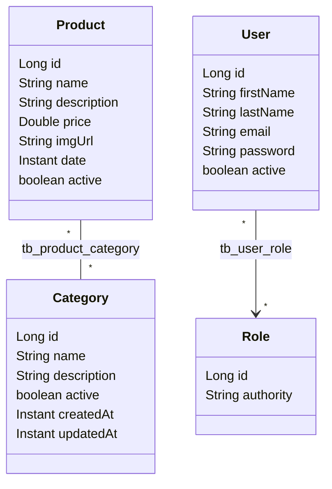

# Modelo de domínio

Este guia descreve as entidades do ASJCatalog no capítulo 03, seus campos, construtores e relacionamentos: `Category` e `Product`, do catálogo, e `User` e `Role`, da segurança.

## Sumário

1. [Visão geral](#1-visão-geral)
2. [Diagrama de relacionamentos](#2-diagrama-de-relacionamentos)
3. [Category](#3-category)
4. [Product](#4-product)
5. [User](#5-user)
6. [Role](#6-role)
7. [Construtores](#7-construtores)
8. [Limitações conhecidas](#8-limitações-conhecidas)

## 1. Visão geral

Uma **entidade** é uma classe Java mapeada para uma tabela do banco com as anotações do JPA (`@Entity`, `@Table`, `@Column`). O **JPA** é a especificação Java de persistência, e o **Hibernate** é a biblioteca que a implementa e traduz as operações nos objetos em comandos SQL.

Neste capítulo existem quatro entidades, no pacote `com.albertsilva.dev.asjcatalog.entity`:

| Entidade | Tabela | Representa |
| --- | --- | --- |
| `Category` | `tb_category` | Uma categoria do catálogo |
| `Product` | `tb_product` | Um produto do catálogo |
| `User` | `tb_user` | Um usuário que faz login na API |
| `Role` | `tb_role` | Um perfil de permissões, como `ROLE_ADMIN` |

Todas usam `id` do tipo `Long`, gerado pelo banco (`GenerationType.IDENTITY`), e implementam `Serializable`. As datas usam `Instant`, gravado como `TIMESTAMP WITHOUT TIME ZONE`.

## 2. Diagrama de relacionamentos

Modelo conceitual do capítulo, que mostra as entidades e os relacionamentos de forma simplificada:

A imagem omite alguns campos: `active` em todas as entidades, `description`, `createdAt` e `updatedAt` em `Category` e `date` em `Product`. O diagrama abaixo mostra todos os campos:

Os dois relacionamentos são **muitos para muitos** (`@ManyToMany`), gravados em **tabelas de junção**, que guardam os pares de ids:

| Relacionamento | Tabela de junção | Lado dono | Lado inverso |
| --- | --- | --- | --- |
| Produto e categorias | `tb_product_category` (`product_id`, `category_id`) | `Product.categories` | `Category.products` (`mappedBy = "categories"`) |
| Usuário e roles | `tb_user_role` (`user_id`, `role_id`) | `User.roles` | Nenhum: `Role` não conhece os usuários |

O **lado dono** é a entidade cujo mapeamento controla a tabela de junção. Para vincular um produto a categorias, ou um usuário a roles, altera-se a coleção do lado dono.

Na exclusão:

- apagar um **produto** ou um **usuário** remove também os vínculos dele na tabela de junção (confirmado por execução: `DELETE /products/1` e `DELETE /users/3` responderam 204);
- apagar uma **categoria** que ainda tem produtos é recusado pelo banco, por causa da chave estrangeira: resposta 409 (veja [ERROR-HANDLING.md](ERROR-HANDLING.md)).

## 3. Category

Tabela `tb_category`.

| Campo | Coluna | Regra no mapeamento |
| --- | --- | --- |
| `name` | `name` | **Obrigatório e único** (`nullable = false, unique = true`), até 80 caracteres |
| `description` | `description` | Até 255 caracteres |
| `active` | `active` | Obrigatório no banco (`NOT NULL`); indica se a categoria está ativa |
| `createdAt` | `created_at` | Preenchido em `@PrePersist`, antes da primeira gravação |
| `updatedAt` | `updated_at` | Preenchido em `@PreUpdate`, a cada atualização |
| `products` | — | Lado inverso do relacionamento com `Product` |

`@PrePersist` e `@PreUpdate` são **callbacks do JPA**: métodos que o Hibernate chama automaticamente antes de inserir ou de atualizar a linha.

Neste capítulo, `name` passou a ser obrigatório e único também no banco. A API confere a unicidade antes de gravar, sem diferenciar maiúsculas (veja [VALIDATION.md](VALIDATION.md#3-validadores-customizados)).

## 4. Product

Tabela `tb_product`.

| Campo | Coluna | Regra no mapeamento |
| --- | --- | --- |
| `name` | `name` | **Obrigatório e único**, até 255 caracteres no banco (a validação limita a 100) |
| `description` | `description` | Texto longo (`TEXT`) |
| `price` | `price` | `Double` (coluna `FLOAT(53)`) |
| `imgUrl` | `img_url` | Endereço da imagem |
| `date` | `date` | Data informada pelo cliente |
| `active` | `active` | Obrigatório no banco; indica se o produto está ativo |
| `categories` | — | Lado dono do relacionamento com `Category` |

Categoria e produto são criados sempre ativos, e o status muda pelos endpoints `activate` e `deactivate`.

## 5. User

Tabela `tb_user`. `User` implementa `UserDetails`, a interface do Spring Security que representa um usuário que pode se autenticar.

| Campo | Coluna | Regra no mapeamento |
| --- | --- | --- |
| `firstName` | `first_name` | Sem restrição no banco (a validação exige 2 a 80 caracteres) |
| `lastName` | `last_name` | Sem restrição no banco (idem) |
| `email` | `email` | **Obrigatório e único**. É o login do usuário |
| `password` | `password` | Hash BCrypt da senha; nunca a senha em texto |
| `active` | `active` | Obrigatório no banco; indica se o usuário está ativo |
| `roles` | — | Lado dono do relacionamento com `Role` |

Métodos ligados à segurança:

| Método | Devolve |
| --- | --- |
| `getUsername()` | O `email` |
| `getAuthorities()` | As `roles` |
| `hasRole(String)` | Se o usuário tem a role com aquele nome exato (por exemplo `ROLE_ADMIN`) |

O usuário é criado ativo pelo `UserService`. A senha recebida é criptografada antes de gravar.

## 6. Role

Tabela `tb_role`. `Role` implementa `GrantedAuthority`, a interface do Spring Security para uma permissão.

| Campo | Coluna | Conteúdo |
| --- | --- | --- |
| `authority` | `authority` | O nome da role, com o prefixo `ROLE_` |

Os dados de exemplo têm duas roles: `ROLE_OPERATOR` (id 1) e `ROLE_ADMIN` (id 2). Não há endpoint para criar roles; elas vêm das migrations e do `import.sql`. O uso das roles nas permissões está em [AUTHENTICATION.md](AUTHENTICATION.md#6-roles-e-regras-de-acesso).

## 7. Construtores

| Entidade | Construtores |
| --- | --- |
| `Category` | `Category()`, `Category(id, name, description, active)` e `Category(name, description, active)` |
| `Product` | `Product()`, `Product(id, name, description, price, imgUrl, date, active)` e `Product(name, description, price, imgUrl, date, active)` |
| `User` | `User()` e `User(id, firstName, lastName, email, password, active)` |
| `Role` | `Role()` e `Role(id, authority)` |

O construtor sem argumentos é exigido pelo JPA. Os construtores sem id de `Category` e `Product` são usados pelas factories dos testes.

## 8. Limitações conhecidas

- **Usuário desativado continua fazendo login.** `User` não sobrescreve `isEnabled()`, e o login não considera o campo `active`. Veja [AUTHENTICATION.md](AUTHENTICATION.md#11-limitações-conhecidas). O bloqueio de usuários inativos chega no capítulo 04.
- **O produto não registra quando foi criado ou alterado.** Não há `createdAt` nem `updatedAt` em `Product`; o campo `date` é um valor livre enviado pelo cliente. As datas de auditoria do produto chegam no capítulo 04.
- **`updatedAt` fica vazio na criação da categoria.** `Category.prePersist` só preenche `createdAt`.
- **Igualdade por id.** `equals` e `hashCode` das entidades comparam só o `id`. Duas instâncias ainda não salvas (com `id` nulo) são consideradas iguais.
- **Preço em ponto flutuante.** `price` é `Double`, um tipo que não representa todos os valores decimais de forma exata.
- **Limites diferentes no banco e na validação.** O nome do produto aceita 255 caracteres no banco e 100 na validação; nome e sobrenome do usuário não têm limite no banco.
