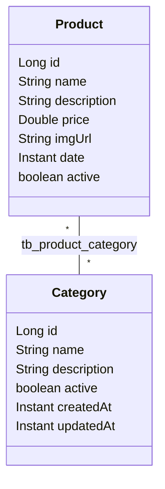

# Modelo de domínio

Este guia descreve as entidades do ASJCatalog no capítulo 01, seus campos e o relacionamento entre elas.

## Sumário

1. [Visão geral](#1-visão-geral)
2. [Diagrama de relacionamentos](#2-diagrama-de-relacionamentos)
3. [Category](#3-category)
4. [Product](#4-product)
5. [Limitações conhecidas](#5-limitações-conhecidas)

## 1. Visão geral

Uma **entidade** é uma classe Java mapeada para uma tabela do banco com as anotações do JPA (`@Entity`, `@Table`, `@Column`). O **JPA** é a especificação Java de persistência, e o **Hibernate** é a biblioteca que a implementa e traduz as operações nos objetos em comandos SQL.

Neste capítulo existem duas entidades, no pacote `com.albertsilva.dev.asjcatalog.entity`:

| Entidade | Tabela | Representa |
| --- | --- | --- |
| `Category` | `tb_category` | Uma categoria do catálogo |
| `Product` | `tb_product` | Um produto do catálogo |

As duas usam `id` do tipo `Long`, gerado pelo banco (`GenerationType.IDENTITY`), e implementam `Serializable`. As datas usam `Instant`, gravado como `TIMESTAMP WITHOUT TIME ZONE`.

## 2. Diagrama de relacionamentos

O relacionamento é **muitos para muitos** (`@ManyToMany`): um produto pode ter várias categorias, e uma categoria pode ter vários produtos. Ele é gravado na **tabela de junção** `tb_product_category`, que guarda os pares `product_id` e `category_id`.

O **lado dono** do relacionamento, a entidade cujo mapeamento controla a tabela de junção, é `Product.categories` (`@JoinTable`). `Category.products` é o lado inverso (`mappedBy = "categories"`). Na prática, para vincular um produto a categorias, altera-se a coleção do produto.

## 3. Category

Tabela `tb_category`.

| Campo | Coluna | Regra no mapeamento |
| --- | --- | --- |
| `name` | `name` | Texto até 255 caracteres, sem restrição de obrigatoriedade nem de unicidade |
| `description` | `description` | Texto até 255 caracteres |
| `active` | `active` | Obrigatório no banco (`NOT NULL`); indica se a categoria está ativa |
| `createdAt` | `created_at` | Preenchido em `@PrePersist`, antes da primeira gravação |
| `updatedAt` | `updated_at` | Preenchido em `@PreUpdate`, a cada atualização |
| `products` | — | Lado inverso do relacionamento com `Product` |

`@PrePersist` e `@PreUpdate` são **callbacks do JPA**: métodos que o Hibernate chama automaticamente antes de inserir ou de atualizar a linha.

A categoria é criada sempre ativa (`CategoryService.create` define `active = true`), e o status muda pelos endpoints `activate` e `deactivate`.

## 4. Product

Tabela `tb_product`.

| Campo | Coluna | Regra no mapeamento |
| --- | --- | --- |
| `name` | `name` | Texto até 255 caracteres, sem restrição de obrigatoriedade nem de unicidade |
| `description` | `description` | Texto longo (`TEXT`) |
| `price` | `price` | `Double` (coluna `FLOAT(53)`) |
| `imgUrl` | `img_url` | Endereço da imagem |
| `date` | `date` | Data informada pelo cliente na criação e na atualização |
| `active` | `active` | Obrigatório no banco (`NOT NULL`); indica se o produto está ativo |
| `categories` | — | Lado dono do relacionamento com `Category` |

O produto também é criado sempre ativo, e o status muda pelos endpoints `activate` e `deactivate`. As categorias são informadas por id (`categoryIds`) e resolvidas pelo `ProductService`; veja [API-ENDPOINTS.md](API-ENDPOINTS.md).

## 5. Limitações conhecidas

- **Nomes repetidos e vazios são aceitos.** As colunas `name` não têm `NOT NULL` nem `UNIQUE`, e os DTOs não têm validação: é possível criar duas categorias com o mesmo nome, ou um produto sem nome. Nomes únicos e validação chegam no capítulo 03.
- **O produto não registra quando foi criado ou alterado.** Não há `createdAt` nem `updatedAt` em `Product`; o campo `date` é um valor livre enviado pelo cliente. As datas de auditoria do produto chegam no capítulo 04.
- **Igualdade por id.** `equals` e `hashCode` das entidades comparam só o `id`. Duas instâncias ainda não salvas (com `id` nulo) são consideradas iguais.
- **Preço em ponto flutuante.** `price` é `Double`, um tipo que não representa todos os valores decimais de forma exata.
