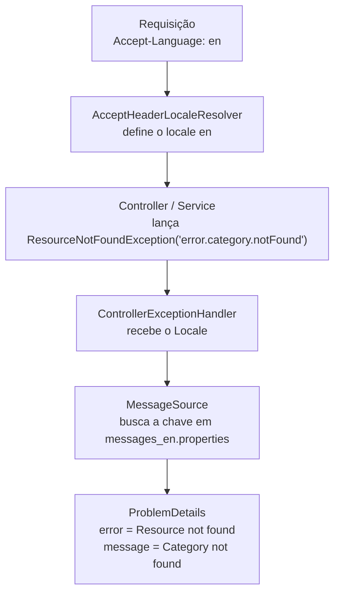

# Internacionalização

⬅️ Anterior: [Tratamento de erros](ERROR-HANDLING.md) · [🏠 Índice](../HOME.md) · Próximo: [Autenticação e autorização](AUTHENTICATION.md) ➡️

Este guia explica como a API responde em português, inglês ou espanhol, onde ficam as mensagens e como adicionar uma mensagem ou um idioma novo.

## Sumário

1. [Visão geral](#1-visão-geral)
2. [Configuração](#2-configuração)
3. [Arquivos de mensagens](#3-arquivos-de-mensagens)
4. [O que é traduzido](#4-o-que-é-traduzido)
5. [Fluxo de uma resposta traduzida](#5-fluxo-de-uma-resposta-traduzida)
6. [Exemplos](#6-exemplos)
7. [Testes](#7-testes)
8. [Adicionar uma mensagem](#8-adicionar-uma-mensagem)
9. [Adicionar um idioma](#9-adicionar-um-idioma)
10. [Limitações conhecidas](#10-limitações-conhecidas)

## 1. Visão geral

**Internacionalização** (abreviada como **i18n**: "i", 18 letras, "n") é preparar a aplicação para mais de um idioma, sem textos fixos no código.

A API tem mensagens em três idiomas:

| Idioma | Arquivo |
| --- | --- |
| Português do Brasil (padrão) | `messages_pt_BR.properties` |
| Inglês | `messages_en.properties` |
| Espanhol | `messages_es.properties` |

O cliente escolhe o idioma pelo cabeçalho HTTP **`Accept-Language`** (por exemplo `Accept-Language: en`). Sem o cabeçalho, ou com um idioma não suportado, a resposta vem em português. Nada fica guardado em sessão: cada requisição traz o seu idioma.

## 2. Configuração

A configuração fica na classe `config/i18n/MessageSourceConfig.java`, que declara dois beans:

| Bean | Classe | Configuração |
| --- | --- | --- |
| `messageSource` | `ReloadableResourceBundleMessageSource` | Arquivos `classpath:messages_*.properties`, lidos em UTF-8; não usa o idioma do sistema operacional como reserva (`fallbackToSystemLocale=false`); idioma padrão `pt_BR` |
| `localeResolver` | `AcceptHeaderLocaleResolver` | Lê o idioma do cabeçalho `Accept-Language`; padrão `pt_BR` |

O **`MessageSource`** é o componente do Spring que busca um texto pela chave e pelo idioma. O **`LocaleResolver`** decide o idioma (*locale*) de cada requisição.

**Idioma não suportado.** Com `Accept-Language: fr`, por exemplo, não existe `messages_fr.properties`. Como a busca no idioma do sistema está desligada, o `MessageSource` usa o idioma padrão, e a resposta vem em português. O `AcceptLanguageIT` confirma esse comportamento.

> **Atenção:** como a classe declara os beans `messageSource` e `localeResolver`, as propriedades `spring.messages.*` e `spring.web.locale*` **não têm efeito** neste projeto. Para mudar o comportamento de idioma, altere `MessageSourceConfig`.

## 3. Arquivos de mensagens

Os três arquivos ficam em `backend/src/main/resources`, estão em UTF-8 e têm **exatamente as mesmas chaves** (hoje, 79). Muda só o texto. Cada arquivo é dividido em blocos comentados:

| Bloco | Exemplos de chave |
| --- | --- |
| API - Erros Globais (ProblemDetails) | `error.resource.title`, `error.category.notFound`, `error.token.expired` |
| Category - Validação | `category.name.notBlank`, `category.name.unique` |
| Product - Validação | `product.price.positive`, `product.categoryIds.invalid` |
| Role - Validação | `role.invalid` |
| User - Dados pessoais | `user.email.invalid`, `user.email.unique` |
| User - Senha | `user.password.uppercase`, `user.password.personalData` |
| Email - Validação | `email.sender.notBlank` |

Algumas mensagens têm **placeholders**, trechos entre chaves que o Bean Validation substitui pelo valor da anotação. Por exemplo, `category.name.size=O nome da categoria deve ter entre {min} e {max} caracteres` recebe `{min}` e `{max}` do `@Size(min = 3, max = 80)`.

O projeto não tem `ValidationMessages.properties`: todas as mensagens, inclusive as de validação, ficam nos arquivos `messages_*.properties`.

## 4. O que é traduzido

| Origem | Como a chave chega ao texto |
| --- | --- |
| Anotações de validação dos DTOs | `@NotBlank(message = "{category.name.notBlank}")`: o Bean Validation traduz a chave no idioma da requisição |
| Validadores customizados | Usam a mesma forma, por exemplo `buildConstraintViolationWithTemplate("{user.email.unique}")` |
| Exceções de negócio | Carregam a chave como mensagem: `new ResourceNotFoundException("error.category.notFound")` |
| `ControllerExceptionHandler` | Recebe o `Locale` da requisição e usa o `MessageSource` para montar os campos `error` e `message` |

**Código estável.** Além do texto traduzido, toda resposta de erro traz o campo `code`, do enum `ApiErrorCode` (por exemplo `RESOURCE_NOT_FOUND`), que **não muda com o idioma**. O cliente deve usar `code` para decidir o que fazer e `error`/`message` para mostrar ao usuário. Veja [ERROR-HANDLING.md](ERROR-HANDLING.md).

O formato das respostas de erro é a classe `ProblemDetails`, **do próprio projeto**. Ela não segue a RFC 7807, apesar do nome parecido.

## 5. Fluxo de uma resposta traduzida



## 6. Exemplos

Respostas reais de `GET /api/v1/categories/999999`.

**Sem `Accept-Language`, ou com `Accept-Language: fr`:**

```json
{
  "timestamp": "2026-09-29T21:02:30.319566500Z",
  "status": 404,
  "code": "RESOURCE_NOT_FOUND",
  "error": "Recurso não encontrado",
  "message": "Categoria não encontrada",
  "path": "/api/v1/categories/999999"
}
```

**Com `Accept-Language: en`:**

```json
{
  "timestamp": "2026-09-29T21:02:30.375480900Z",
  "status": 404,
  "code": "RESOURCE_NOT_FOUND",
  "error": "Resource not found",
  "message": "Category not found",
  "path": "/api/v1/categories/999999"
}
```

**PowerShell**:

```powershell
curl.exe -s http://localhost:8080/api/v1/categories/999999 -H 'Accept-Language: en'
```

**bash**:

```bash
curl -s http://localhost:8080/api/v1/categories/999999 -H 'Accept-Language: en'
```

Os erros de validação (422) também chegam traduzidos, campo a campo. Um exemplo completo com `fieldErrors` está em [ERROR-HANDLING.md](ERROR-HANDLING.md#3-validationerror).

## 7. Testes

| Teste | Tipo | O que garante |
| --- | --- | --- |
| `i18n/MessagesPropertiesTest` | Unidade | Os três arquivos têm as mesmas chaves; as traduções de uma chave usam os mesmos placeholders; toda chave usada no código de produção (literais `"{chave}"` e chaves passadas às exceções do pacote `service/exception`) existe nos três arquivos |
| `integrations/i18n/AcceptLanguageIT` | Integração | Resposta em inglês com `en`, em espanhol com `es`, em português sem o cabeçalho e em português com um idioma não suportado; mensagens de validação em inglês com `en` |

O `MessagesPropertiesTest` lê os arquivos Java de `src/main/java` como texto, procurando as chaves. Ele falha se uma chave for usada no código e esquecida em algum arquivo de mensagens.

## 8. Adicionar uma mensagem

1. Escolha uma chave no padrão do bloco a que ela pertence, por exemplo `error.product.outOfStock` ou `product.stock.positive`.
2. Adicione a chave **nos três arquivos**, no mesmo bloco, com o texto traduzido. Se usar placeholders (`{min}`), use os mesmos nas três traduções.
3. Use a chave no código:
   - numa anotação: `@Positive(message = "{product.stock.positive}")`;
   - numa exceção de negócio: `throw new ResourceNotFoundException("error.product.outOfStock")`.
4. Rode o teste de mensagens:

   ```powershell
   cd backend
   .\mvnw test '-Dtest=MessagesPropertiesTest'
   ```

   No bash: `./mvnw test -Dtest=MessagesPropertiesTest`.

## 9. Adicionar um idioma

Exemplo com francês:

1. Copie `messages_en.properties` para `messages_fr.properties`, na mesma pasta, salvando em UTF-8.
2. Traduza todos os textos, sem mudar as chaves nem os placeholders.
3. Inclua o arquivo novo no `MessagesPropertiesTest`: a lista `OTHER_FILES` hoje tem só `messages_en.properties` e `messages_es.properties`.
4. Rode os testes (`./mvnw test`) e confira com `Accept-Language: fr`.

A classe `MessageSourceConfig` não precisa mudar: ela procura qualquer arquivo `messages_<idioma>.properties`.

## 10. Limitações conhecidas

- **Os erros de `/oauth2/token` não são traduzidos.** As mensagens do login (`Invalid credentials`, `Your account has not been activated yet. Please check your email.`) são textos fixos em inglês no `CustomPasswordAuthenticationProvider`.
- **O 401 do Resource Server não é traduzido.** Requisições sem token ou com token inválido em rotas protegidas são recusadas pelos filtros de segurança antes do `ControllerExceptionHandler`, e a resposta vem sem corpo.
- **Textos fixos em outros pontos.** Os assuntos e textos dos e-mails (`Confirmação de Cadastro`, `Redefinição de Senha`) e as mensagens de log estão em português, direto no código.
- **Uma chave inexistente aparece crua.** Se o handler receber uma chave que não está nos arquivos, o campo mostra a própria chave (ou a mensagem reserva do handler). O `MessagesPropertiesTest` evita isso para as chaves que ele consegue encontrar no código.

---

⬅️ Anterior: [Tratamento de erros](ERROR-HANDLING.md) · [🏠 Índice](../HOME.md) · Próximo: [Autenticação e autorização](AUTHENTICATION.md) ➡️
