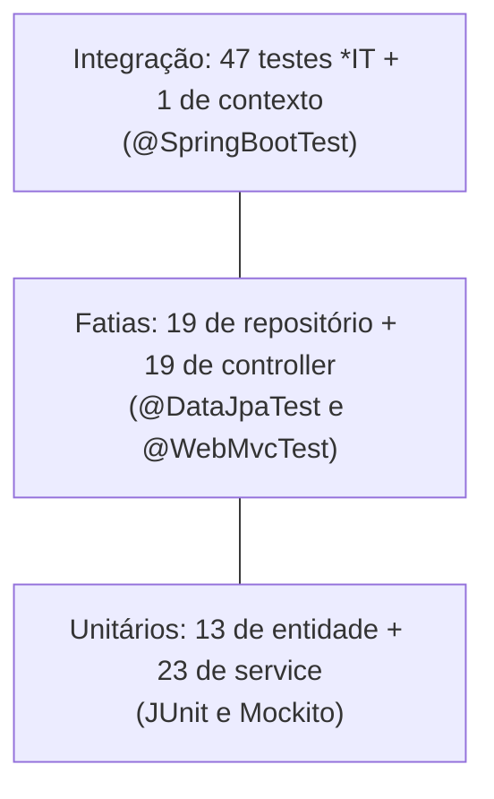
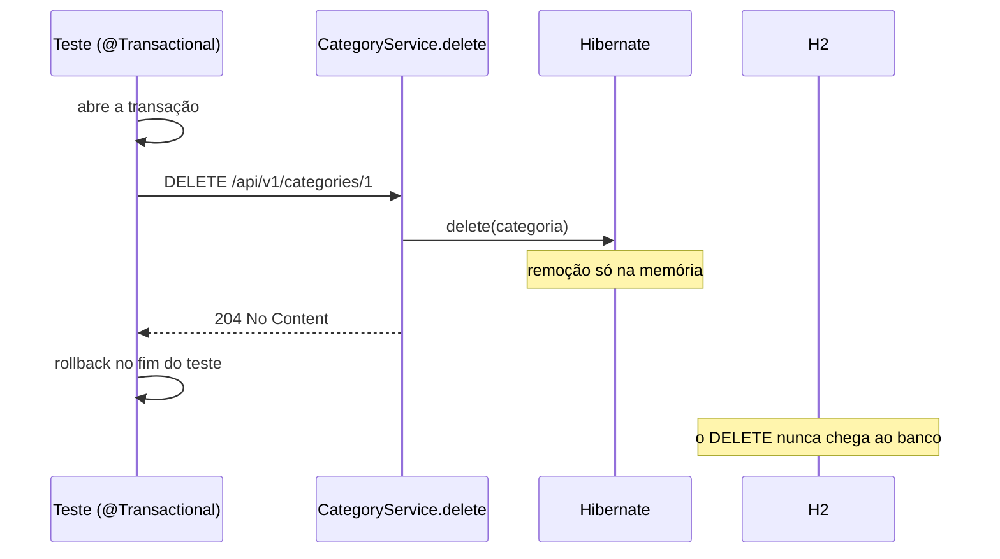

# Testes automatizados

Este guia mostra como os testes automatizados do ASJCatalog estão organizados no capítulo 02, como rodá-los e o que cada tipo de teste verifica, com trechos reais do código.

## Sumário

1. [Como rodar os testes](#1-como-rodar-os-testes)
2. [Tipos de teste e a pirâmide](#2-tipos-de-teste-e-a-pirâmide)
3. [Mapa dos pacotes de teste](#3-mapa-dos-pacotes-de-teste)
4. [Inventário das classes](#4-inventário-das-classes)
5. [Testes de entidade](#5-testes-de-entidade)
6. [Testes de repositório com @DataJpaTest](#6-testes-de-repositório-com-datajpatest)
7. [Testes de service com Mockito](#7-testes-de-service-com-mockito)
8. [Testes de controller com @WebMvcTest](#8-testes-de-controller-com-webmvctest)
9. [Testes de integração com @Transactional](#9-testes-de-integração-com-transactional)
10. [Factories e dados de exemplo](#10-factories-e-dados-de-exemplo)
11. [Padrões de escrita](#11-padrões-de-escrita)
12. [TDD](#12-tdd)
13. [Limitações conhecidas](#13-limitações-conhecidas)

## 1. Como rodar os testes

Todos os comandos rodam dentro da pasta `backend`. O projeto traz o **Maven Wrapper** (`mvnw` e `mvnw.cmd`), então não é preciso instalar o Maven. Nenhum comando desta seção precisa do PostgreSQL: o perfil padrão do projeto é `test`, que usa o banco H2 em memória (veja [CONFIGURATION.md](CONFIGURATION.md)).

### Suíte padrão

**PowerShell**:

```powershell
cd backend
.\mvnw clean verify
```

**bash**:

```bash
cd backend
./mvnw clean verify
```

Resultado esperado: `Tests run: 75, Failures: 0, Errors: 0, Skipped: 0` e `BUILD SUCCESS`.

Quem executa os testes no Maven é o **Surefire**, um plugin que, por padrão, só roda as classes cujo nome começa com `Test` ou termina em `Test`, `Tests` ou `TestCase`. Por isso as quatro classes terminadas em `IT` (os testes de integração, 47 no total) **não rodam** no `verify` deste capítulo. Veja [Limitações conhecidas](#13-limitações-conhecidas).

Os relatórios de cada execução ficam em `backend/target/surefire-reports`.

### Uma classe

```powershell
.\mvnw test '-Dtest=CategoryServiceTest'
```

```bash
./mvnw test -Dtest=CategoryServiceTest
```

Roda os 12 testes de `CategoryServiceTest`. O parâmetro `-Dtest` escolhe as classes de teste; no PowerShell, ele vai entre aspas simples por causa do ponto no nome.

### Um método

Os métodos de teste ficam dentro de **classes aninhadas** (`@Nested`, seção 11). Por isso o filtro precisa do nome da classe interna, separado por `$`, e do método, depois de `#`:

```powershell
.\mvnw test '-Dtest=CategoryServiceTest$FindByIdOperations#findByIdShouldReturnCategoryWhenIdExists'
```

```bash
./mvnw test '-Dtest=CategoryServiceTest$FindByIdOperations#findByIdShouldReturnCategoryWhenIdExists'
```

Resultado: `Tests run: 1`. Sem o nome da classe aninhada (`-Dtest=CategoryServiceTest#findByIdShouldReturnCategoryWhenIdExists`), o Maven não encontra o método e roda 0 testes. No bash, as aspas simples impedem que o `$` seja interpretado pelo terminal.

### Testes de integração

```powershell
.\mvnw test '-Dtest=*IT'
```

```bash
./mvnw test '-Dtest=*IT'
```

Resultado: `Tests run: 47, Failures: 1` e `BUILD FAILURE`. A falha é conhecida e está explicada na [seção 9](#9-testes-de-integração-com-transactional):

```text
CategoryControllerIT.deleteShouldReturnBadRequestWhenCategoryHasAssociatedProducts Status expected:<409> but was:<204>
```

**Contorno 1**: rodar todos e não interromper o build pela falha. A falha continua aparecendo no relatório, mas o resultado é `BUILD SUCCESS`:

```powershell
.\mvnw test '-Dtest=*IT' '-Dmaven.test.failure.ignore=true'
```

```bash
./mvnw test '-Dtest=*IT' -Dmaven.test.failure.ignore=true
```

**Contorno 2**: deixar de fora a classe `CategoryControllerIT` inteira. Rodam 35 testes, todos passando:

```powershell
.\mvnw test '-Dtest=*IT,!CategoryControllerIT' '-Dsurefire.failIfNoSpecifiedTests=false'
```

```bash
./mvnw test '-Dtest=*IT,!CategoryControllerIT' -Dsurefire.failIfNoSpecifiedTests=false
```

Excluir só o método que falha (`!CategoryControllerIT#deleteShould...`, com ou sem o nome da classe aninhada) não funcionou: o filtro selecionou 0 testes.

## 2. Tipos de teste e a pirâmide

| Tipo | O que sobe | Velocidade | Neste projeto |
| --- | --- | --- | --- |
| **Unitário** | Nada do Spring; só a classe testada, com as dependências simuladas | Milissegundos | Entidades e services |
| **Fatia** (*slice*) | Só uma camada do Spring: JPA ou MVC | Segundos | Repositórios (`@DataJpaTest`) e controllers (`@WebMvcTest`) |
| **Integração** | A aplicação inteira, com banco H2 e dados de exemplo | Segundos | Classes `*IT` e o teste de contexto |

Um **mock** é um objeto falso que substitui uma dependência real. O teste diz ao mock o que ele deve devolver e, depois, confere se ele foi chamado como esperado. Assim, um teste de service não precisa de banco: o repositório é um mock.

A **pirâmide de testes** é a recomendação de ter muitos testes rápidos e isolados na base e poucos testes lentos e amplos no topo:



## 3. Mapa dos pacotes de teste

Os testes ficam em `backend/src/test/java`, espelhando os pacotes do código principal:

```text
com.albertsilva.dev.asjcatalog
├── AsjcatalogApplicationTests        o contexto da aplicação sobe
├── entity                            CategoryTest, ProductTest
├── factory                           CategoryFactory, ProductFactory (dados de teste)
├── repository                        CategoryRepositoryTest, ProductRepositoryTest
├── service                           CategoryServiceTest, ProductServiceTest
├── web/controller                    CategoryControllerTest, ProductControllerTest
└── integrations
    ├── service                       CategoryServiceIT, ProductServiceIT
    └── web/controller                CategoryControllerIT, ProductControllerIT
```

Não existe `src/test/resources`. Os testes usam a configuração de `src/main/resources`, em que o `application.properties` ativa o perfil `test`.

## 4. Inventário das classes

| Classe | Tipo | Testes | O que cobre |
| --- | --- | --- | --- |
| `AsjcatalogApplicationTests` | `@SpringBootTest` | 1 | O contexto da aplicação sobe |
| `CategoryTest` | Unitário (JUnit) | 6 | Construção, `prePersist`, `preUpdate`, `equals` e `hashCode` |
| `ProductTest` | Unitário (JUnit) | 7 | Construção, categorias, `equals`, `hashCode`, `active` e `date` |
| `CategoryRepositoryTest` | `@DataJpaTest` | 10 | Salvar, buscar por id, busca por nome, ordenação e exclusão |
| `ProductRepositoryTest` | `@DataJpaTest` | 9 | Salvar com categorias, buscar por id, exclusão e limpeza da tabela de junção |
| `CategoryServiceTest` | Unitário (Mockito) | 12 | `create`, `findById`, `search`, `update` e `delete` |
| `ProductServiceTest` | Unitário (Mockito) | 11 | `create`, `findById`, `search`, `update` e `delete` |
| `CategoryControllerTest` | `@WebMvcTest` | 10 | POST, GET, GET por id, PATCH e DELETE, com sucesso e 404 |
| `ProductControllerTest` | `@WebMvcTest` | 9 | POST, GET, GET por id, PATCH e DELETE, com sucesso e 404 |
| `CategoryServiceIT` | `@SpringBootTest` | 13 | O service com banco e dados de exemplo |
| `ProductServiceIT` | `@SpringBootTest` | 11 | O service com banco e dados de exemplo |
| `CategoryControllerIT` | `@SpringBootTest` + MockMvc | 12 | Requisições HTTP passando por todas as camadas |
| `ProductControllerIT` | `@SpringBootTest` + MockMvc | 11 | Requisições HTTP passando por todas as camadas |

Total: 75 testes no `verify` e 47 nas classes `*IT`, ou seja, 122 testes.

## 5. Testes de entidade

**Onde:** `entity/CategoryTest` e `entity/ProductTest`.

São testes de **JUnit 5** puro: não carregam o Spring nem o banco. O **JUnit** é a biblioteca que executa os métodos anotados com `@Test` e oferece as verificações (`Assertions.assertNotNull`, `assertEquals`...).

Os callbacks do JPA (`@PrePersist`, `@PreUpdate`), que o Hibernate chama antes de gravar, são métodos comuns da entidade. O teste os chama diretamente:

```java
@Test
@DisplayName("Category prePersist should set createdAt")
void categoryPrePersistShouldSetCreatedAt() {

  // Arrange
  Category category = CategoryFactory.createCategory();

  // Act
  category.prePersist();

  // Assert
  Assertions.assertNotNull(category.getCreatedAt());
}
```

Os testes de `equals` e `hashCode` confirmam que duas entidades com o mesmo `id` são iguais. Veja [DOMAIN-MODEL.md](DOMAIN-MODEL.md).

## 6. Testes de repositório com @DataJpaTest

**Onde:** `repository/CategoryRepositoryTest` e `repository/ProductRepositoryTest`.

`@DataJpaTest` sobe só a parte do Spring ligada ao JPA: entidades, repositórios e o banco. Controllers e services não são carregados. Por padrão, o Spring:

- usa um banco embarcado, aqui o H2;
- executa cada teste numa transação que é desfeita (*rollback*) no fim, então um teste não enxerga o que o outro gravou.

No log, o Hibernate cria as tabelas a partir das entidades e executa o `import.sql`. Por isso o banco já começa com as 15 categorias e os 25 produtos de exemplo, e os testes comparam contagens relativas (`countBefore + 1`) em vez de números fixos.

As verificações usam o **AssertJ**, biblioteca de asserções encadeadas (`assertThat(...).isNotNull().isPositive()`), com `.as("...")` para descrever o que está sendo conferido.

O `TestEntityManager` dá acesso direto ao banco. Em `ProductRepositoryTest`, ele roda uma consulta SQL na tabela de junção para provar que os vínculos foram apagados junto com o produto:

```java
void shouldDeleteProductAndRemoveManyToManyAssociations() {

  // Arrange
  Category category = categoryRepository.saveAndFlush(CategoryFactory.createCategory());

  Product product = ProductFactory.createProduct();
  product.getCategories().add(category);
  product = productRepository.saveAndFlush(product);

  Long productId = product.getId();

  // Act
  productRepository.deleteById(productId);
  productRepository.flush();

  // Assert
  assertThat(productRepository.existsById(productId)).as("Product should be deleted").isFalse();

  assertThat(countProductCategoryAssociations(productId)).as("Join table associations should be removed").isZero();
}
```

```java
private long countProductCategoryAssociations(Long productId) {
  Number result = (Number) entityManager.getEntityManager()
      .createNativeQuery("SELECT COUNT(*) FROM tb_product_category WHERE product_id = :id")
      .setParameter("id", productId).getSingleResult();

  return result.longValue();
}
```

O `flush()` força o Hibernate a enviar ao banco o SQL das mudanças pendentes. Sem ele, a exclusão poderia ficar só na memória até o fim da transação (detalhes na [seção 9](#9-testes-de-integração-com-transactional)).

## 7. Testes de service com Mockito

**Onde:** `service/CategoryServiceTest` e `service/ProductServiceTest`.

O **Mockito** é a biblioteca que cria os mocks. A classe de teste é configurada assim:

```java
@DisplayName("CategoryService Unit Tests")
@ExtendWith(MockitoExtension.class)
class CategoryServiceTest {

  @InjectMocks
  private CategoryService service;

  @Mock
  private CategoryRepository repository;

  @Mock
  private CategoryMapper categoryMapper;
```

| Recurso | Para que serve |
| --- | --- |
| `@ExtendWith(MockitoExtension.class)` | Liga o Mockito ao JUnit, sem subir o Spring |
| `@Mock` | Cria um mock da dependência |
| `@InjectMocks` | Cria o objeto testado e passa os mocks para o construtor dele |
| `Mockito.when(...).thenReturn(...)` | Define o que o mock devolve |
| `Mockito.when(...).thenThrow(...)` e `doThrow(...).when(...)` | Fazem o mock lançar uma exceção |
| `Mockito.verify(...)` | Confere se o mock foi chamado |
| `Mockito.never()` | Confere que o mock **não** foi chamado |
| `Mockito.any()` | Aceita qualquer argumento |

Exemplo real: buscar uma categoria inexistente deve lançar `ResourceNotFoundException` e não chamar o mapper:

```java
void findByIdShouldThrowResourceNotFoundExceptionWhenIdDoesNotExist() {

  Mockito.when(repository.findById(NON_EXISTING_ID)).thenReturn(Optional.empty());

  ResourceNotFoundException exception = Assertions.assertThrows(ResourceNotFoundException.class,
      () -> service.findById(NON_EXISTING_ID));

  Assertions.assertEquals("Entity not found id: " + NON_EXISTING_ID, exception.getMessage());

  Mockito.verify(repository).findById(NON_EXISTING_ID);
  Mockito.verify(categoryMapper, Mockito.never()).toResponse(Mockito.any());
}
```

Em `ProductServiceTest`, o teste `deleteShouldThrowDatabaseExceptionWhenDependentId` usa `doThrow(DataIntegrityViolationException.class)` para simular um erro do banco e confere que o service o converte em `DatabaseException`. Esse é um cenário que, com o banco real, não foi observado (veja [ERROR-HANDLING.md](ERROR-HANDLING.md#5-limitações-conhecidas)); o mock permite testá-lo mesmo assim.

## 8. Testes de controller com @WebMvcTest

**Onde:** `web/controller/CategoryControllerTest` e `web/controller/ProductControllerTest`.

`@WebMvcTest(CategoryController.class)` sobe só a camada web do Spring para aquele controller. O service não existe nesse contexto e é substituído por um mock com `@MockitoBean`, a anotação do Spring Framework 6.2 que coloca um mock do Mockito no contexto do Spring.

O **MockMvc** simula requisições HTTP sem abrir uma porta de rede e permite conferir o status, os cabeçalhos e o JSON da resposta. O `jsonPath("$.id")` lê um campo do JSON devolvido.

```java
@WebMvcTest(CategoryController.class)
@Import(ControllerExceptionHandler.class)
@DisplayName("Tests for CategoryController")
class CategoryControllerTest {

  private static final String BASE_URL = "/api/v1/categories";

  @Autowired
  private MockMvc mockMvc;

  @Autowired
  private ObjectMapper objectMapper;

  @MockitoBean
  private CategoryService categoryService;
```

O `@Import(ControllerExceptionHandler.class)` coloca no contexto o tratamento global de erros, que transforma a exceção do service em 404:

```java
void findByIdShouldReturnNotFoundWhenIdDoesNotExist() throws Exception {

  // Arrange
  when(categoryService.findById(NON_EXISTING_ID))
      .thenThrow(new ResourceNotFoundException("Entity not found id: " + NON_EXISTING_ID));

  // Act
  ResultActions resultActions = mockMvc.perform(get(BASE_URL + "/{id}", NON_EXISTING_ID));

  // Assert
  resultActions.andExpect(status().isNotFound());

  verify(categoryService).findById(NON_EXISTING_ID);
}
```

O `ObjectMapper` (do Jackson, a biblioteca de JSON do Spring) converte os DTOs de requisição em texto JSON para o corpo do `POST` e do `PATCH`.

## 9. Testes de integração com @Transactional

**Onde:** `integrations/service` e `integrations/web/controller`.

`@SpringBootTest` sobe a aplicação inteira, no perfil `test`: H2 em memória, tabelas criadas pelo Hibernate e dados do `import.sql`. Nas classes de controller, `@AutoConfigureMockMvc` disponibiliza o MockMvc para fazer requisições que passam por controller, service, repositório e banco.

As quatro classes têm `@Transactional`. Num teste, essa anotação abre uma transação no início de cada método e a **desfaz** no fim. Assim, um teste que apaga a categoria 11 não afeta o próximo, que volta a encontrar as 15 categorias.

### Por que um teste falha

Para entender a falha, é preciso saber o que é o **flush**: o Hibernate não envia cada alteração ao banco na hora. Ele as acumula na memória e só executa o SQL no flush, que acontece antes do *commit* da transação, antes de uma consulta que dependa das alterações ou quando o código chama `flush()`.

O service tem `@Transactional` com a propagação padrão (`REQUIRED`): se já existe uma transação aberta, ele **participa dela** em vez de abrir outra. Nos testes, a transação já foi aberta pelo `@Transactional` da classe de teste. Logo, o fim do método do service não faz commit nem flush.

Compare os dois testes que apagam uma categoria com produtos (`DEPENDENT_ID = 1`):

`CategoryServiceIT` chama `flush()` e recebe o erro da chave estrangeira. **Passa:**

```java
void deleteShouldThrowDataIntegrityViolationExceptionWhenCategoryHasAssociatedProducts() {

  // Arrange
  assertTrue(repository.existsById(DEPENDENT_ID));

  // Act + Assert
  assertThrows(DataIntegrityViolationException.class, () -> {
    service.delete(DEPENDENT_ID);
    repository.flush();
  });
}
```

`CategoryControllerIT` não chama `flush()`. O `DELETE` fica pendente, a resposta sai com 204 e a transação é desfeita sem que o SQL chegue ao banco. **Falha:**

```java
void deleteShouldReturnBadRequestWhenCategoryHasAssociatedProducts() throws Exception {

  // Act
  ResultActions resultActions = mockMvc.perform(delete(BASE_URL + "/{id}", DEPENDENT_ID));

  // Assert
  resultActions.andExpect(status().isConflict());
}
```



A aplicação em si se comporta corretamente: rodando de verdade, sem a transação do teste, o service faz commit ao terminar, o banco recusa a exclusão e a resposta é 409 (confirmado por execução; veja [API-ENDPOINTS.md](API-ENDPOINTS.md#5-exemplos)).

O teste vizinho, que apaga a categoria 11 (sem produtos), passa porque chama `categoryRepository.count()` depois da requisição. Antes de uma consulta na tabela alterada, o Hibernate faz o flush automaticamente:

```java
void deleteShouldRemoveCategoryWhenIdExistsAndHasNoDependencies() throws Exception {

  // Arrange
  long initialCount = categoryRepository.count();
  assert categoryRepository.existsById(NON_DEPENDENT_ID);

  // Act
  ResultActions resultActions = mockMvc.perform(delete(BASE_URL + "/{id}", NON_DEPENDENT_ID));

  // Assert
  resultActions.andExpect(status().isNoContent());

  assert categoryRepository.count() == initialCount - 1;
  assert !categoryRepository.existsById(NON_DEPENDENT_ID);
}
```

## 10. Factories e dados de exemplo

Uma **factory** de teste é uma classe que monta objetos prontos para os testes, para não repetir os mesmos dados em cada um. Ficam no pacote `factory`.

| Factory | Métodos |
| --- | --- |
| `CategoryFactory` | `createCategory`, `createCategoryResponse`, `createCategoryCreateRequest`, `createCategoryUpdateRequest`, `createUpdatedCategoryResponse` |
| `ProductFactory` | `createProduct`, `createProductResponse`, `createProductDetailsResponse`, `createProductCreateRequest`, `createProductUpdateRequest`, `createUpdatedProductResponse` |

As factories também guardam constantes, importadas nos testes com `import static`:

| Constante | Valor | Significado nos dados do `import.sql` |
| --- | --- | --- |
| `CategoryFactory.EXISTING_ID` | `1` | Categoria `Books` |
| `CategoryFactory.NON_EXISTING_ID` | `1000` | Id que não existe |
| `CategoryFactory.DEPENDENT_ID` | `1` | `Books`, que tem produtos vinculados (1 e 5) |
| `CategoryFactory.NON_DEPENDENT_ID` | `11` | `Beauty`, sem produtos vinculados |
| `CategoryFactory.COUNT_TOTAL_CATEGORIES` | `15` | Total de categorias |
| `ProductFactory.EXISTING_ID` | `1` | Produto `The Lord of the Rings` |
| `ProductFactory.NON_EXISTING_ID` | `1000` | Id que não existe |
| `ProductFactory.COUNT_TOTAL_PRODUCTS` | `25` | Total de produtos |
| `ProductFactory.EXISTING_NAME` | `"Macbook"` | Declarada, mas não usada por nenhum teste |

Os testes de integração dependem desses dados: ids, totais e ordem alfabética. `CategoryControllerIT` espera `Automotive`, `Beauty` e `Books` nas três primeiras posições ordenadas por nome, e `ProductServiceIT` espera `Macbook Pro`, `PC Gamer` e `PC Gamer Alfa`. Mudar o `import.sql` quebra esses testes. Veja [DATABASE-MIGRATIONS.md](DATABASE-MIGRATIONS.md#5-o-importsql-do-perfil-test).

## 11. Padrões de escrita

**Arrange, Act, Assert.** Os testes são divididos em três partes: preparar os dados (*Arrange*), executar a ação (*Act*) e verificar o resultado (*Assert*). A maioria marca as partes com comentários (`// Arrange`, `// Act`, `// Assert`). Em `CategoryServiceTest`, as três partes seguem a mesma ordem, mas sem os comentários.

**`@DisplayName`.** Dá um nome legível ao teste ou à classe no relatório, em inglês: `@DisplayName("findById should return category when id exists")`. Está em 121 dos 122 métodos de teste; só o `contextLoads` de `AsjcatalogApplicationTests` não tem.

**`@Nested`.** Agrupa os testes de uma classe em classes internas, por operação. Exemplo em `CategoryServiceTest`: `InsertOperations`, `FindByIdOperations`, `FindAllPagedOperations`, `UpdateOperations` e `DeleteOperations`. Em `CategoryServiceIT`, `ProductServiceIT` e `CategoryControllerIT`, as leituras ficam em dois níveis (`ReadOperations` > `FindByIdOperations`). Na saída do Maven, cada classe aninhada aparece como um bloco próprio (`Tests run: 2 ... in FindById Operations`).

**Nomes dos métodos.** O padrão predominante é `<ação>Should<resultado>When<cenário>`:

| Nome real | Leitura |
| --- | --- |
| `findByIdShouldReturnCategoryWhenIdExists` | `findById` deve devolver a categoria quando o id existe |
| `updateShouldThrowResourceNotFoundExceptionWhenIdDoesNotExist` | `update` deve lançar `ResourceNotFoundException` quando o id não existe |
| `deleteShouldReturnNoContentWhenIdExists` | `delete` deve responder 204 quando o id existe |

Variações encontradas: nos testes de repositório, o nome começa por `should` (`shouldPersistCategoryWithAutoGeneratedIdWhenIdIsNull`); nos de entidade, pelo nome da entidade (`categoryPrePersistShouldSetCreatedAt`); e alguns não têm a parte `When` (`createShouldSaveProduct`).

## 12. TDD

**TDD** (*Test-Driven Development*, desenvolvimento guiado por testes) é a prática de escrever o teste antes do código, em ciclos curtos:

| Etapa | O que fazer |
| --- | --- |
| Red | Escrever um teste para o comportamento desejado e vê-lo falhar |
| Green | Escrever o mínimo de código para o teste passar |
| Refactor | Melhorar o código, com o teste garantindo que nada quebrou |

O TDD foi estudado e aplicado como prática de aprendizado neste capítulo. O código não registra em que ordem testes e implementação foram escritos, então este guia não indica quais partes nasceram de um ciclo de TDD.

A estrutura do projeto favorece a prática: os services recebem as dependências pelo construtor, o que permite trocá-las por mocks (seção 7), e o padrão de nomes `<ação>Should<resultado>When<cenário>` obriga a descrever o comportamento antes de implementá-lo.

## 13. Limitações conhecidas

- **Os testes de integração não rodam no `verify`.** O `pom.xml` não tem o **Failsafe**, o plugin do Maven que executa as classes `*IT`, e o Surefire as ignora. É preciso rodá-las à parte (seção 1). O Failsafe entra no capítulo 04, e a partir dele o `verify` roda as duas suítes.
- **Um teste de integração falha.** `CategoryControllerIT.deleteShouldReturnBadRequestWhenCategoryHasAssociatedProducts` espera 409 e recebe 204, porque o `@Transactional` do teste impede o flush do `DELETE` (seção 9). A API responde 409 corretamente. No capítulo 03 o teste foi comentado, e no capítulo 04 ele não existe mais.
- **O nome do teste que falha diz `BadRequest`, mas ele espera 409** (`isConflict()`), não 400.
- **`activate` e `deactivate` não têm testes** em nenhuma camada: entidade, service, controller ou integração.
- **`assert` do Java nas classes `CategoryControllerIT` e `ProductControllerIT`.** Algumas verificações usam a palavra-chave `assert`, que só é avaliada com a opção `-ea` da JVM. O Surefire liga essa opção por padrão; ao rodar o teste por uma IDE sem `-ea`, essas linhas são ignoradas e não podem falhar.
- **`CategoryRepository` não é mockado em `ProductServiceTest`.** O `ProductService` recebe três dependências, mas o teste só cria mocks de `ProductRepository` e `ProductMapper`; o `@InjectMocks` passa `null` para a terceira. Os testes atuais passam porque sempre usam `categoryIds` vazio; um teste com categorias receberia `NullPointerException`.
- **Dependência dos dados de exemplo.** Os testes de integração usam ids, totais e ordens do `import.sql` (seção 10).
- **`ProductFactory.EXISTING_NAME` não é usada.**
