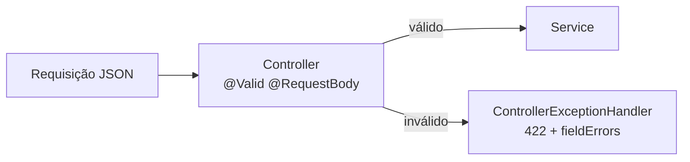

# Validação

Este guia explica como a API valida os dados recebidos: as anotações padrão do Bean Validation, os validadores próprios do projeto, as regras de senha e a validação de e-mail.

## Sumário

1. [Como a validação funciona](#1-como-a-validação-funciona)
2. [Regras por DTO](#2-regras-por-dto)
3. [Validadores customizados](#3-validadores-customizados)
4. [Senha forte](#4-senha-forte)
5. [Dados pessoais na senha](#5-dados-pessoais-na-senha)
6. [Validação de e-mail](#6-validação-de-e-mail)
7. [Limitações conhecidas](#7-limitações-conhecidas)

## 1. Como a validação funciona

**Bean Validation** (pacote `jakarta.validation`) é a especificação Java para validar objetos com anotações, como `@NotBlank` (não pode ser vazio) ou `@Size` (tamanho mínimo e máximo).

No projeto:

1. Cada DTO de entrada (pacote `dto.*.request`) tem anotações nos campos ou na classe.
2. O controller recebe o DTO com `@Valid @RequestBody`. O Spring valida o objeto **antes** de chamar o service.
3. Se alguma regra falha, o Spring lança `MethodArgumentNotValidException`. O `ControllerExceptionHandler` responde **422 Unprocessable Entity** com um `ValidationError`, que lista cada campo inválido em `fieldErrors`.

As mensagens usam chaves entre chaves, por exemplo `message = "{category.name.notBlank}"`. A chave é traduzida para o idioma do cabeçalho `Accept-Language` com os arquivos `messages_*.properties` (veja [INTERNATIONALIZATION.md](INTERNATIONALIZATION.md)). O formato da resposta está em [ERROR-HANDLING.md](ERROR-HANDLING.md).

## 2. Regras por DTO

Todos os DTOs de entrada passam por `@Valid`.

| DTO | Usado em | Campo | Regras |
| --- | --- | --- | --- |
| `CategoryCreateRequest` | `POST /categories` | `name` | Obrigatório; 3 a 80 caracteres; só letras (com acento), números e espaços |
| | | `description` | Vazio ou de 3 a 255 caracteres |
| | | (classe) | `@CategoryCreateValid`: nome único |
| `CategoryUpdateRequest` | `PATCH /categories/{id}` | `name`, `description` | Mesmas regras do cadastro (`name` também é obrigatório) |
| | | (classe) | `@CategoryUpdateValid`: nome único, desconsiderando a própria categoria |
| `ProductCreateRequest` | `POST /products` | `name` | Obrigatório; 3 a 100 caracteres; letras, números, espaços, hífen e parênteses |
| | | `description` | 3 a 200 caracteres |
| | | `price` | Positivo |
| | | `imgUrl` | Começa com `http://` ou `https://` |
| | | `date` | No passado ou no presente |
| | | `categoryIds` | Lista não vazia |
| | | (classe) | `@ProductCreateValid`: nome único e categorias existentes |
| `ProductUpdateRequest` | `PUT /products/{id}` | `name`, `description`, `price`, `imgUrl`, `categoryIds` | Mesmas regras do cadastro |
| | | (classe) | `@ProductUpdateValid`: nome único (desconsiderando o próprio produto) e categorias existentes |
| `UserRegisterRequest` | `POST /accounts/register` | `firstName`, `lastName` | Obrigatórios; 2 a 80 caracteres |
| | | `email` | Obrigatório; `@ValidEmail`; `@UniqueEmail` |
| | | `password` | Obrigatória; 10 a 72 caracteres; `@StrongPassword` |
| | | (classe) | `@PasswordPersonalData` |
| `UserCreateRequest` | `POST /users` | Mesmos campos do cadastro | Mesmas regras do cadastro |
| | | `roleIds` | `@ValidRoles`: todas as roles existem |
| `UserUpdateRequest` | `PUT /users/{id}` | `firstName`, `lastName` | Obrigatórios; 2 a 80 caracteres |
| | | `email` | Obrigatório; `@ValidEmail` |
| | | `password` | Opcional; `@StrongPassword` (sem limite de tamanho) |
| | | `roleIds` | `@ValidRoles` |
| | | (classe) | `@UserUpdateValid`: e-mail único e senha sem dados pessoais |
| `UserEmailRequest` | `POST /accounts/resend-activation` e `/password-recovery` | `email` | Obrigatório; `@ValidEmail` |
| `PasswordResetRequest` | `POST /accounts/reset-password` | `token` | Obrigatório |
| | | `password` | Obrigatória; `@StrongPassword` (sem limite de tamanho) |
| `AuthenticatedUserUpdateRequest` | `PUT /accounts/me` | `firstName`, `lastName` | Obrigatórios; até 100 caracteres |
| | | `email` | Obrigatório; `@Email` (só formato); até 255 caracteres; `@UniqueEmailForAuthenticatedUser` |
| `PasswordUpdateRequest` | `PATCH /accounts/me/password` | `currentPassword` | Obrigatória |
| | | `newPassword` | Obrigatória; 10 a 72 caracteres; `@StrongPassword` |
| | | `confirmPassword` | Obrigatória; 10 a 72 caracteres |

O limite de 72 caracteres existe porque o BCrypt, algoritmo usado para guardar as senhas, só considera os primeiros 72 bytes.

A troca de senha em `PATCH /accounts/me/password` tem três regras a mais, verificadas no `AccountService` e não no DTO. Quando falham, a resposta é 422 com `code` igual a `PASSWORD_UPDATE_ERROR`:

| Regra | Chave da mensagem |
| --- | --- |
| `newPassword` igual a `confirmPassword` | `error.account.password.confirmationMismatch` |
| `currentPassword` confere com a senha atual | `error.account.password.currentInvalid` |
| `newPassword` diferente da senha atual | `error.account.password.sameAsCurrent` |

## 3. Validadores customizados

Um **validador customizado** tem duas partes: uma anotação (pacote `validation.<assunto>.annotation`) e uma classe que implementa `ConstraintValidator` com a regra (pacote `validation.<assunto>.validator`). A anotação pode ficar num campo ou na classe inteira; na classe, o validador enxerga todos os campos de uma vez.

| Anotação | Onde | O que impõe | Consulta o banco? |
| --- | --- | --- | --- |
| `@CategoryCreateValid` | Classe | Nome de categoria único, sem diferenciar maiúsculas (`category.name.unique`) | Sim |
| `@CategoryUpdateValid` | Classe | Nome único, desconsiderando a categoria do `{id}` da URL | Sim |
| `@ProductCreateValid` | Classe | Nome de produto único (`product.name.unique`) e todos os `categoryIds` existentes (`product.categoryIds.invalid`) | Sim |
| `@ProductUpdateValid` | Classe | As mesmas regras, desconsiderando o produto do `{id}` da URL | Sim |
| `@ValidRoles` | Campo `roleIds` | Todas as roles informadas existem (`role.invalid`). Lista nula ou vazia é aceita | Sim |
| `@UniqueEmail` | Campo `email` | Nenhum usuário tem esse e-mail, sem diferenciar maiúsculas (`user.email.unique`) | Sim |
| `@UniqueEmailForAuthenticatedUser` | Campo `email` | Nenhum **outro** usuário tem esse e-mail; o usuário do token é desconsiderado | Sim |
| `@UserUpdateValid` | Classe | E-mail único, desconsiderando o usuário do `{id}` da URL, e senha sem dados pessoais | Sim |
| `@PasswordPersonalData` | Classe | Senha sem dados pessoais (seção 5) | Não |
| `@StrongPassword` | Campo | Regras de senha forte (seção 4) | Não |
| `@ValidEmail` | Campo | Formato do e-mail e registro MX do domínio (seção 6) | Não; consulta o DNS |

Os validadores de atualização descobrem o registro que está sendo editado lendo o `{id}` da URL da requisição.

Quando um valor é nulo, os validadores customizados o consideram válido; a obrigatoriedade fica por conta de `@NotBlank` ou `@NotEmpty`.

## 4. Senha forte

`@StrongPassword` verifica todas as regras e devolve **todas** as que falharam, cada uma com sua mensagem:

| Regra | Chave da mensagem |
| --- | --- |
| Não contém espaços | `user.password.whitespace` |
| Tem pelo menos uma letra maiúscula (A–Z) | `user.password.uppercase` |
| Tem pelo menos uma letra minúscula (a–z) | `user.password.lowercase` |
| Tem pelo menos um número | `user.password.number` |
| Tem pelo menos um caractere especial (qualquer coisa que não seja letra, número ou espaço) | `user.password.specialCharacter` |
| Não é uma senha comum: `123456`, `1234567`, `12345678`, `password`, `admin`, `qwerty`, `abc123`, `111111` ou `123123` (sem diferenciar maiúsculas) | `user.password.common` |
| Não tem sequência numérica crescente ou decrescente de 6 dígitos | `user.password.sequence` |

A regra de sequência junta só os dígitos da senha, na ordem em que aparecem, e procura 6 seguidos em ordem. Por isso `Ab#1x2y3z4w5v6` é recusada: os dígitos formam `123456`.

O tamanho mínimo (10) e máximo (72) não fazem parte de `@StrongPassword`: vêm do `@Size` de cada DTO.

Exemplo de senha que passa em todas as regras: `Catalogo#2026`.

## 5. Dados pessoais na senha

`@PasswordPersonalData` (no cadastro e na criação de usuário) recusa a senha que contém, sem diferenciar maiúsculas:

- o primeiro nome;
- o sobrenome;
- a parte do e-mail antes do `@`.

Só entram na comparação os valores com 3 caracteres ou mais. O erro é associado ao campo `password`, com a chave `user.password.personalData`, e aparece uma única vez, mesmo que mais de um dado esteja na senha.

Os DTOs que usam essa anotação implementam a interface `PasswordPersonalDataCandidate` (pacote `validation.user.contract`), que expõe `firstName()`, `lastName()`, `email()` e `password()`. Assim, um único validador atende DTOs diferentes.

Em `PUT /users/{id}`, a mesma regra é aplicada pelo `@UserUpdateValid`, só quando a senha é enviada.

## 6. Validação de e-mail

`@ValidEmail` faz duas verificações, depois de retirar espaços e passar o e-mail para minúsculas:

1. **Formato**, com a expressão `^[A-Za-z0-9+_.-]+@[A-Za-z0-9.-]+\.[A-Za-z]{2,}$`.
2. **Registro MX do domínio.** Um registro **MX** (*Mail Exchanger*) é a informação do DNS que diz qual servidor recebe e-mails de um domínio. O validador consulta o DNS (pela API JNDI do Java) e aceita o e-mail só se o domínio tiver pelo menos um registro MX.

Qualquer falha na consulta, como falta de internet, DNS fora do ar ou domínio inexistente, faz o e-mail ser recusado com `user.email.invalid`.

**Consequência: a validação de e-mail depende de internet.** Isso vale para a aplicação e para os testes. `ValidEmailValidatorTest` consulta o DNS real de `gmail.com`, e testes de integração como o `AccountFlowIT` cadastram usuários com e-mails `@gmail.com`. Sem acesso ao DNS, esses testes falham. Veja [TESTING.md](TESTING.md#8-dependências-externas).

`@ValidEmail` é usado no cadastro, na criação e na atualização de usuários, no reenvio de ativação e na recuperação de senha. A atualização do próprio usuário (`PUT /accounts/me`) usa o `@Email` padrão do Bean Validation, que confere só o formato.

## 7. Limitações conhecidas

- **Redefinição de senha sem limite de tamanho.** Em `POST /accounts/reset-password` e no campo `password` de `PUT /users/{id}`, não há `@Size`: só `@StrongPassword`, que não confere tamanho. Uma senha forte com menos de 10 caracteres é aceita.
- **Dados pessoais não são checados em todas as trocas de senha.** `POST /accounts/reset-password` e `PATCH /accounts/me/password` não usam `@PasswordPersonalData`.
- **`@UserUpdateValid` compara só com os dados enviados.** A verificação de dados pessoais usa o nome e o e-mail da requisição, e não os gravados no banco.
- **Regras de e-mail diferentes.** `PUT /accounts/me` aceita e-mails que o `@ValidEmail` recusaria (domínios sem MX), porque usa só o `@Email`.
- **Validação dependente de rede.** Uma falha temporária de DNS recusa e-mails válidos.
- **`PATCH` de categoria exige o nome.** Apesar de ser um `PATCH` (atualização parcial), `CategoryUpdateRequest` tem `@NotBlank` no `name`.
