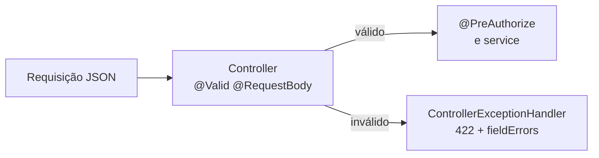

# Validação

Este guia explica como a API do ASJCatalog valida os dados recebidos no capítulo 03: as anotações do Bean Validation, os validadores próprios do projeto, as regras de senha e de e-mail e o formato das respostas de erro.

## Sumário

1. [Como a validação funciona](#1-como-a-validação-funciona)
2. [Regras por DTO](#2-regras-por-dto)
3. [Validadores customizados](#3-validadores-customizados)
4. [Senha forte](#4-senha-forte)
5. [Dados pessoais na senha](#5-dados-pessoais-na-senha)
6. [Validação de e-mail](#6-validação-de-e-mail)
7. [De onde vêm as mensagens](#7-de-onde-vêm-as-mensagens)
8. [Exemplos reais](#8-exemplos-reais)
9. [Limitações conhecidas](#9-limitações-conhecidas)

## 1. Como a validação funciona

**Bean Validation** (pacote `jakarta.validation`) é a especificação Java para validar objetos com anotações, como `@NotBlank` (não pode ser vazio) ou `@Size` (tamanho mínimo e máximo). O **Hibernate Validator**, incluído pelo `spring-boot-starter-validation`, é a biblioteca que executa essas regras.

Um **DTO** (*Data Transfer Object*) é a classe que representa o corpo JSON de uma requisição. No projeto:

1. Cada DTO de entrada (pacote `dto.*.request`) tem anotações nos campos e uma anotação na classe.
2. O controller recebe o DTO com `@Valid @RequestBody`. O Spring valida o objeto **antes** de chamar o método do controller.
3. Se alguma regra falha, o Spring lança `MethodArgumentNotValidException`. O `ControllerExceptionHandler` responde **422 Unprocessable Entity** com um `ValidationError`, que lista cada campo inválido em `fieldErrors`.



Todos os seis DTOs de entrada passam por `@Valid`: criação e atualização de categoria, de produto e de usuário. O formato completo da resposta de erro está em [ERROR-HANDLING.md](ERROR-HANDLING.md).

## 2. Regras por DTO

Uma anotação que aceita `null` só é verificada quando o campo é enviado. Por exemplo, `@Positive` em `price` não exige o preço; só recusa um preço enviado com valor zero ou negativo.

**Categorias** (`CategoryCreateRequest` em `POST /categories` e `CategoryUpdateRequest` em `PATCH /categories/{id}`, com as mesmas regras):

| Campo | Regras |
| --- | --- |
| `name` | Obrigatório (`@NotBlank`); 3 a 80 caracteres (`@Size`); só letras, inclusive acentuadas, números e espaços (`@Pattern`) |
| `description` | Opcional; se enviado, vazio ou de 3 a 255 caracteres (`@Pattern("^$\|^.{3,255}$")`) |
| Classe | Nome único, sem diferenciar maiúsculas (`@CategoryCreateValid` / `@CategoryUpdateValid`) |

**Produtos** (`ProductCreateRequest` em `POST /products` e `ProductUpdateRequest` em `PATCH /products/{id}`, com as mesmas regras):

| Campo | Regras |
| --- | --- |
| `name` | Obrigatório; 3 a 100 caracteres; letras, números, espaços, hífen e parênteses |
| `description` | Opcional; se enviado, 3 a 200 caracteres (`@Size`) |
| `price` | Opcional; se enviado, maior que zero (`@Positive`) |
| `imgUrl` | Opcional; se enviado, começa com `http://` ou `https://` (`@Pattern`) |
| `date` | Opcional; se enviada, no passado ou no presente (`@PastOrPresent`) |
| `categoryIds` | Obrigatório e não vazio (`@NotEmpty`) |
| Classe | Nome único e todas as categorias existentes (`@ProductCreateValid` / `@ProductUpdateValid`) |

**Usuários** (`UserCreateRequest` em `POST /users` e `UserUpdateRequest` em `PUT /users/{id}`):

| Campo | Criação | Atualização |
| --- | --- | --- |
| `firstName` | Obrigatório; 2 a 80 caracteres | Igual |
| `lastName` | Obrigatório; 2 a 80 caracteres | Igual |
| `email` | Obrigatório; formato e domínio válidos (`@ValidEmail`); único (`@UniqueEmail`) | Obrigatório; `@ValidEmail`; único exceto o próprio usuário (na classe) |
| `password` | Senha forte, se enviada (`@StrongPassword`) | Igual; se não for enviada, a senha atual é mantida |
| `roleIds` | Obrigatório e não vazio; todas as roles existentes (`@ValidRoles`) | Igual |
| Classe | Senha sem dados pessoais (`@UserCreateValid`) | E-mail único e senha sem dados pessoais (`@UserUpdateValid`) |

## 3. Validadores customizados

Uma **anotação customizada** é uma anotação criada pelo projeto, ligada a uma classe `ConstraintValidator` que contém a regra. Elas ficam em `validation/<recurso>/annotation` e `validation/<recurso>/validator`:

```text
validation
├── category   CategoryCreateValid, CategoryUpdateValid
├── product    ProductCreateValid, ProductUpdateValid
├── role       ValidRoles
└── user       StrongPassword, UniqueEmail, ValidEmail, UserCreateValid, UserUpdateValid
```

| Anotação | Onde é usada | O que verifica | Mensagem |
| --- | --- | --- | --- |
| `@CategoryCreateValid` | Classe `CategoryCreateRequest` | Nome ainda não usado (`existsByNameIgnoreCase`) | `Já existe uma categoria com este nome` (campo `name`) |
| `@CategoryUpdateValid` | Classe `CategoryUpdateRequest` | Nome não usado por outra categoria; o id vem da URL | Igual |
| `@ProductCreateValid` | Classe `ProductCreateRequest` | Nome único e categorias existentes | `Já existe um produto com este nome`; `Uma ou mais categorias informadas não existem` |
| `@ProductUpdateValid` | Classe `ProductUpdateRequest` | Igual, desconsiderando o próprio produto | Igual |
| `@ValidRoles` | Campo `roleIds` | Todas as roles existem | `Uma ou mais roles informadas não existem` |
| `@UniqueEmail` | Campo `email` na criação | E-mail ainda não cadastrado | `Email já existente` |
| `@ValidEmail` | Campo `email` | Formato e registro MX do domínio (seção 6) | `Favor informar um email válido` |
| `@StrongPassword` | Campo `password` | Regras da seção 4 | Uma mensagem por regra violada |
| `@UserCreateValid` | Classe `UserCreateRequest` | Senha sem dados pessoais (seção 5) | `Senha não pode conter dados pessoais` |
| `@UserUpdateValid` | Classe `UserUpdateRequest` | E-mail único exceto o próprio usuário e senha sem dados pessoais | `Email já cadastrado`; `Senha não pode conter dados pessoais` |

Os validadores de atualização descobrem o id do registro lendo as variáveis da URL (`HandlerMapping.URI_TEMPLATE_VARIABLES_ATTRIBUTE`) pelo `HttpServletRequest`. Os que consultam o banco recebem o repositório pelo construtor: o Spring cria os validadores e injeta as dependências.

## 4. Senha forte

`@StrongPassword` aplica as regras na ordem abaixo. Se a senha está vazia, só a primeira mensagem aparece; nos demais casos, todas as regras violadas aparecem juntas.

| Regra | Mensagem |
| --- | --- |
| Não pode ser vazia | `Senha não pode ser vazia` |
| Sem espaços | `Senha não pode conter espaços` |
| Pelo menos 10 caracteres | `Senha deve possuir ao menos 10 caracteres` |
| Uma letra maiúscula | `Senha deve conter ao menos uma letra maiúscula` |
| Uma letra minúscula | `Senha deve conter ao menos uma letra minúscula` |
| Um número | `Senha deve conter ao menos um número` |
| Um caractere especial (fora de letras, números e espaço) | `Senha deve conter ao menos um caractere especial` |
| Não conter `123456`, `12345678`, `password`, `admin`, `qwerty`, `abc123`, `111111` ou `123123`, sem diferenciar maiúsculas | `Senha contém padrões muito comuns e inseguros` |

Uma senha que passa em todas as regras: `JAVA!@#ResTIc18`, usada pelas factories dos testes.

A senha **nula** (campo não enviado) é considerada válida pelo `@StrongPassword`. Na atualização, isso é útil: a senha atual é mantida. Na criação, o resultado é um erro 500 (veja Limitações conhecidas).

## 5. Dados pessoais na senha

`@UserCreateValid` e `@UserUpdateValid` recusam a senha que contém, sem diferenciar maiúsculas:

- o `firstName`;
- o `lastName`;
- a parte do e-mail antes do `@`.

Só valores com 3 caracteres ou mais são considerados. Exemplo confirmado por execução: `firstName` `Pedro` com a senha `Pedro!@#Res18` → `Senha não pode conter dados pessoais`.

## 6. Validação de e-mail

`@ValidEmail` faz duas verificações:

1. **Formato:** a expressão regular `^[A-Za-z0-9+_.-]+@[A-Za-z0-9.-]+\.[A-Za-z]{2,}$`, depois de retirar espaços das pontas e passar para minúsculas.
2. **Registro MX do domínio:** um **registro MX** é a informação do DNS que indica qual servidor recebe e-mails de um domínio. O validador consulta o DNS (pela JNDI do Java) e recusa o e-mail se o domínio não tiver registro MX ou se a consulta falhar.

Confirmado por execução: `pedro@dominio-inexistente-xyz.com` → `Favor informar um email válido`; `pedro@gmail.com` → aceito.

Como a segunda verificação depende da rede, **sem acesso ao DNS nenhum e-mail é aceito**, nem na API nem nos testes de usuário. Veja [TESTING.md](TESTING.md#11-limitações-conhecidas).

## 7. De onde vêm as mensagens

As mensagens dos campos estão em português e vêm de três lugares:

| Origem | Usada por | Exemplo |
| --- | --- | --- |
| `backend/src/main/resources/ValidationMessages.properties` | Anotações padrão com chave entre chaves: `message = "{category.name.notBlank}"` | `category.name.notBlank=O nome da categoria é obrigatório` |
| Mensagem padrão da anotação customizada (`message()`) | `@UniqueEmail`, `@ValidEmail` | `Email já existente` |
| Texto fixo no código do validador | Validadores de classe, `@StrongPassword` e `@ValidRoles` | `Já existe uma categoria com este nome` |

O `ValidationMessages.properties` é o arquivo que o Hibernate Validator procura por padrão para traduzir as chaves. Os títulos gerais da resposta (`error` e `message`) são fixos em inglês no handler: `Validation Error` e `One or more fields are invalid`.

A internacionalização das mensagens, com escolha do idioma pelo cabeçalho `Accept-Language`, chega no capítulo 04.

## 8. Exemplos reais

Respostas obtidas com o token de `maria@gmail.com` (ADMIN), no perfil `test`. Como obter o token: [AUTHENTICATION.md](AUTHENTICATION.md#3-login).

**Categoria com nome inválido e descrição curta** (`{"name":"ab$","description":"x"}`):

```json
{
  "timestamp" : "2026-10-06T01:53:06.401075100Z",
  "status" : 422,
  "error" : "Validation Error",
  "message" : "One or more fields are invalid",
  "path" : "/api/v1/categories",
  "fieldErrors" : [ {
    "fieldName" : "name",
    "message" : "O nome da categoria possui caracteres inválidos"
  }, {
    "fieldName" : "description",
    "message" : "A descrição deve ter entre 3 e 255 caracteres"
  } ]
}
```

**Categoria com nome já existente** (`{"name":"books"}`, a categoria `Books` já existe): `fieldErrors` com `name` → `Já existe uma categoria com este nome`.

**Produto inválido** (`{"name":"TV","price":-5,"imgUrl":"ftp://x","date":"2999-01-01T00:00:00Z","categoryIds":[999]}`), em `fieldErrors`:

| Campo | Mensagem |
| --- | --- |
| `categoryIds` | `Uma ou mais categorias informadas não existem` |
| `name` | `O nome do produto deve conter entre 3 e 100 caracteres` |
| `date` | `A data deve ser no passado ou presente` |
| `imgUrl` | `A URL da imagem é inválida` |
| `price` | `O preço deve ser um valor positivo` |

**Usuário inválido** (`{"firstName":"A","email":"maria@gmail.com","password":"123456","roleIds":[]}`): um erro para `lastName` (obrigatório), um para `firstName` (tamanho), `Email já existente`, `Usuário deve possuir ao menos uma role` e uma mensagem para cada regra de senha violada (tamanho, maiúscula, minúscula, caractere especial e padrão comum).

## 9. Limitações conhecidas

- **Criar usuário sem senha responde 500.** `password` não tem `@NotBlank`, e o `@StrongPassword` aceita `null`. A requisição passa na validação e quebra ao criptografar a senha nula (confirmado por execução: `500 Internal server error`). O `@NotBlank` na senha da criação chega no capítulo 04.
- **O `PATCH` de categoria e de produto deixou de ser parcial.** Os DTOs de atualização têm as mesmas regras obrigatórias da criação. Confirmado por execução: `PATCH /categories/2` só com `description` → 422 `O nome da categoria é obrigatório`; `PATCH /products/2` só com `price` → 422 para `name` e `categoryIds`. O mapper ainda ignora campos nulos, mas o cliente precisa enviar os obrigatórios. Continua no capítulo 04.
- **A validação acontece antes do `@PreAuthorize`.** Um usuário sem permissão que envia um corpo inválido recebe 422 com os erros de validação, e não 403. Confirmado por execução: `POST /api/v1/users` com o token de `albert@gmail.com` (OPERATOR) e corpo `{}` → 422; com corpo válido → 403. Continua no capítulo 04.
- **A validação de e-mail depende do DNS.** Sem rede, nenhum e-mail passa no `@ValidEmail`. Continua no capítulo 04.
- **Chaves não usadas no `ValidationMessages.properties`.** 14 chaves existem no arquivo, mas nenhum código as usa, porque os validadores têm textos fixos: `category.name.unique`, `product.name.unique`, `product.categoryIds.invalid`, `user.email.invalid`, `user.email.unique`, `user.roleIds.invalid` e as oito chaves `user.password.*`.
- **A ordem dos `fieldErrors` varia.** O Bean Validation não garante a ordem das violações; o mesmo corpo pode gerar a lista em outra ordem a cada requisição. Um campo pode aparecer mais de uma vez, uma para cada regra violada.
- **Mensagens só em português, com títulos em inglês.** `error` e `message` vêm em inglês, e as mensagens dos campos em português. A internacionalização chega no capítulo 04.
